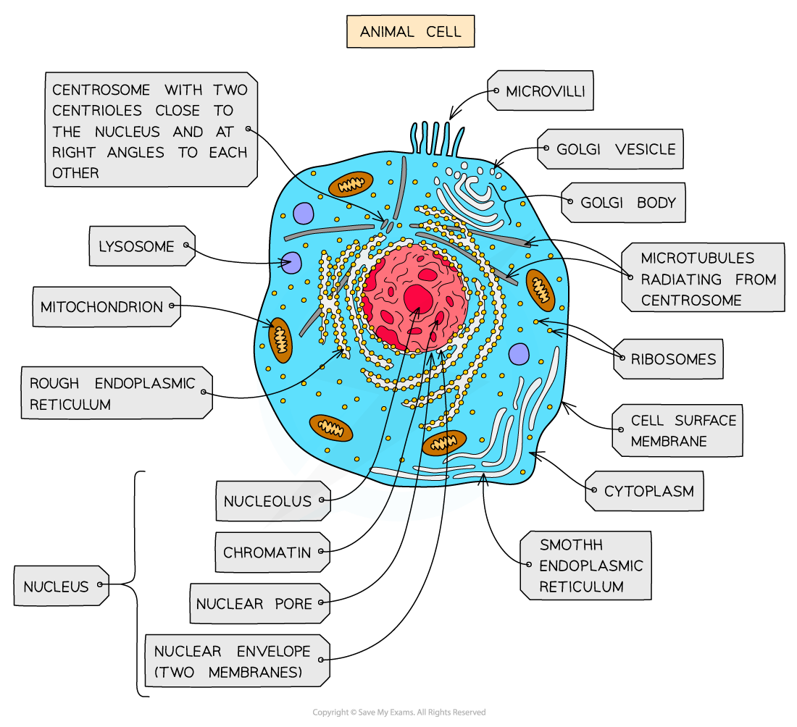
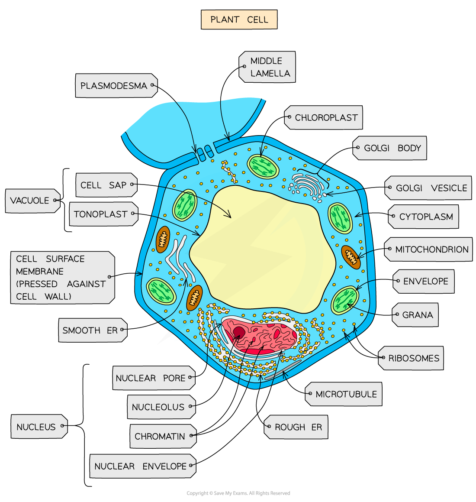
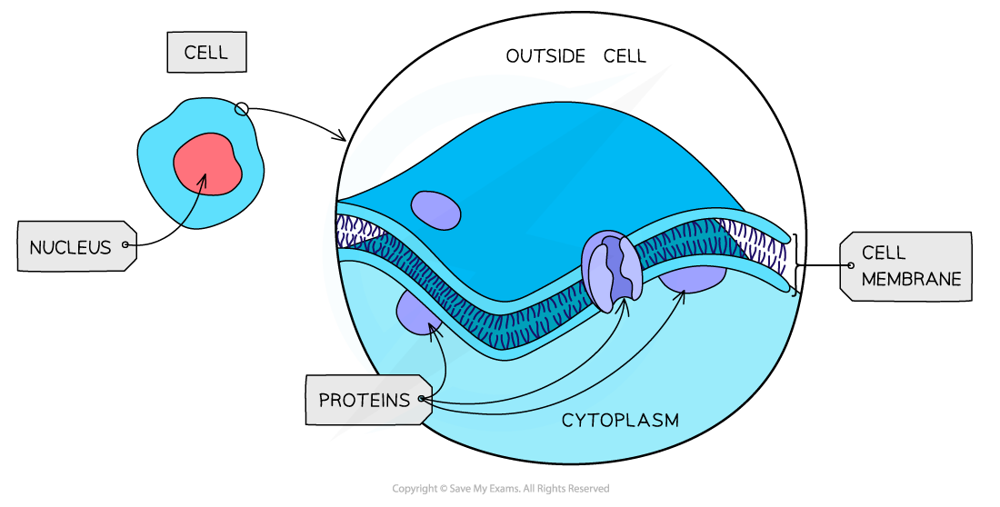
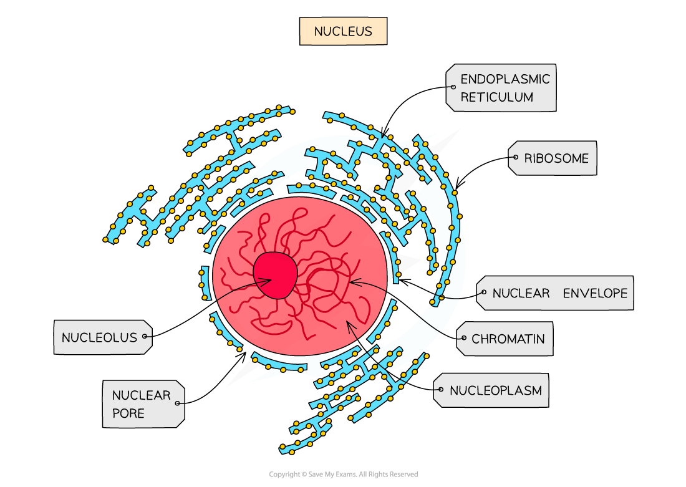
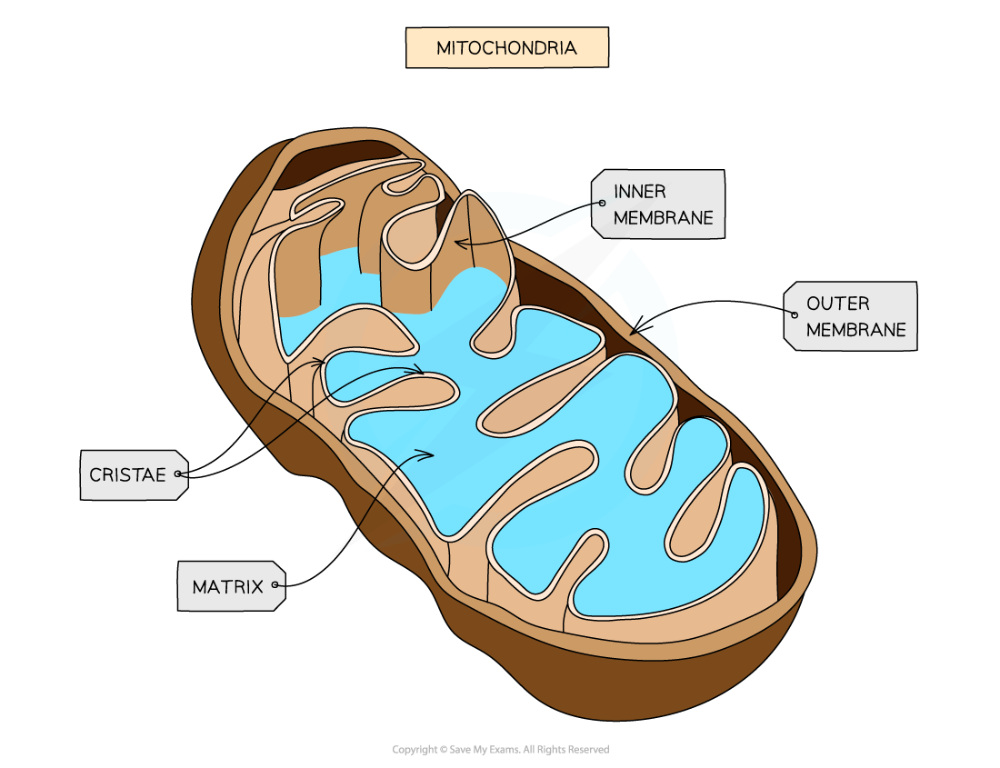
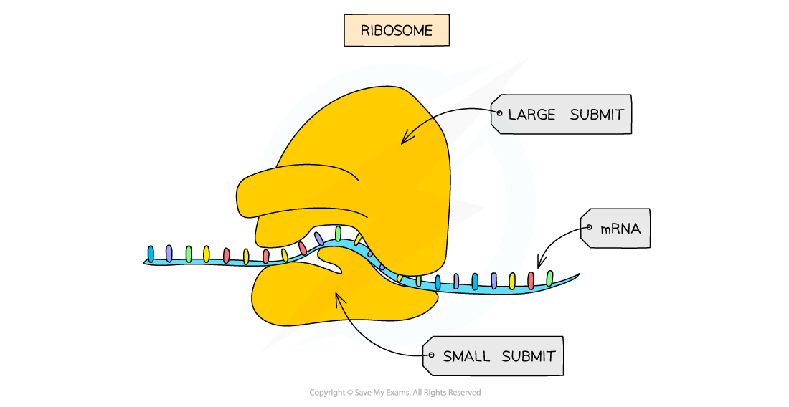
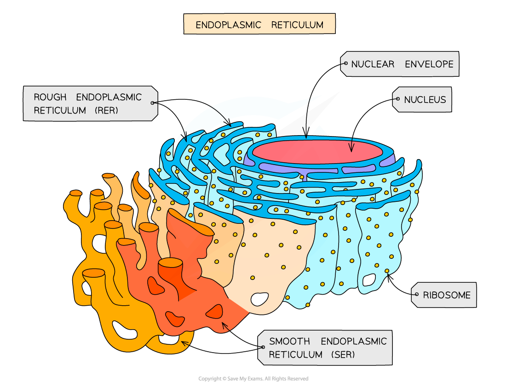
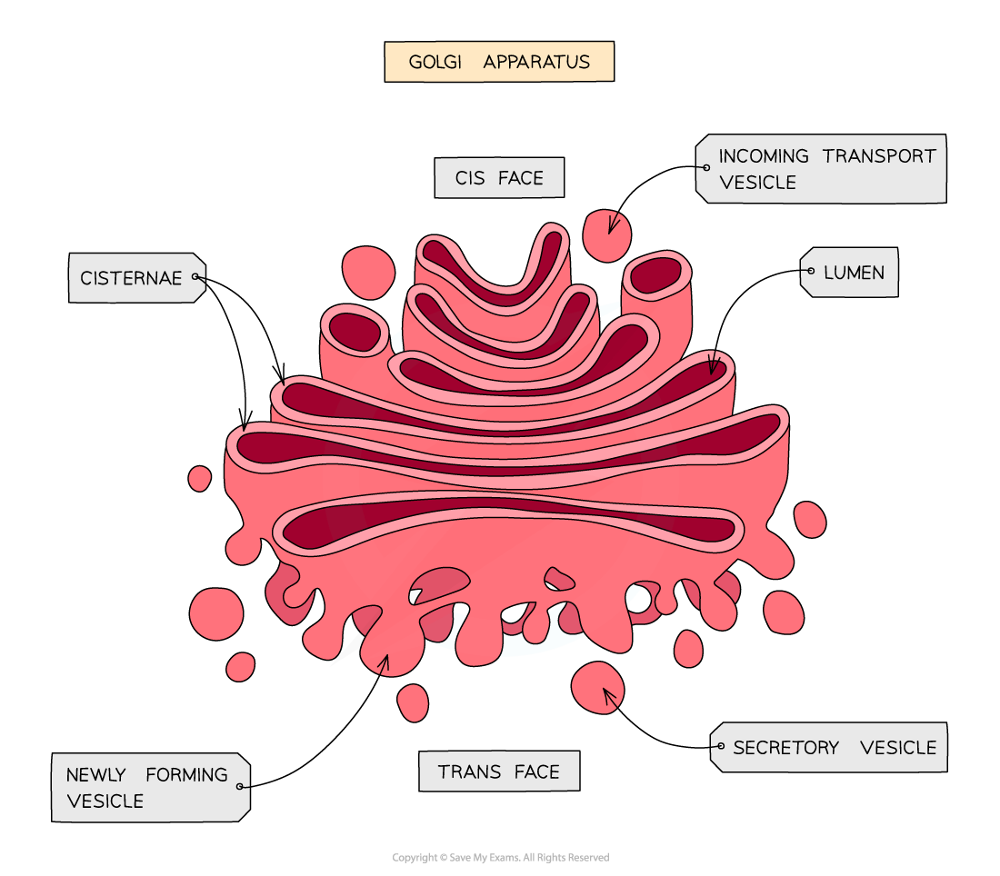
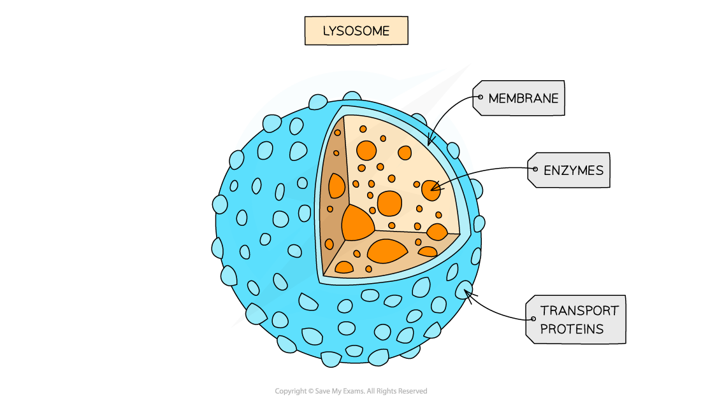
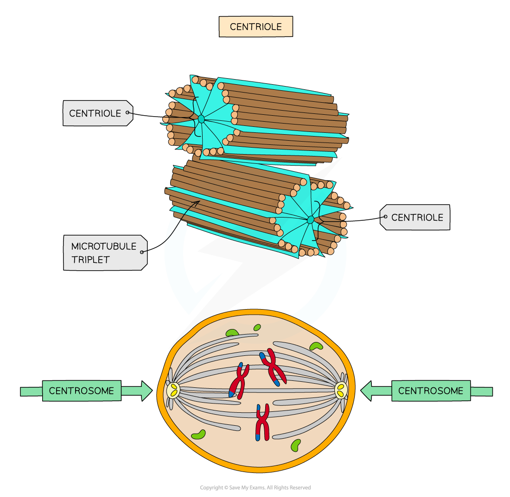

# Eukaryotic Cells

## Organelle Structures

> **Spec point** — `spcpt_JMkTTZ5sFqWg5Smg`

## Organelle Structures

- Cells can be divided into two broad types; **eukaryotic **and **prokaryotic** cells
- Eukaryotic cells have a **more complex ultrastructure** than prokaryotic cells

  - The term ultrastructure refers to the** internal structure of cells**
- Eukaryotic cells are larger than prokaryotic cells

  - Eukaryotic cells range in diameter from around 10-100 μm
  - Prokaryotic cells range in diameter from around 0.1-5 μm
- The cytoplasm of eukaryotic cells is divided up into **membrane-bound compartments** called **organelles**
- Animal and plant cells are both types of eukaryotic cells that **share key structures** such as

  - Membrane-bound organelles, including a nucleus
  - Larger ribosomes known as 80S ribosomes
- **Key differences** between animal and plant cells include

  - Animal cells contain **centrioles** and some have **microvilli** while plant cells do not
  
    - Microvilli are folded regions of the cell surface membrane that increase cell surface area for absorption, e.g. in the small intestine
  - Plant cells have a **cellulose cell wall**, large permanent **vacuoles**, and **chloroplasts** while animal cells do not

***Animal cells are a type of eukaryotic cell***

***Plant cells are eukaryotic cells that have a cellulose cell wall, permanent vacuole, and chroroplasts***

## Organelle Functions

> **Spec point** — `spcpt_FN4z8thYksBy2gzD`

## Organelle Functions

#### Cell surface membrane

- All cells are surrounded by a cell surface membrane which **controls the exchange of material**s between the internal cell environment and the external environment

  - The membrane is described as being **partially permeable**, meaning that some substances can pass through the membrane while others cannot
- Cell membrane is formed from a *phospholipid*** bilayer **spanning a diameter of around 10 nm
- Many organelles inside cells are surrounded by cell membrane, so when referring to the outer membrane of a cell it is always a good idea to refer to it as the cell** surface** membrane

  - The cell surface membrane can also be referred to as the **plasma membrane**

***The cell surface membrane surrounds the cell, separating it from its external environment***

#### Nucleus

- Present in all eukaryotic cells, the nucleus is relatively **large** and separated from the cytoplasm by a **double membrane **called the **nuclear envelope,** which has many pores

  - Nuclear pores are important channels for allowing mRNA and ribosomes to travel out of the nucleus, as well as allowing enzymes, e.g. DNA polymerases, and signalling molecules to travel in
- The nucleus contains **chromatin, **the material from which chromosomes are made

  - Chromosomes are made of sections of **linear DNA** tightly wound around proteins called **histones**
- Usually, at least one or more darkly stained regions of the nucleus can be observed under a microscope; these regions are individually termed **nucleolus **(plural nucleoli) and are the sites of **ribosome production**

***The nucleus of a eukaryotic cell is surrounded by the nuclear envelope and contains chromatin as well as a region called the nucleolus. Note that the nucleus is shown here surrounded by another organelle; the endoplasmic reticulum***

#### Mitochondria

- The site of **aerobic** *respiration* within eukaryotic cells, mitochondria (singular mitochondrion) are just visible with a light microscope
- Mitochondria are surrounded by a **double-membrane** with the inner membrane folded to form structures called **cristae**
- The **matrix** of mitochondria contains enzymes needed for **aerobic respiration, **producing **ATP**
- Small circular pieces of **DNA, **known as** **mitochondrial DNA, and ribosomes are also found in the matrix

  - These are needed for replication of mitochondria before cell division

***Mitochondria are the site of aerobic respiration in eukaryotic cells***

#### Ribosomes

- Ribosomes can be found as free organelles in the cytoplasm of all cells or as part of the **rough endoplasmic reticulum **in eukaryotic cells
- They are not surrounded by a membrane
- Each ribosome is a complex of **ribosomal RNA (rRNA)** and **proteins**
- *80s ribosomes* are found in eukaryotic cells
- *70s ribosomes* are found in prokaryotes, mitochondria, and chloroplasts
- Ribosomes are the site of *translation*

***Ribosomes are formed in the nucleolus and are composed of almost equal amounts of RNA and protein***

#### Endoplasmic reticulum

- There are two types of endoplasmic reticulum; rough and smooth
- **Rough Endoplasmic Reticulum (RER)**

  - RER is formed from folds of membrane continuous with the **nuclear envelope**
  - The surface of RER is covered in **ribosomes**
  - The role of the RER is to **process protein**s made on the** **ribosomes
- **Smooth Endoplasmic Reticulum (SER)**

  - SER is also formed from folds of membrane but its function is distinct from the RER, being involved in the production, processing and storage of **lipids, carbohydrates **and **steroids**
  - SER does not have ribosomes on its surface

***The RER and SER are visible under the electron microscope; the presence or absence of ribosomes helps to distinguish between them***

#### Golgi apparatus

- The Golgi apparatus consists of **flattened sacs of membrane** similar in appearance to the smooth endoplasmic reticulum

  - The Golgi apparatus is sometimes known as the **Golgi body**
  - The Golgi can be distinguished from the SER by its **regular, stacked appearance**; it can be described as looking like a wifi symbol!
- The role of the Golgi apparatus is to** modify proteins and lipids** before **packaging** them into **Golgi vesicles**

  - The vesicles then** transport the proteins and lipids** to their required destination
  - Proteins that go through the Golgi apparatus can be
  
    - Exported from the cell, e.g. hormones such as insulin
    - Put into lysosomes, e.g. hydrolytic enzymes
    - Delivered to other membrane-bound organelles

***The Golgi apparatus; the cis face lies near the rough endoplasmic reticulum, while the trans face lies near the cell membrane***

#### Lysosomes

- Lysosomes are specialist forms of *vesicle* which contain *hydrolytic*** enzymes**
- The role of lysosomes is to break down waste materials such as worn-out organelles,

  - Lysosomes are used extensively by cells of the **immune system** and in programmed cell death, known as **apoptosis**

***Lysosomes contain digestive enzymes***

#### Centrioles

- Centrioles are made of hollow fibres knows as **microtubules**

  - Microtubules are filaments of protein that can be used to **move substances around** inside a cell, as well as to **support the shape of a cell** from the inside
- Two centrioles at right angles to each other form a **centrosome** which organises the *spindle fibres* during cell division
- Centrioles are not found in plants and fungi

***Centrioles are structures formed from microtubules; they are involved with the process of nuclear division in animal cells***
