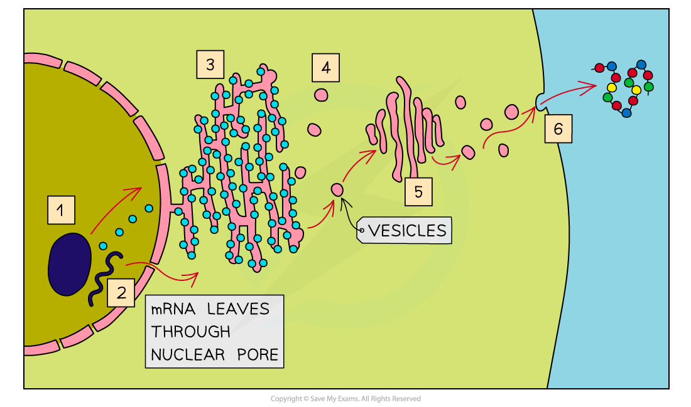
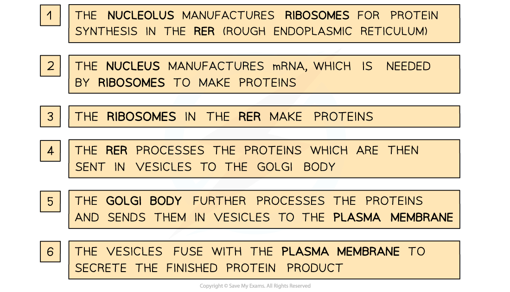

# The Rough Endoplasmic Reticulum & Golgi

## Formation of Extracellular Enzymes

> **Spec point** — `spcpt_kfg6zP3D45r98Sdt`

## Formation of Extracellular Enzymes

- In cells, **many organelles** are involved in the **production** and **secretion** of *proteins*

  - Organelles are **specialised parts of a cell** that carry out a particular function
  - Some organelles are membrane-bound, meaning that they are surrounded by membrane
- The **organelles** involved in protein synthesis include

  - Nucleus
  
    - *Transcription* of the DNA code occurs here
  - Ribosomes
  
    - Free ribosomes and those on the RER produce proteins in the process of *translation*
  - Rough endoplasmic reticulum (RER)
  - Golgi apparatus
  - Cell surface membrane
  
    - Proteins formed within the cell are secreted here

#### Rough endoplasmic reticulum

- Ribosomes on the RER produce proteins that can be **secreted out of the cell **or become **attached to the cell surface membrane**
- Proteins that have been passed into the lumen of the **rough endoplasmic reticulum** are **folded** and **processed **here

  - The term lumen refers to the inside space of the RER
- Note that free ribosomes found within the cytoplasm make proteins that stay within the cytoplasm rather than being moved to another organelle or being exported from the cell

#### Golgi apparatus

- Processed proteins from the RER are transported to the **Golgi apparatus** in **vesicles** which fuse with the Golgi apparatus, releasing the proteins into the Golgi

  - The Golgi apparatus **modifies** the proteins, preparing them for **secretion**
- Proteins that go through the Golgi apparatus are usually

  - Exported, e.g. extracellular enzymes
  
    - The term extracellular refers to 'outside the cell'
  - Put into lysosomes, e.g. *hydrolytic* enzymes
  - Delivered to other membrane-bound organelles
- The modified proteins then leave the Golgi apparatus in **vesicles**

***The RER and Golgi apparatus are involved with producing, packaging and transporting proteins in a cell. This process can be used to produce and export extracellular enzymes.***
