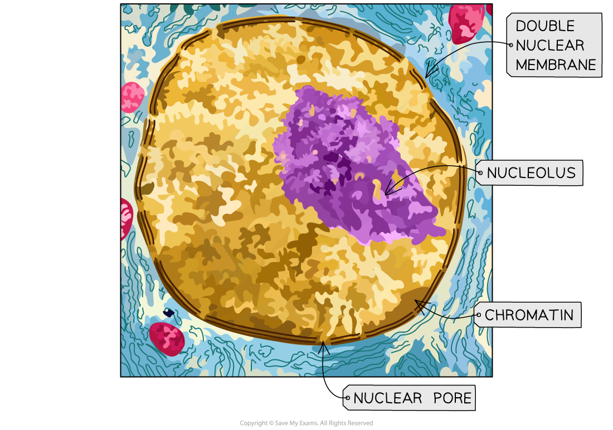
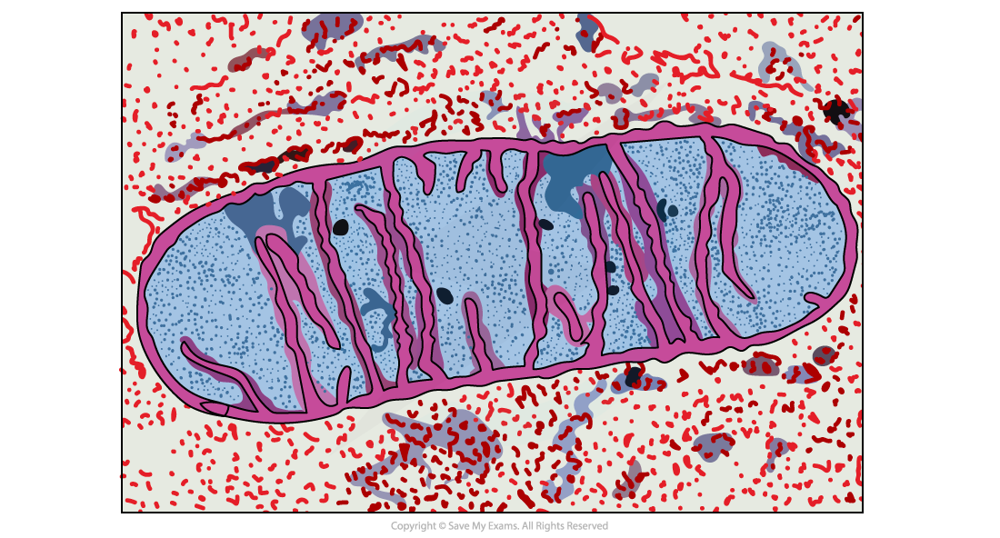
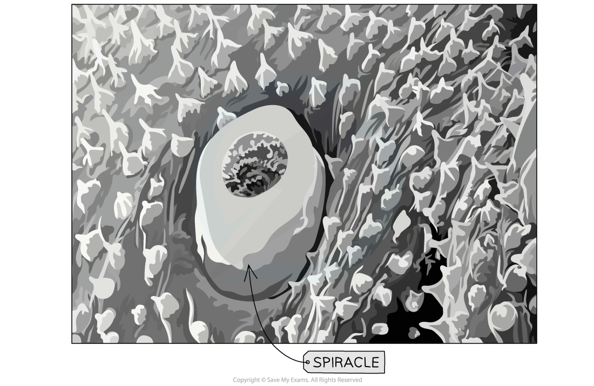
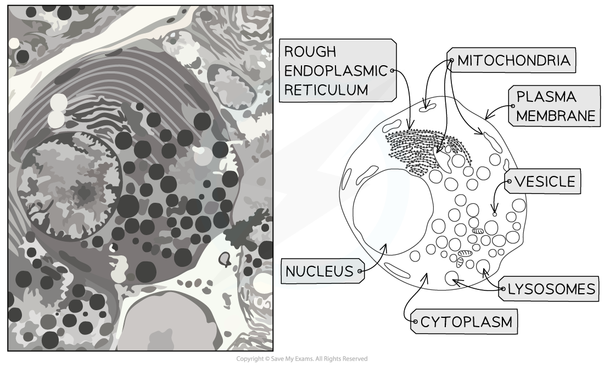

# Electron Microscopy of Animal Cells

## Electron Microscopy of Animal Cells

> **Spec point** — `spcpt_ZTmnQ2cmyYPc7Y2D`

## Electron Microscopy of Animal Cells

#### Organelles under the electron microscope

- There are two types of electron microscope

  - **Transmission** electron microscopes (TEMs)
  - **Scanning** electron microscopes (SEMs)
- **Transmission Electron Microscopes **

  - TEMs use electromagnets to focus a **beam of electrons**
  - This beam of electrons is **transmitted through** a thin specimen
  - Denser parts of the specimen absorb more electrons; these denser parts appear **darker** on the final image, producing **contrast** between different parts of the object being observed
  - The **internal structures** within cells, or even within organelles can be seen as a **2D image**
  - The **resolution** of these images is **very high**
- **Scanning Electron Microscopes**

  - SEMs scan a beam of electrons across a specimen
  - This beam **bounces off the surface of the specimen** and the electrons are detected, forming an image
  - This means SEMs can produce **3D images** that show the **surface** of specimens
  - Since they scan the outside surface it means that the specimen viewed **does not have to be thin**
  - The images they form are of a **lower resolution than TEMs**

***A stained TEM microscope of the nucleus. It is clear this is a TEM micrograph as the image is 2D and in high resolution; the inside of the nucleus would not be clear to view at low resolution.***

***A stained TEM micrograph of a mitochondrion. It is clear this is a TEM micrograph as the image is 2D and in high resolution; the inside of a mitochondrion would not be clear to view at low resolution.***

***A SEM of a spiracle (part of an insect). You can tell this is a SEM micrograph as the image is 3D.***

***Cell organelles can be identified in a micrograph produced using a TEM***

> **Exam Hint**
> You need to be able to recognise organelles from electron microscope images; cells in real life are not always as easy to observe as cells in diagrams, so be sure to get practice at looking at electron micrographs of cells
> 
> Generally, if you can see internal structures the image would have been taken with a TEM and if the image appears 3D then an SEM would have been used.
