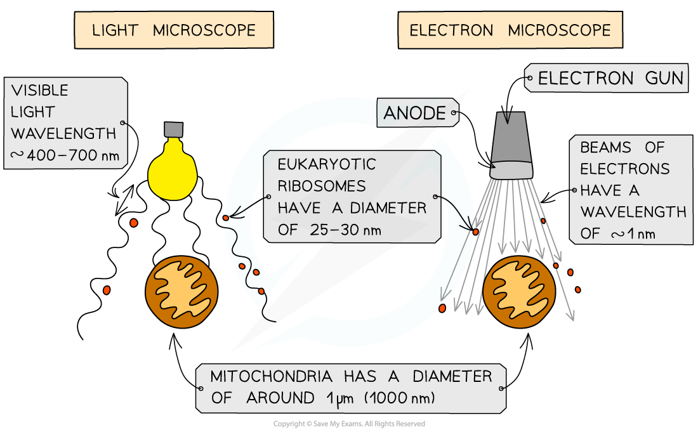
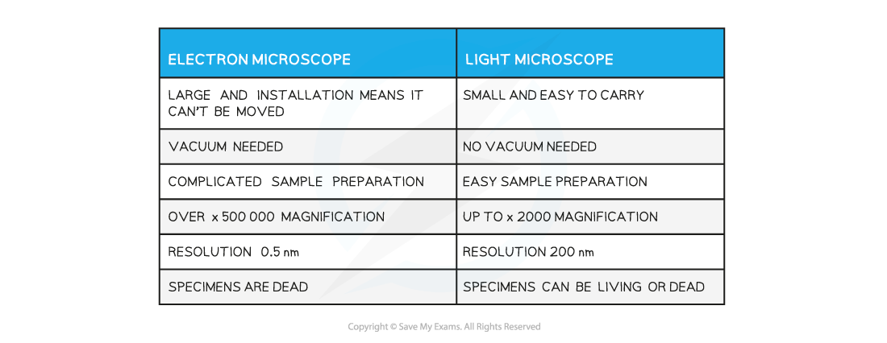
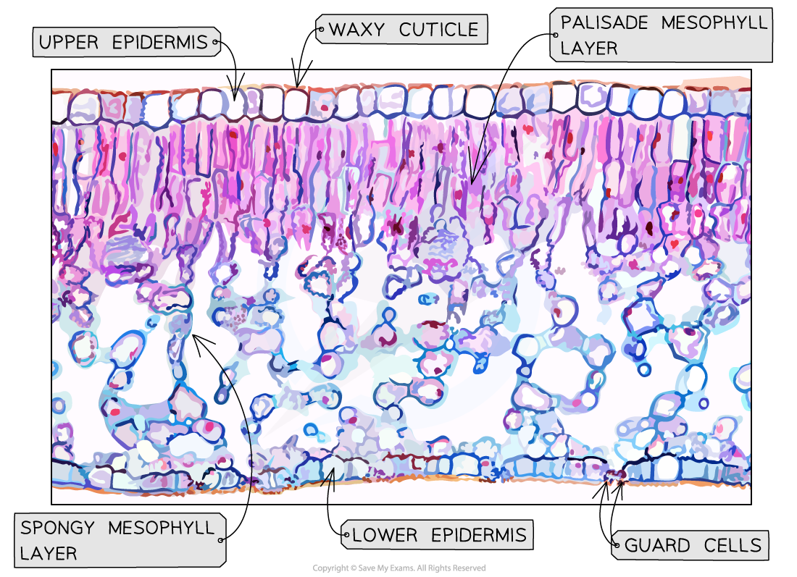

# Microscopy: Magnification & Resolution

## Magnification & Resolution

> **Spec point** — `spcpt_3XSQ4NhmXGcMrdQw`

## Magnification & Resolution

#### Magnification

- Magnification is how many times bigger the image of a specimen observed is in comparison to the actual, real-life size of the specimen
- A **light microscope** has two types of lens

  - An **eyepiece lens** which often has a magnification of x10
  - A series of, usually 3, **objective lenses**, each with a different magnification
- To calculate the **total magnification,** the magnification of the **eyepiece** lens and the **objective** lens are **multiplied** together

**total magnification = eyepiece lens magnification x objective lens magnification**

#### Resolution

- **Resolution**, or **resolving power,** is the ability to distinguish between two separate points

  - If two separate points cannot be resolved, they will be observed as one point and the image will be unclear
- The resolution of a microscope **limits the magnification** that it is capable of; there is no point in magnifying an image at low resolution as this will just result in a big blur rather than a small blur!
- The resolution of a light microscope is **limited by the wavelength of light; **the wavelength of light is too long to allow for high resolution

  - E.g. the phospholipid bilayer structure of the cell membrane cannot be observed under a light microscope
  
    - The width of the phospholipid bilayer is about 10 nm
    - The maximum resolution of a light microscope is 200 nm
    - Any points that are separated by a distance less than 200 nm cannot be resolved by a light microscope and therefore will not be distinguishable as separate points on an image
- **Electron microscopes** have a much higher resolution, and therefore magnification, than a light microscope as electrons have a much smaller wavelength than visible light

***The resolving power of an electron microscope is much greater than that of the light microscope due to the smaller wavelength of electrons***

#### Comparing electron & light microscopes

- **Light microscopes** are used for specimens **larger than 200 nm**

  - Light microscopes shine **light** through the specimen
  - The specimens can be** living, **and therefore can be moving, **or dead**
  - Light microscopes are useful for looking at **whole cells**, small plant and animal **organisms**, and **tissues within organs** such as in leaves or skin
- **Electron microscopes**, both scanning and transmission, are used for specimens **larger than 0.5 nm**

  - Electron microscopes fire a **beam of electrons** at the specimen
  - The electrons are picked up by an electromagnetic lens which then shows the image
  - Electron microscopy requires the specimen to be **dead**; this can provide a **snapshot** in time of what is occurring in a cell, e.g. DNA can be seen replicating and chromosome position within the stages of mitosis are visible
  - Electron microscopes are useful for looking at **organelles, viruses,** and **DNA, **as well as looking at whole cells in more detail

**Light v Electron Microscope Table**

## Staining Specimens

> **Spec point** — `spcpt_D5y2DRt3xdMvvnNX`

## Staining Specimens

- Specimens to be viewed under a microscope sometimes need to be **stained**, as the cytoplasm and other cell structures may be **transparent** or **difficult to distinguish**

  - Note that most of the colours seen in** **images taken using a light microscope are the result of added stains
  
    - Chloroplasts are the exception to this; they show up green, which is their natural colour
- The **type of stain** used is dependent on what type of specimen is being prepared and what the researcher wants to observe within the specimen

  - **Different molecules absorb different dyes** depending on their chemical nature
- Specimens or sections are sometimes stained with **multiple dyes** to ensure that several **different tissues** within the specimen show up; this is known as **differential staining**
- Some common stains include

  - Haemotoxylin
  
    - Stains plant and animal cell nuclei purple, brown or blue
  - Methylene blue
  
    - Stains animal cell nuclei blue
  - Acetocarmine
  
    - Stains chromosomes in dividing nuclei of plant and animal cells
  - Iodine
  
    - Stains starch-containing material in plant cells blue-black
  - Toluidine blue
  
    - Stains tissues that contain DNA and RNA blue
  - Phloroglucinol
  
    - Stains a chemical called lignin found in some plant cells red/pink

***Toluidine blue and phloroglucinol have been used to stain this tissue specimen taken from a leaf***
