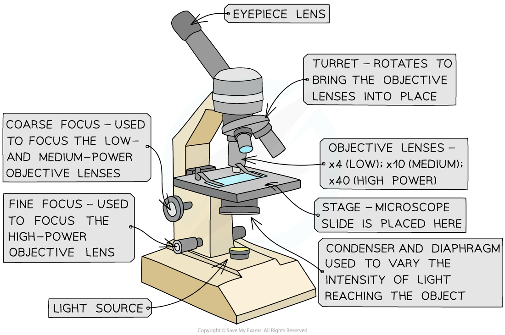
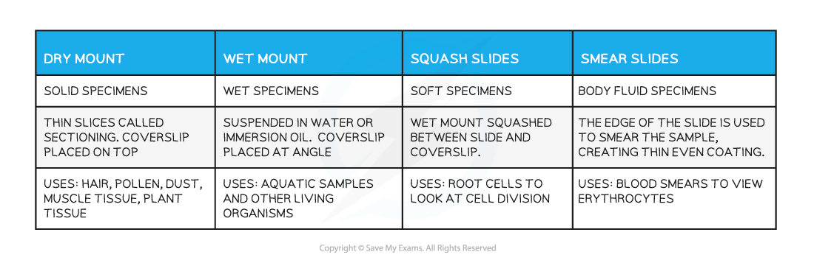
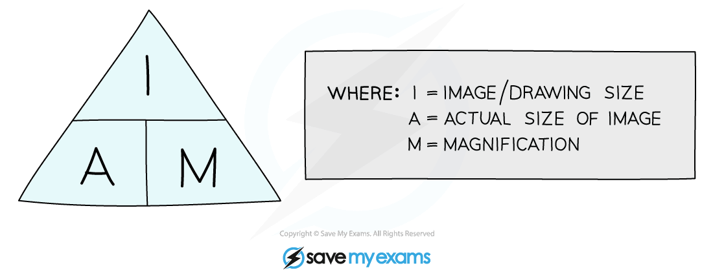
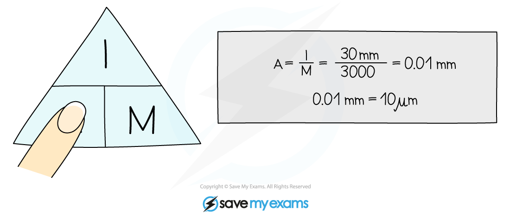
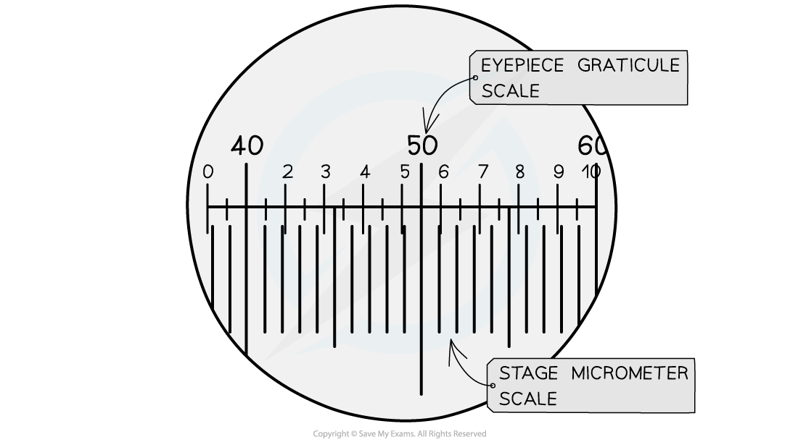

# Core Practical 5: Light Microscopy

## Microscope Images

> **Spec point** — `spcpt_q5sRsCgs8dTg94zb`

## Microscope Images

- Many biological structures are too small to be seen by the naked eye
- **Optical, **or** light, microscopes** are an invaluable tool for scientists as they allow for tissues, cells and organelles to be seen and studied

  - Light is directed through a thin layer of biological material that is supported on a glass slide
  - This light is focused through several lenses so that an image is visible through the eyepiece
  - The magnifying power of the microscope can be increased by rotating the higher power objective lens into place

#### Preparation of microscope slides

- The key components of an optical microscope are

  - The eyepiece lens
  - The objective lenses
  - The stage
  - The light source
  - The coarse and fine focus
- Other tools that may be used

  - Forceps
  - Scissors
  - Scalpel
  - Coverslip
  - Slides
  - Pipette
  - Staining solution

***The components of an optical microscope***

#### Method

- Preparing a slide using a **liquid specimen**

  - Add a few drops of the sample to the slide using a pipette
  - Cover the liquid / smear with a coverslip and gently press down to **remove air bubbles**
  - **Wear gloves** to ensure there is no cross-contamination of foreign cells
- Methods of preparing a microscope slide using a **solid specimen**

  - Take care when using sharp objects and wear gloves to prevent the stain from dying your skin
  - Use scissors or a scalpel to cut a small sample of the tissue
  - Use forceps to peel away or cut a** very thin layer** of cells from the tissue sample to be placed on the slide
  
    - The tissue needs to be thin so that the **light** from the microscope can pass through
  - Apply a stain to make cells more visible
  - Gently place a coverslip on top and press down to remove any air bubbles

- Some tissue samples need to be treated with **chemicals to kill cells or make the tissue rigid**

  - This involves** fixing the specimen** using the preservative formaldehyde, dehydrating it using a series of **ethanol** solutions, impregnating it with **paraffin or resin** for support and then cutting thin slices from the specimen
  - The paraffin is removed from the slices and a **stain** is applied before the specimen is mounted and a coverslip is applied

**Slide Preparation Table**

#### Using a microscope

- When using an optical microscope always **start with the low power objective lens**

  - It is **easier to find** what you are looking for in the field of view
  - This helps to **prevent damage** to the lens or coverslip in case the stage has been raised too high
- **Preventing the dehydration **of tissue

  - The thin layers of material placed on slides can **dry up rapidly**
  - Adding a drop of water to the specimen beneath the coverslip can prevent the cells from being damaged by dehydration
- **Unclear or blurry images**

  - Switch to the lower power objective lens and try using the **coarse focus **to get a clearer image
  - Consider whether the specimen sample is** thin enough** for light to pass through to see the structures clearly
  - There could be **cross-contamination** with foreign cells or bodies

#### Limitations

- The size of cells or structures of tissues may appear inconsistent in different specimen slides

  - Cell structures are 3D and the different tissue samples will have been **cut at different planes **resulting in this inconsistencies when viewed on a 2D slide
- Optical microscopes do not have the same magnification power as other types of microscopes and so there are some structures that cannot be seen
- The treatment of specimens when preparing slides could alter the structure of cells

#### Drawing cells

- To record the observations seen under the microscope, or from photomicrographs taken, a **labelled biological drawing** is often made

  - Biological drawings are **line drawings **that show specific features that have been observed when the specimen was viewed
- There are a number of **rules or conventions** that are followed when making a biological drawing

  - The drawing must have a title
  - The **magnification** under which the observations shown by the drawing are made must be recorded
  - A **sharp pencil** should be used
  - Drawings should be on plain white paper
  - Lines should be **clear**, **single** **lines** with no sketching
  - **No shading**
  - The drawing should take up as much of the space on the page as possible
  - Well-defined structures should be drawn
  - The drawing should be made with **proper proportions**
  - **Label lines **should not cross or have arrowheads and should **connect directly **to the part of the drawing being labelled
  - Label lines should ideally be kept to one side of the drawing in parallel to the top of the page, and should be drawn with a** ruler**
  - Only visible structures should be drawn; not structures that the viewer thinks they should be able to see!
- Drawings of **cells** are typically made when visualizing cells at a **higher magnification power**

***An example of a cellular drawing taken from a high-power image of phloem tissue***

- **Plan drawings** that show the arrangement of cells within a tissue or organ are typically made using samples viewed under **lower magnifications**

  - Individual cells are never drawn in a plan diagram

***An example of a tissue plan diagram drawn from a low-power image of a transverse section of a root. Note that there is no cell detail present.***

## Measurements of Microscopic Images

> **Spec point** — `spcpt_CWJstXXJTMZZPXFQ`

## Measurements of Microscopic Images

- **Magnification** is **how many times bigger** the image of a specimen observed is in comparison to the actual, real-life size of the specimen
- A **light microscope** has two types of lens:

  - An **eyepiece lens,** which often has a magnification of x10
  - A series of (usually 3) **objective lenses**, each with a different magnification
  - To calculate the **total magnification, **the magnification of the **eyepiece** lens and the **objective** lens are **multiplied** together:

**total magnification = eyepiece lens magnification x objective lens magnification**

- The **magnification** (M) of an object can also be calculated if both the size of the **image** (I), and the **actual size **of the specimen (A), is known

**magnification = ** **image size **$\div$** actual size**

- Remember to ensure that the image size (I) and the actual size (A) of the specimen have the **same units** before doing the calculation

***The equation for calculating magnification can be rearranged to calculate either actual size, image size, or magnification.***

> **Worked Example**
> An **image** of an animal cell is 30 mm in diameter and it has been **magnified** by a factor of  x3000.
> 
> What is the **actual** diameter of the cell?

#### Using an eyepiece graticule & stage micrometer

- A **graticule** is a small disc that has an **engraved ruler**
- It can be placed **into the eyepiece **of a microscope to act as a ruler in the field of view, so is sometimes known as an **eyepiece graticule**
- As an eyepiece graticule has no fixed units it must be **calibrated **for the objective lens that is in use

  - The graticule in the eyepiece remains the same size when the magnification of the microscope is altered, so recalibration is needed at each viewing magnification
- Calibration of the eyepiece graticule is done a microscope slide with an engraved scale known as **a stage micrometer**
- By using the** eyepiece graticule and the stage micrometer together,** the size of each graticule unit can be calculated

  - After this is known the graticule can be used as a **ruler **to measure objects in the field of view

***The stage micrometer scale is used to find out how many micrometers each eyepiece graticule unit represents***

> **Worked Example**
> Calculate the size of the units of the eyepiece graticule in the image below.
> 
> Note that the large divisions in the top half of the image show the stage micrometer and that each stage micrometer division is 1 mm across.
> 
> 
> 
> **Answer:**
> 
> **Step 1: Observe the number of eyepiece unit divisions per micrometer unit**
> 
> In the image, the stage micrometer has three lines
> 
> Each micrometer division has 40 eyepiece graticule divisions within it
> 
> **Step 2: Calculate the size of each eyepiece graticule unit**
> 
> 40 graticule divisions = 1 mm (1000 µm)
> 
> 1 graticule unit = 1000 **÷** 40 = 25 µm
> 
> - An object that spanned five eyepiece graticule units could therefore be measured as follows
> 
> 5 x 25 µm = 125 µm

> **Exam Hint**
> The biggest pitfall with these kinds of calculations is forgetting to convert the units so that they match before embarking on a calculation. E.g. if image size is measured in mm but the actual size of an object is given in µm then both need to be converted into µm before using the equation triangle above.
> 
> To convert a measurement from mm into µm the measurement must be multiplied by 1000 (there are 1000 µm in 1 mm).
