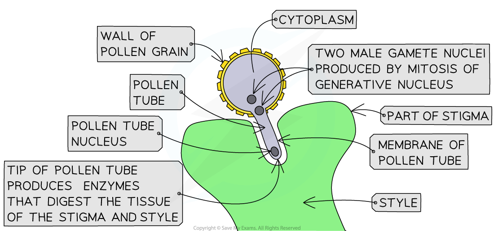
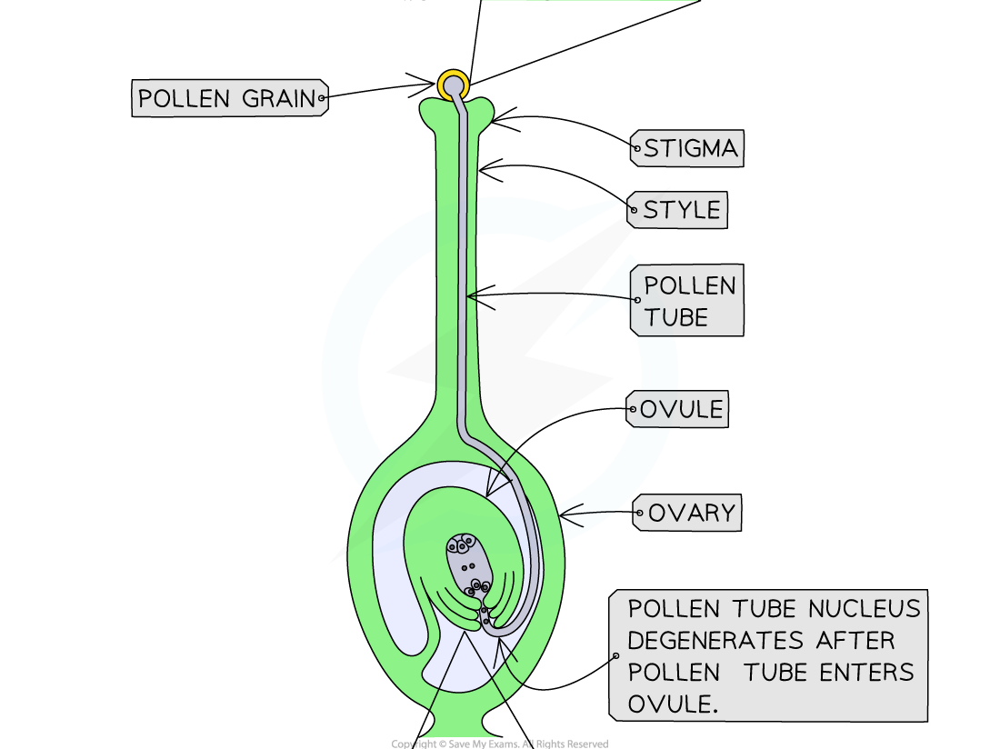
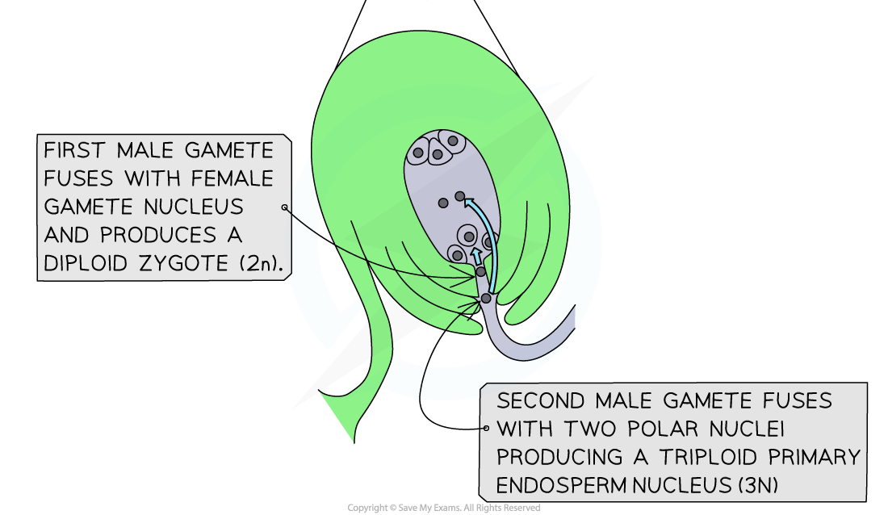

# Fertilisation: Flowering Plants

## Fertilisation in Flowering Plants

> **Spec point** — `spcpt_BRw8tXTZzqxz3jhP`

## Fertilisation in Flowering Plants

- **Sexual** reproduction in flowering plants requires the **transfer of pollen** between male and female parts of flowers
- The development of flowers occurs in the **reproductive stage** of the plant life cycle
- Flowers contain all the necessary organs and tissues required for** sexual reproduction** by **pollination**
- Key structures of the flower include

  - The **anther** - where pollen is produced
  - The **stigma **- part of the female reproductive organ which receives the pollen
  - The **ovary **- where the female gametes are located
- Flowers usually contain both male and female reproductive parts
- The male reproductive parts produce **pollen**
- The **transferal of pollen from the anther to the stigma **is known as **pollination**

#### Double fertilisation

- After pollination has occurred, the pollen grain begins to 'grow' or 'germinate' and a **pollen tube** grows from the **pollen grain** down the **style** to the **ovary** of the plant
- As the pollen tube grows towards the ovary, **two haploid male nuclei** move down the tube

  - These are known as the **pollen tube nucleus** and the **generative nucleus**
- At some point, as it travels down the pollen tube, the generative nucleus **divides by mitosis **to form a further **two haploid male nuclei**

  - These are the **male gametes**
  - The two haploid male nuclei travel down the pollen tube towards the female **ovule**
- As the pollen tube reaches the ovule, the **pollen tube nucleus breaks down **and the **two haploid male nuclei **pass** into the ovule **so that **fertilisation** can occur
- In fact, a process known as** double fertilisation** occurs:

  - One haploid male nucleus fuses with the nucleus of the egg cell to form a **diploid zygote**
  - The other haploid male nucleus fuses with **two polar nuclei** present in the ovule to form a **triploid endosperm nucleus**, which will form the **endosperm **(the food supply for the embryo plant when it begins to germinate)

***The process of double fertilisation in plants, in which one male nucleus fuses with the two polar nuclei to form the triploid endosperm nucleus and the other fuses with the egg cell to form the diploid zygote***

> **Exam Hint**
> Students often get confused between pollination and fertilisation in plants, but they are not the same thing. Think of pollination as the plant’s equivalent to sexual intercourse in mammals – after sexual intercourse, the male sex cells (sperm) have been deposited into the female. But, for fertilisation to occur, the nucleus of a male sperm cell has to fuse with the nucleus of a female sex cell (egg) and the sperm has to travel to find the egg before this happens. It’s exactly the same in plants!
