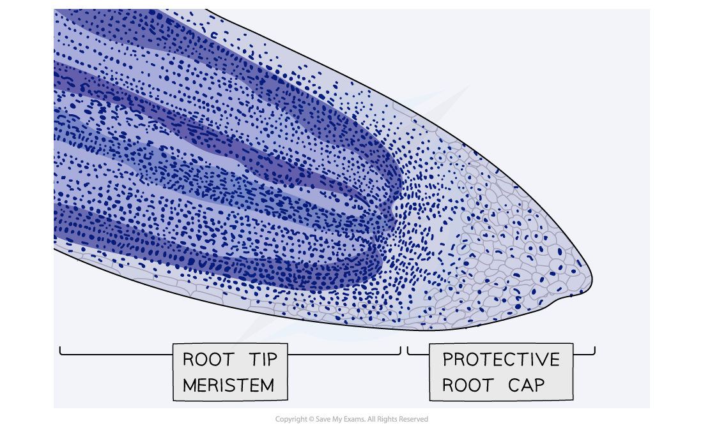
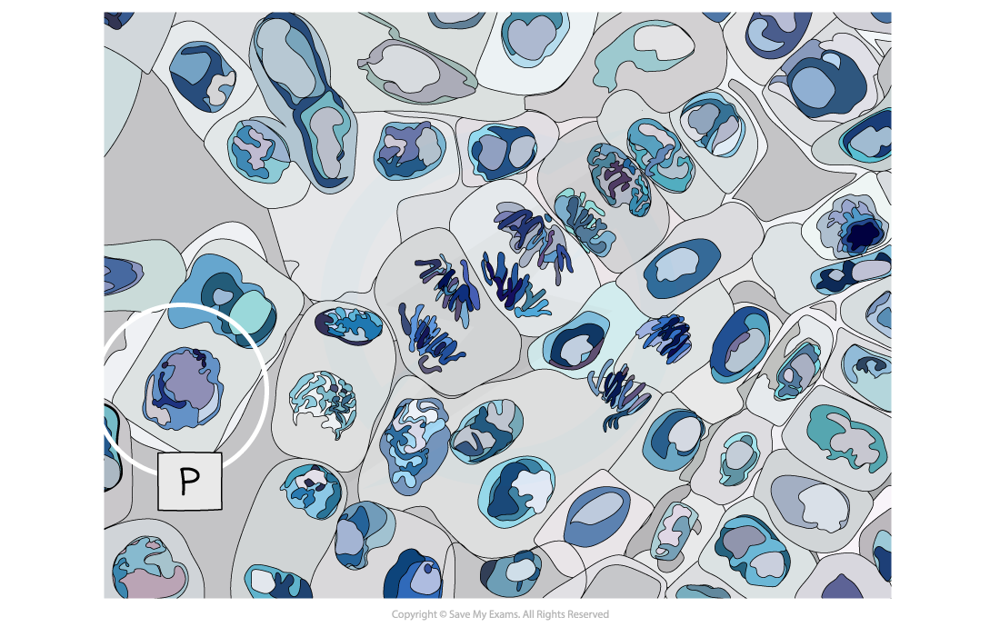
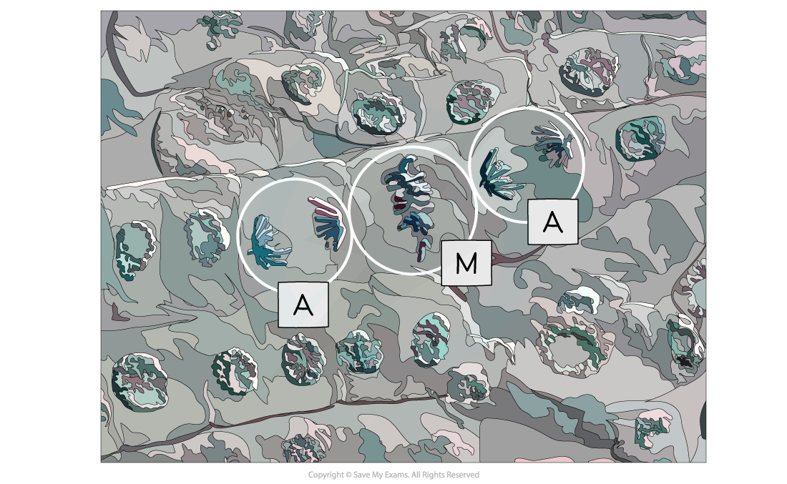

# Core Practical 6: Observing the Stages of Mitosis

## Observing the Stages of Mitosis

> **Spec point** — `spcpt_9dZtjtzvCVV24YJH`

## Observing the Stages of Mitosis

- Growth in plants occurs in specific regions called *meristems*
- The root tip meristem can be used to study **mitosis**
- The root tip meristem can be found **just behind the protective root cap**
- In the root tip meristem, there is a** zone of cell division** that contains cells undergoing **mitosis**
- Pre-prepared slides of root tips can be studied or temporary slides can be prepared using the **squash technique** (root tips are **stained** and then **gently squashed**, spreading the cells out into a thin sheet and allowing individual cells undergoing mitosis to be clearly seen)

***A micrograph of a stained root tip, nuclei are clearly visible***

#### Apparatus

- Roots of onion or garlic
- Microscope slide
- Cover slip
- 1 M hydrochloric acid
- Stain (acetic orcein, toluidine blue for example)
- Paper towel
- Scalpel blade
- Cutting tile
- Water bath at 60oC
- Boiling tube
- Optical microscope

#### Method

1. **Garlic** or **onion** (*Allium cepa*) root tips are most commonly used (the bulbs can be encouraged to grow roots by suspending them over water for a week or two)
2. Prepare a boiling tube of 1M hydrochloric acid and place in a water bath at 60oC for 10 minutes
3. Remove the **tips** of the roots (about 1cm) and place in the **warmed hydrochloric acid **for 5 minutes
4. Rinse the tips well in cold water using a pipette and blot dry with a paper towel
5. Cut approximately 2mm off the tip and place onto a microscope slide
6. Add a drop of a suitable **stain** (eg. warm, acetic orcein, which stains chromosomes a deep purple)
7. The stained root tip is **gently squashed** on a **glass slide** using a blunt instrument (eg. the handle of a mounting needle or a cover slip using your fist to gently apply pressure in a rolling motion)
8. View the slide under the microscope
9. Cells undergoing mitosis (similar to those in the images below) can be seen and drawn
10. Annotations can then be added to these drawings to show the **different stages of mitosis**

#### Results

- You should be able to observe cells in different stages of mitosis from the stained meristem

***Micrograph of cells from a meristem showing cells in prophase (P)***

***Micrograph of cells undergoing metaphase (M) and anaphase (A)***
