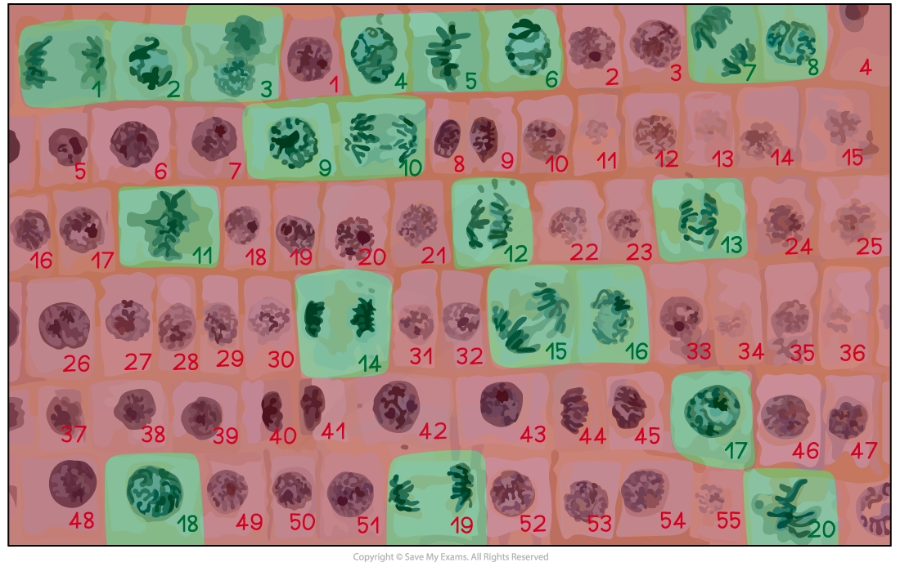

# Calculation of Mitotic Index

## Calculation of Mitotic Index

> **Spec point** — `spcpt_xVgVBFBxskvWtPK5`

## Calculation of Mitotic Index

#### How to calculate mitotic index

- The mitotic index is the **proportion** of cells (in a group of cells or a sample of tissue) that are **undergoing mitosis**
- The mitotic index can be calculated using the formula below:

#### Mitotic index formula

*mitotic index = number of cells with visible chromosomes ÷ total number of cells*

- You can multiply the answer by **100** if you need to give the mitotic index as a **percentage**

> **Worked Example**
> A student who wanted to observe mitosis prepared a sample of cells. They counted a **total of 42** cells in their sample, **32 of which had visible chromosomes**. Calculate the mitotic index for this sample of cells (give your answer to 2 decimal places).
> 
> **Answer:**
> 
> Mitotic index = number of cells with visible chromosomes ÷ total number of cells
> 
> - Mitotic index = 32 ÷ 42
> - Mitotic index = <u>**0.76**</u>

> **Worked Example**
> The table below shows the number of cells in different stages of mitosis in a sample from a garlic root tip. Calculate the mitotic index for this tissue (give your answer to 2 decimal places).
> 
> 

- Mitotic index = number of cells with visible chromosomes ÷ total number of cells

  - Mitotic index = (prophase + metaphase + anaphase + telophase) ÷ total number of cells
  - Mitotic index = (14 + 5 + 3 + 6) ÷ (36 + 14 + 5 + 3 + 6)
  - Mitotic index = 28 ÷ 64
  - Mitotic index = <u>**0.44**</u>

> **Worked Example**
> The micrograph below shows a sample of cells from an onion root tip. Calculate the mitotic index for this tissue (give your answer to 2 decimal places).
> 
> 

***The cells undergoing mitosis have been identified in green***

- Number of cells with visible chromosomes (green) = 20

  - Total number of cells (green + red) = 20 + 55 = 75
  - Mitotic index = number of cells with visible chromosomes ÷ total number of cells
  - Mitotic index = 20 ÷ 75
  - Mitotic index = <u>**0.27**</u>
