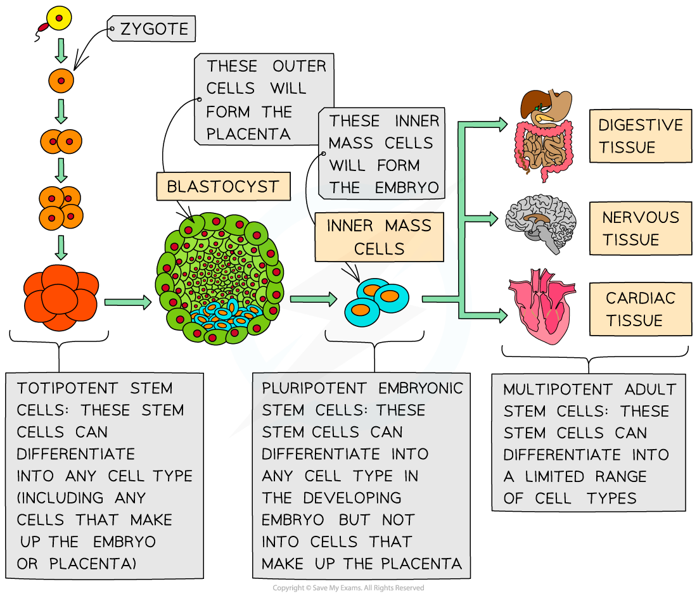
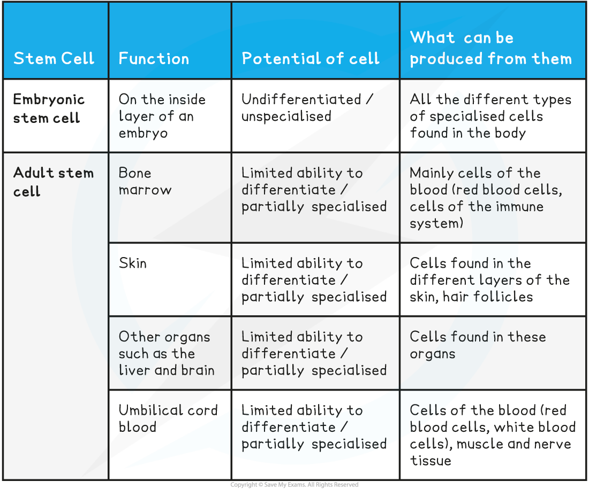
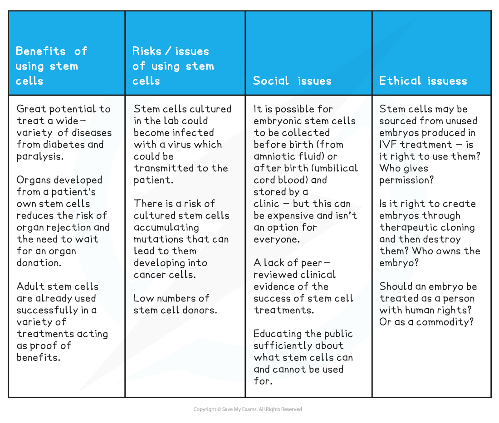

# Stem Cells & Cell Potency

## Stem Cells

> **Spec point** — `spcpt_5F7PpkfsJQzT9J2t`

## Stem Cells

- A **stem cell** is a cell that can divide (by mitosis) an unlimited number of times
- Each new cell (produced when a stem cell divides) has the potential to remain a stem cell or to develop into a **specialised cell** such as a blood cell or a muscle cell (by a process known as **differentiation**)
- This ability of stem cells to differentiate into more specialised cell types is known as **potency**
- There are three main types of potency:

  - **Totipotency** – totipotent stem cells are **embryonic** stem cells that can differentiate into **any cell type found in an embryo**, as well as **extra-embryonic cells **(the cells that make up the **placenta** and **umbilical cord**)
  - **Pluripotency** – pluripotent stem cells are **embryonic** stem cells that can differentiate into any cell type found in an embryo but are **not able** to differentiate into cells forming the placenta and umbilical cord
  - **Multipotency** – multipotent stem cells are **adult** stem cells that have lost some of the potency associated with embryonic stem cells and are **no longer pluripotent**

#### Totipotent cells

- Totipotent cells can divide and produce **any type of body cell**
- Totipotent cells exist for a** limited time **in early mammalian embryos
- The **zygote** formed when a sperm cell fertilises an egg cell is **totipotent**
- The **embryonic cells up to the 16-cell stage** of human embryo development (around the **fourth day after fertilisation**) are also **totipotent**

  - These cells are still in the form of a solid ball of cells known as a **morula**
- Initially, the totipotent cells in the embryo are **unspecialised**
- During development, totipotent cells begin to translate only part of their DNA, which results in cell specialisation
- There are no totipotent cells present in the later stages of development as cells lose their ability to differentiate into any cell type

#### Pluripotent cells

- By around the** fifth day** **after fertilization**, the embryonic cells have divided further and formed a structure known as a **blastocyst**, which has an **outer layer of cells** and an **inner mass of cells** (that are located inside the outer layer)
- The **outer layer **of cells will later form the **placenta**
- The inner mass cells are **no longer totipotent **(they have lost some of their ability to differentiate)

  - They can still differentiate into any cell type found in an embryo but are **not able** to differentiate into cells forming the placenta and umbilical cord
  - These cells are known as **pluripotent embryonic stem cells**

#### Multipotent cells

- Stem cells are also found in **some adult tissues** but they are **much less potent **than embryonic stem cells (i.e. they can only specialise into **certain types of cells**)

  - For example, intestinal stem cells specialise into intestinal epithelial cells to replace those that are constantly being lost
- This form of potency is known as **multipotency** – multipotent stem cells are adult stem cells that have lost some of the potency associated with embryonic stem cells and are **no longer pluripotent**
- Plants also contain stem cell in areas of growth, such as their shoots and roots

***Stem cells can be totipotent, pluripotent or multipotent***

## Use of Stem Cells in Medicine

> **Spec point** — `spcpt_hq8YcJzZsSZVzqMr`

## Use of Stem Cells in Medicine

- As stem cells have the ability to **differentiate** into other **specialised cell types**, they are very **valuable** in **medical research and treatments** as they have the potential to **replace damaged tissues and cells** (that result from certain diseases)

  - For example, many stem cell therapies already exist, including the treatment for **leukaemia** (bone marrow cancer), in which the existing stem cells in the bone marrow are killed, before being replaced using a **bone marrow stem cell transplant**, which will eventually replace all the bone marrow cells
  - Other stem cell therapies are being researched, including therapies that replace **damaged nerve tissue** to treat **spinal cord injuries** and therapies that replace **damaged heart tissue **to treat **heart disease** and tissue damage caused by **heart attacks**
- There are two sources of human stem cells for use in medicine and research:

  - **Embryonic** stem cells
  - **Adult** stem cells

#### Use of embryonic stem cells

- Due to their ability to differentiate into almost **any cell type**, embryonic stem cells have** huge potential** in the **therapeutic treatment** of many diseases
- For many countries, such as the USA and some countries within the EU, the use of embryonic stem cells is **banned**, even for research
- In other countries, such as the UK, the use of embryonic stem cells is allowed for research but is **very** **tightly regulated**
- Embryonic stem cells can be one of two potencies:

  - **Totipotent** if taken in the first 3-4 days after fertilisation
  - **Pluripotent** if taken on day 5
- The embryos used for research are often the waste (fertilised) embryos from ***in vitro ***fertilisation (IVF) treatment

  - This means these embryos have the **potential to develop into human beings**
  - This is why many people have **ethical objections** to using them in research or medicine

#### Use of adult stem cells

- Adult stem cells can divide (by mitosis) an unlimited number of times but they are only able to produce a **limited range of cell types**
- A small number of adult stem cells are found in certain tissues within the body such as:

  - **Bone marrow** - used to produce different types of **blood cell**
  - **Brain** - used to produce different types of **neural and glial cells**
- These small numbers of stem cells remain to produce new cells for the essential processes of growth, cell replacement and tissue repair
- Research is being carried out on stem cell therapy, which is the introduction of adult stem cells into damaged tissue to treat diseases (e.g. leukaemia) and injuries (e.g. skin burns)
- The use of adult stem cells is **less controversial** than embryonic stem cells because the donor is able to **give permission**

  - For example, many people donate bone marrow to help treat leukaemia patients
- However, if adult stem cells are being donated from one person to another they need to be a **close match **in terms of **blood type** and other body **antigens**

  - Otherwise, there is a chance that the cells used are **rejected** by the patient's **immune system** (the cells in the stem cell transplant are recognised as being **foreign** and are **attacked** by the patient's immune system)
  - Ideally, the patient's **own** adult stem cells are used to treat them, as there is a **much lower chance of rejection**

**Sources of Human Stem Cells Table**

#### Evaluating the use of stem cells in medicine

- The use of stem cells that are collected from embryos created via IVF is **ethically questionable** as this results in a **viable embryo** (an embryo that could become a foetus if implanted in a uterus) being **destroyed**
- Although their use raises fewer ethical questions, the disadvantage of only using adult stem cells is that, unlike embryonic stem cells, they are unable to differentiate into all of the specialised cell types (some of which may be required to treat certain diseases)
- This means that **society** has to use all the **available scientific knowledge** to make decisions about the use of stem cells (especially embryonic stem cells) in medical therapies, considering all the **arguments** **for** and **against** their use
- **Official regulatory authorities** are required to help society make these decisions. They do this by comparing the **benefits** and **ethical issues **of stem cell research and making decisions on the extent to which stem cells can be used. These regulatory authorities carry out the following tasks:

  - **Reviewing proposals for scientific research **that uses stem cells and deciding if this research should be allowed to go ahead
  - **Licensing and monitoring of research centres** that are involved in stem cell research
  - **Providing guidelines and codes of practice** for stem cell researchers to ensure they are working to the same high standards
  - **Monitoring developments in scientific research** into stem cell therapies
  - **Providing governments and other professional bodies with correct, up-to-date advice and information **on stem cell research, which in turn helps society to understand how stem cells are being used and why this work is important

**Evaluating the Use of Stem Cells Table**

