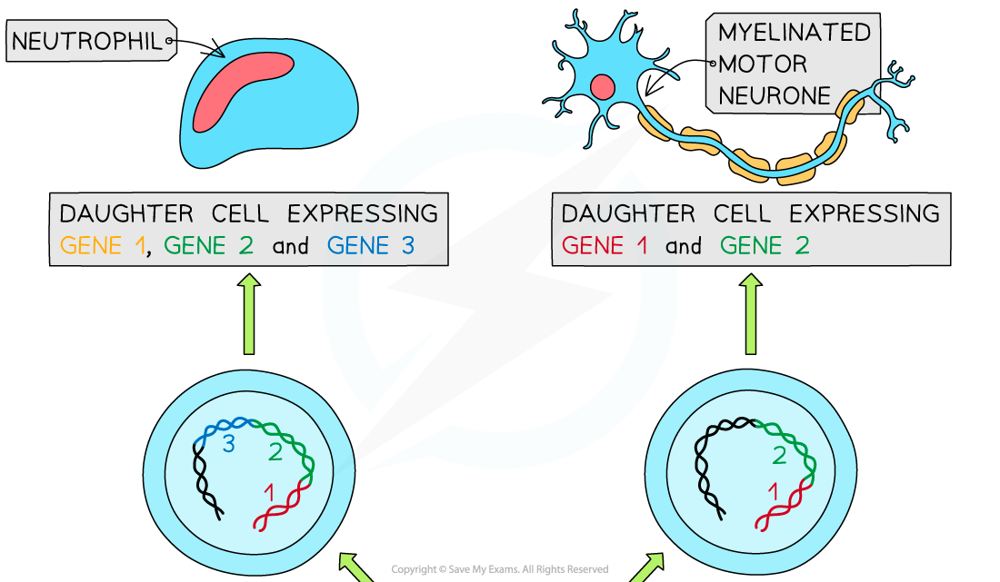
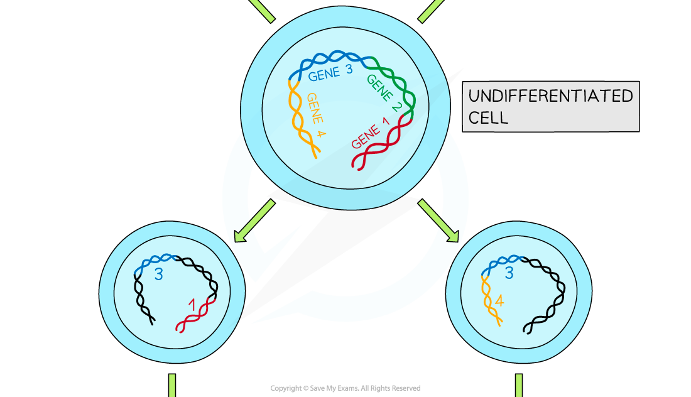
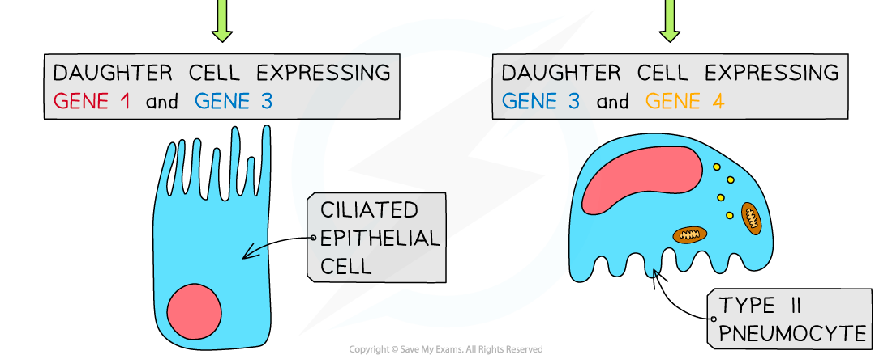
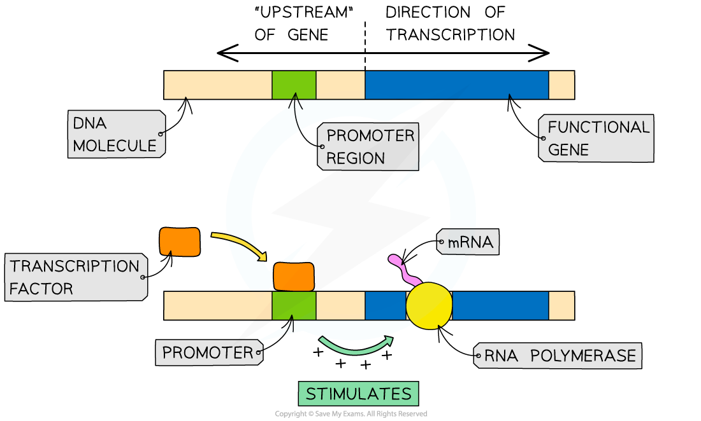

# Cell Specialisation

## Differential Gene Expression

> **Spec point** — `spcpt_JtGZJNMwZxjDN5q3`

## Differential Gene Expression

- **Stem cells** become **specialised** through **differential gene expression**

  - This means that only certain genes in the DNA of the stem cell are **activated** and get **expressed**
- Every nucleus within the stem cells of a multicellular organism contains the **same genes**, that is, all stem cells within an organism have an** identical genome**
- Despite the stem cells having the same genome, they are able to specialise into a diverse range of cell types because during **differentiation** certain genes are expressed (**'switched' on**)
- Controlling gene expression is the key to development as stem cells differentiate due to the different genes being expressed
- This differentiation occurs via the following basic steps:

  - Under certain conditions, some genes in a stem cell are **activated**, whilst others are **inactivated**
  - **mRNA** is **transcribed** from **active genes** only
  - This mRNA is then **translated** to form **proteins**
  - These proteins are responsible for **modifying the cell** (e.g. they help to determine the **structure** of the cell and the **processes** that occur within the cell)
  - As these proteins continue to modify the cell, the cell becomes **increasingly** **specialised**
  - The process of specialisation is **irreversible** (once differentiation has occurred, the cell remains in its specialised form)

***Differential gene expression results in the differentiation of stem cells***

#### Transcription factors control the expression of genes

- Eukaryotes use** transcription factors** to control gene expression
- A transcription factor is a **protein** that controls the transcription of genes by **binding to a specific region of DNA**
- They ensure that genes are being expressed in the correct cells, at the correct time and to the right level
- It is estimated that ~10% of human genes code for transcription factors

  - There are several types of transcription factors that have varying effects on gene expression
  - This is still a relatively young area of research and scientists are working hard to understand how all the different transcription factors function
  - Transcription factors allow organisms to respond to their environment
  - Some hormones achieve their effect via transcription factors
- Transcription factors that **increase** the rate of transcription are known as **activators**

  - Activators work by **helping RNA polymerase to bind** to the DNA at the start of a gene and to begin transcription of that gene
- Transcription factors that **decrease** the rate of transcription are known as **repressors**

  - Repressors work by **stopping RNA polymerase from binding **to the DNA at the start of a gene, inhibiting transcription of that gene
- Some transcription factors bind to the **promoter region** of a gene

  - This binding can either allow or prevent the transcription of the gene from taking place
  - Transcription factors interact with RNA polymerase, either by assisting RNA polymerase binding to the gene (to stimulate expression of the gene) or by preventing it from binding (to inhibit gene expression)
  - Therefore, the presence of a transcription factor will either **increase** or **decrease** the rate of transcription of a gene

***In the example above, the transcription factor is an activator as it stimulates the transcription of the gene. Transcription factors, known as repressors, can also inhibit the transcription of genes***
