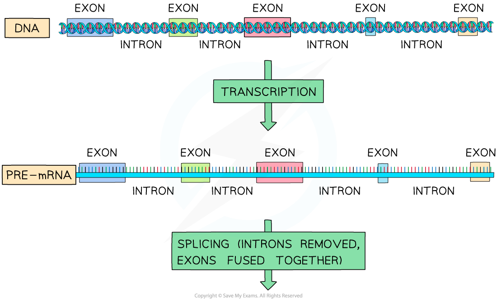
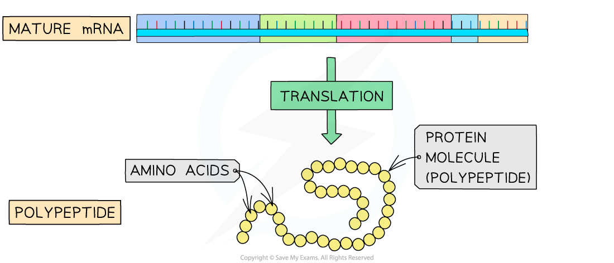
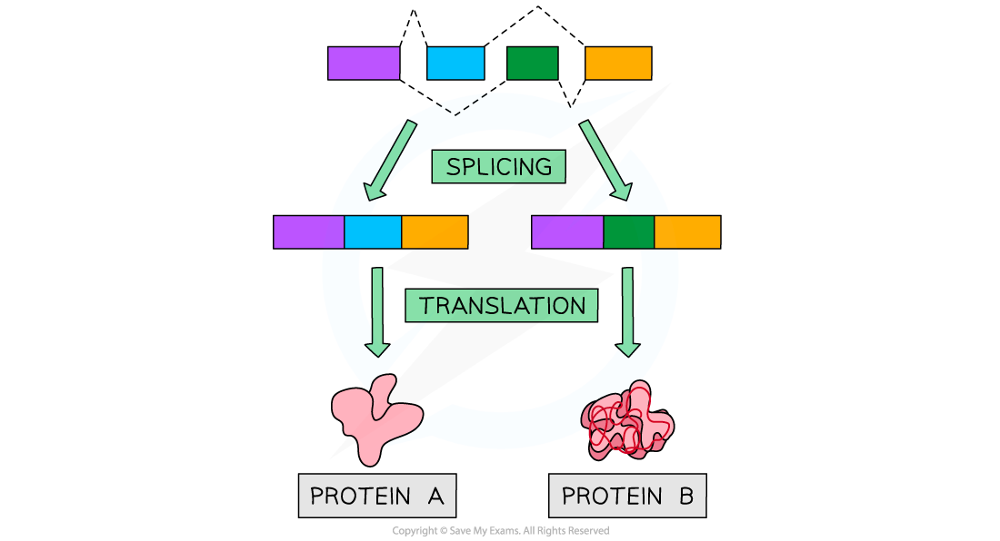

# Post-Transcriptional Changes to mRNA

## One Gene Can Code for More Than One Protein

> **Spec point** — `spcpt_R8KyKyjcNXjCfw2Q`

## One Gene Can Code for More Than One Protein

- **Gene expression **can be** regulated** after an mRNA transcript has been produced
- In eukaryotes, transcription and translation occur in **separate parts of the cell**, allowing for significant **post-transcriptional modification** to occur
- Post-transcriptional modification mechanisms include

  - **Splicing**
  - **Alternative splicing**

#### Splicing

- Polypeptides are made during the process of protein synthesis, during which the DNA base code is *transcribed* and *translated*
- The DNA code within eukaryotic cells contains many **non-coding sections**
- Non-coding DNA can be found within genes; these sections are called **introns**, whilst** **sections of coding DNA are called **exons**
- During transcription, eukaryotic cells transcribe both introns and exons to produce** pre-mRNA **molecules
- Before the pre-mRNA exits the nucleus, a process called **splicing** occurs

  - The **non-coding intron sections **are **removed**
  - The **coding exon sections **are **joined together**
  - The resulting mRNA molecule contains **only the coding sequences** of the gene
- Since these modifications are made after transcription occurred, they are called **post-transcriptional modifications**

***Pre-mRNA is spliced before it exits the nucleus***

#### Alternative splicing

- The exons (coding regions) of genes can be spliced in many different ways to produce **different mature mRNA molecules** through alternative splicing
- A particular exon may or may not be incorporated into the final mature mRNA
- Polypeptides translated from alternatively spliced mRNAs may **differ in their amino acid sequence**, structure and function
- This means that a **single eukaryotic gene can code for multiple proteins**
- This is part of the reason why the **proteome is much bigger than the genome**

***Alternative splicing of a gene can produce more than one type of protein***

> **Exam Hint**
> It is important you learn the terms pre-mRNA and mRNA, their location and whether they include introns as well as exons. A handy way to distinguish between introns and exons is to remember that **EX**ons are **EX**pressed.
