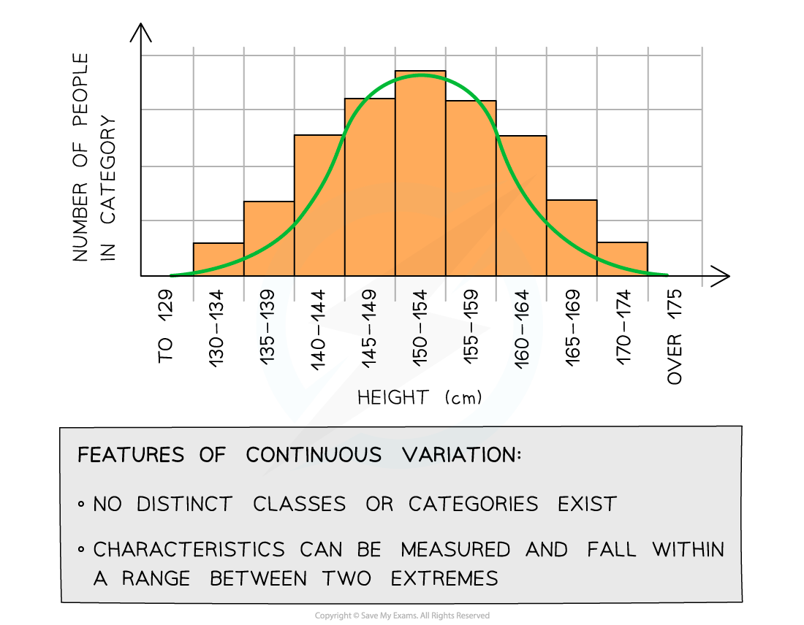

# Polygenic Inheritance & Continuous Variation

## Polygenic Inheritance

> **Spec point** — `spcpt_XTpCVFM5rzXVxcgf`

## Polygenic Inheritance

- Genes can have varying effects on an organism's phenotype:

  - Some characteristics (i.e. the phenotype) are controlled by a **single gene** - these characteristics are known as **monogenic**
  
    - These characteristics usually show** discontinuous variation** (e.g. blood group)
    - Inheritance of these characteristics is known as **monogenic inheritance**
  - Other characteristics are controlled by **several genes** - these characteristics are known as **polygenic**
  
    - These characteristics usually show **continuous variation **(e.g. height, mass, skin colour)
    - Inheritance of these characteristics is known as **polygenic inheritance**

## Continuous Variation

> **Spec point** — `spcpt_CwgwD96bhkfK7Rbt`

## Continuous Variation

- Some phenotypes of individuals within a population show **continuous variation**
- The phenotypes** do not fall into discrete categories** (unlike in discontinuous variation)
- Instead, for these features, **a range of values exists between two extremes**, within which the phenotype will fall

  - For example, the mass or height of a human is an example of continuous variation
- The **lack of categories** and the presence of a **range** of values can be used to identify continuous variation when it is presented in a table or graph

***Graph showing population variation in height: an example of continuous variation with quantitative differences***

#### Causes of continuous variation

- Some phenotypes are affected by **multiple different genes** or by **multiple alleles** for the same gene at **many different loci **(polygenic inheritance) as well as the environment

  - Phenotype = genotype + environment
- This often gives rise to phenotypes that show **continuous variation**
- At the genetic level:

  - **Different alleles **at a single locus have a** small effect **on the phenotype
  - **Different genes** can have the same effect on the phenotype and these add together to have an **additive effect**
  - If a large number of genes have a **combined effect **on the phenotype they are known as **polygenes**

#### The additive effect of genes

- The height of a plant is controlled by two unlinked genes **H / h** and **T / t**
- The two genes have an **additive effect**
- The recessive alleles h and t contribute ***x*** **cm** to the height of the plant
- The dominant alleles H and T contribute **2*****x*** **cm** to the height of the plant
- The following genotypes will have the following phenotypes:

  - **h h t t **:  *x *+ *x* + *x* + *x* = **4*****x***** cm**
  - **H H T T** : 2*x *+ 2*x* + 2*x* +** **2*x* = **8*****x***** cm**
  - **H h T t **: 2*x* + *x* + 2*x* + *x* = **6*****x***** cm**
  - **H H T t** : 2*x* + 2*x* + 2*x* + *x* =** 7*****x***** cm**
  - **H h T T** : 2*x* + *x* + 2*x* + 2*x* = **7*****x***** cm**
  - **h h T t** : *x* + *x* + 2*x* + *x* = **5*****x***** cm**
  - **H h t t** : 2*x* + *x* + *x* + *x* = **5*****x***** cm**

> **Exam Hint**
> Be careful when answering questions that involve polygenes or genes with an additive effect. It is not a given that each gene will have the same effect on the phenotype as in the example above so make sure to double check the information you have been given in the question.
