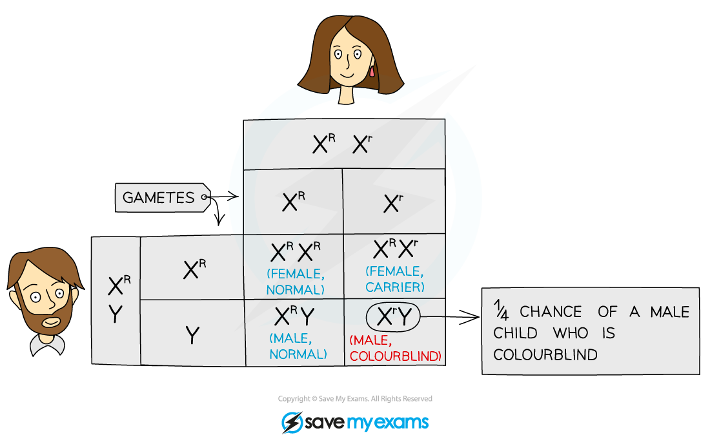
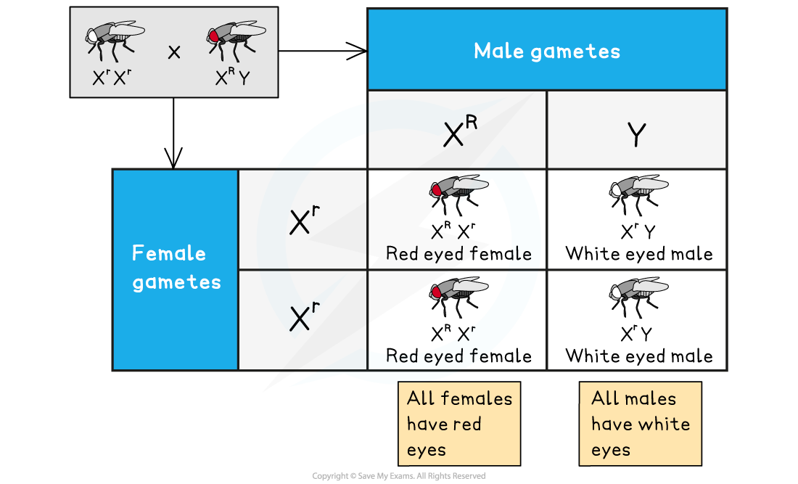

# Gene Locus

## Gene Loci

> **Spec point** — `spcpt_6gsKtggXzzHKZ77t`

## Gene Loci

- Every **chromosome** consists of a long DNA molecule that contains several hundred or even thousands of **different genes **coding for different proteins

  - A length of DNA that codes for a single polypeptide or protein is called a gene
- The position of a gene on a chromosome is known as its **locus** (plural: loci)

  - Through experiments and genetic mapping techniques, scientists have been able to work out the **specific physical locations** of the genes on different chromosomes
  - Each gene occupies a **specific locus** so that the gene for a particular characteristic is always found at the **same position** on a particular chromosome
- Each gene can exist in two or more different forms called **alleles**
- Different alleles of a gene have slightly different nucleotide sequences but they still occupy the **same position** (locus) on the chromosome

***Five different genes found at five different loci***

## Gene Linkage

> **Spec point** — `spcpt_R225mKmKFnwhbjwp`

## Gene Linkage

- Gene loci are said to be **linked** if they are on the **same chromosome**

  - **Loci** (singular: locus) refers to the **specific linear positions** on the chromosome that genes occupy
- Linked genes located on human chromosomes **1 to 22** (i.e. any chromosome that is **not a sex chromosome**, known as **autosomes**) are said to be examples of **autosomal linkage**
- If genes are located on the same **sex chromosome**, they are said to be **sex-linked**

#### Autosomal linkage

- As its name implies, autosomal linkage only occurs on the autosomes (any chromosome that isn’t a sex chromosome)
- Two or more genes on the same autosome **do not assort independently during meiosis**
- Instead, these genes are **linked** and they **stay together** in the **original parental combination**
- These linked genes are passed on to offspring **all together** (through the gametes)

#### Sex linkage

- There are two sex chromosomes: **X** and **Y**
- Females have two copies of the X chromosome (XX), whereas males have one X chromosome and one shorter Y chromosome (XY)
- Some genes are only present on **one sex chromosome** and **not the other**
- As the inheritance of these genes is dependent on the sex of the individual they are known as sex-linked genes

  - Most often sex-linked genes are found on the **longer X chromosome**
- If the gene is on the X chromosome, **males** (XY) will only have **one copy of the gene**, whereas **females** (XX) will have **two**

  - Because males only have one X chromosome, they are much more likely to show **sex-linked recessive conditions** (such as red-green colour blindness and haemophilia)
  - Females, having two copies of the X chromosome, are likely to inherit **one dominant allele** that **masks** **the** **effect** of the** recessive allele**
  - A female with one recessive allele masked in this way is known as a **carrier**; she doesn’t have the disease, but she has a 50% chance of passing it on to her offspring
  - If that offspring is a male, he will have the disease
- The presence of sex linkage can be **identified** using **pedigree diagrams **and **Punnett squares**

  - When a gene is sex-linked the **phenotypes** are **not spread evenly across the sexes**
  - In the case of a gene that causes a sex-linked disease, one sex will be **disproportionately affected**
  - The results of a cross between a normal male and a female who is a carrier for colour blindness are shown below. In this cross, there is a 25% chance of producing a male who is colourblind, a 25% chance of producing a female carrier, a 25% chance of producing a normal female and a 25% chance of producing a normal male

***Punnett square showing the inheritance of colourblindness, an X-linked condition***

- Working in the USA in the early 20th century, a scientist called Thomas Hunt Morgan bred fruit flies (*Drosophila melanogaster*) over successive generations
- In his cross-breeding experiments, he came across red-eyed wild types and white-eyed mutants
- He realised there was a **distinct sex bias in the phenotypic distribution** of the **offspring**:

  - All-female offspring of a red-eyed male were red-eyed while all male offspring of a white-eyed female were also white-eyed
- Morgan hypothesised that this occurred because the** gene for eye colour **was located on a **sex chromosome** (i.e. it was **X-linked**)

***Sex linkage in Drosophila. A cross between a homozygous white-eyed female and a male with red eyes gives all white-eyed males and red-eyed female offspring***
