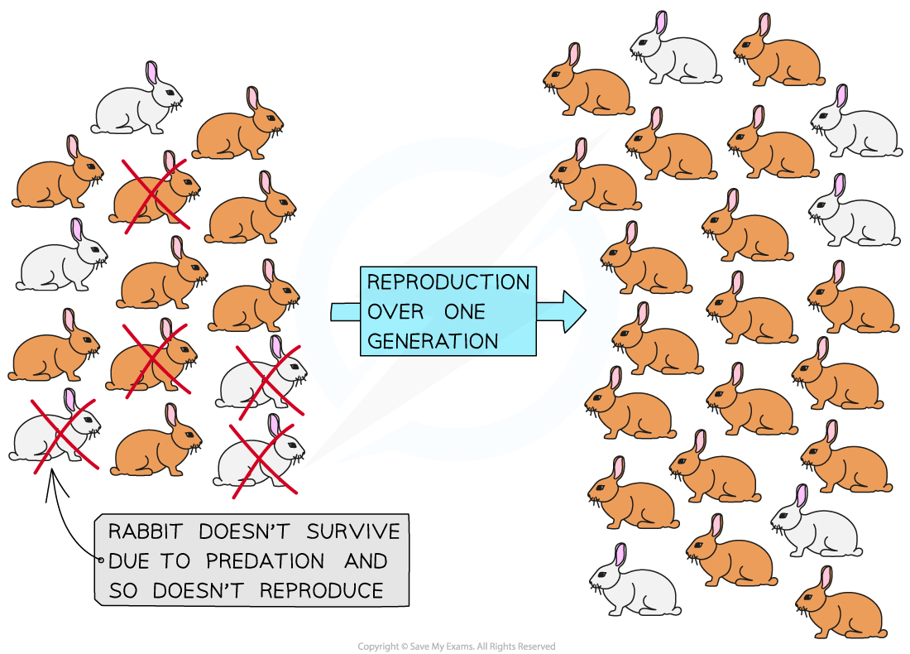
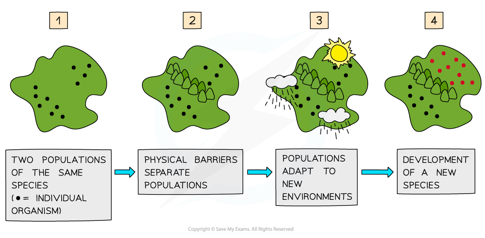
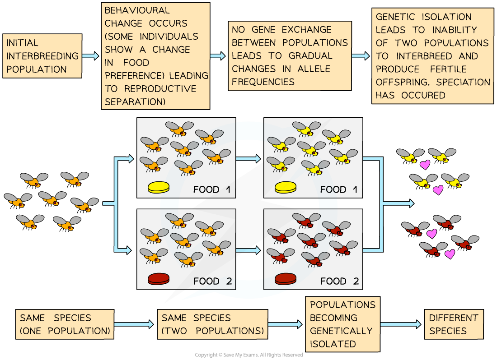
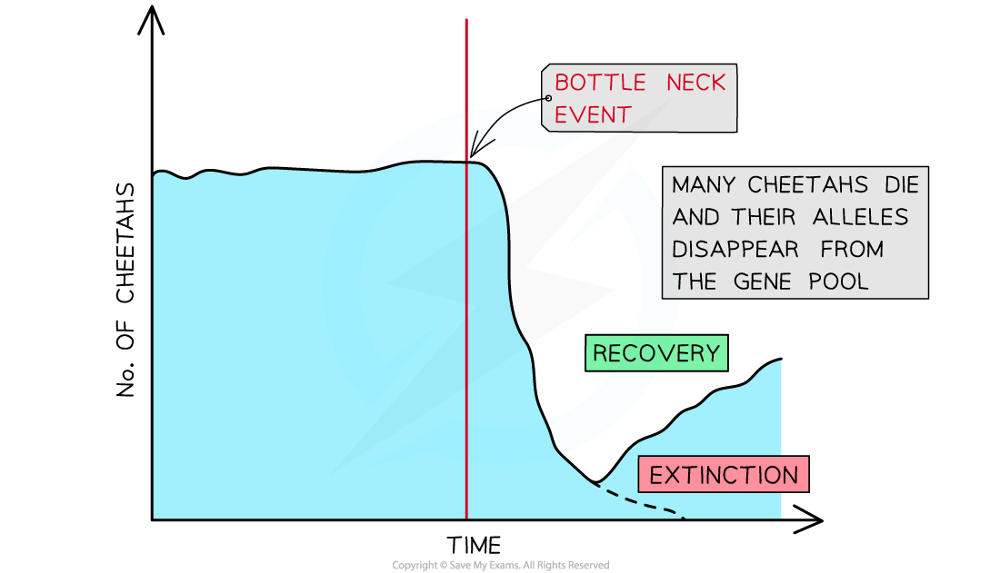
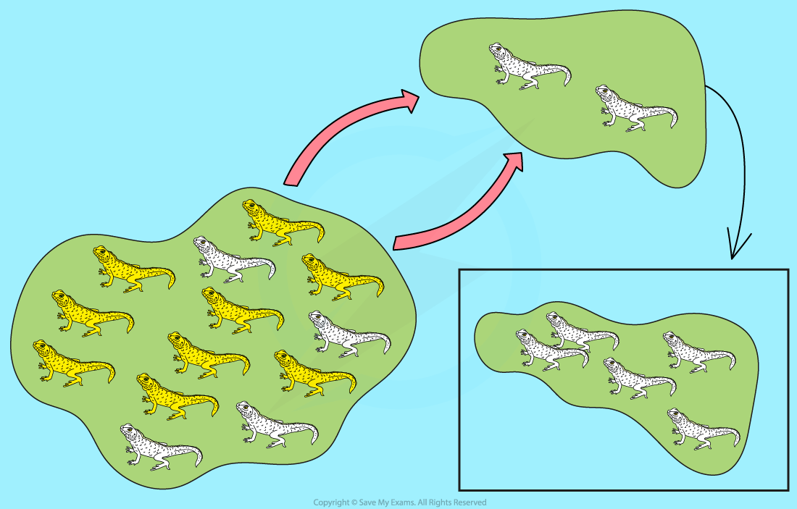

# Hardy-Weinberg Equation

## Changes in Allele Frequency

> **Spec point** — `spcpt_mcm5FhRNMtqtqVJh`

## Changes in Allele Frequency

#### Hardy-Weinberg Principle

- The Hardy-Weinberg principle states that if certain conditions are met, the** allele frequencies of a gene within a population will not change from one generation to the next**
- There are several **conditions or assumptions **that must be met for the Hardy-Weinberg principle to hold true:

  - **Mating** must be **random** between individuals
  - The population is **infinitely large**
  - There is **no migration, mutation** or **natural selection**
- The Hardy-Weinberg **equation** allows for the** calculation of allele and genotype frequencies **within populations
- It also allows for predictions to be made about how these frequencies will change in future generations
- If the allele frequencies in a population **change over time**, then it means that migration, mutation or natural selection has happened

#### Hardy-Weinberg calculations

- If the phenotype of a trait in a population is determined by a single gene with only two alleles (we will use **B / b **as examples throughout this section**)**, then the population will consist of individuals with three possible genotypes:

  - ***Homozygous*** dominant (**BB**)
  - ***Heterozygous***** **(**Bb**)
  - Homozygous recessive (**bb**)
- When using the Hardy-Weinberg equation, the **frequency of a genotype** is represented as a **proportion** of the population

  - For example, the **BB** genotype could be 0.40
  - Whole population = 1
  - The letter ***p*** represents the frequency of the dominant allele (**B**)
  - The letter ***q*** represents the frequency of the recessive allele (**b**)
  - As there are only two alleles at a single gene locus for this phenotypic trait in the population:

***p + q***** = 1**

- The chance of an individual being homozygous dominant is ***p*****2**

  - In this instance, the offspring would inherit dominant alleles from both parents ( ***p ***x*** p ***=*** p*****2***** ****)*
- The chance of an individual being heterozygous is **2*****pq***

  - Offspring could inherit a dominant allele from the father and a recessive allele from the mother (*** p*** x ***q*** ) **or **offspring could inherit a dominant allele from the mother and a recessive allele from the father (*** p*** x ***q*** ) = **2*****pq***
- The chance of an individual being homozygous recessive is** *****q*****2**

  - In this instance, the offspring would inherit recessive alleles from both parents ( ***q ***x*** q**** *=*** q*****2***** ****)*
- As these are all the possible genotypes of individuals in the population, the following equation can be constructed:

***p*****2**** + *****q*****2**** + 2*****pq***** = 1**

> **Worked Example**
> In a population of birds, 10% of the individuals exhibit the recessive phenotype of white feathers. Calculate the frequencies of all genotypes.
> 
> Solution:
> 
> - We will use** F / f** to represent dominant and recessive alleles for feather colour
> - Those with the recessive phenotype must have the homozygous recessive genotype, **ff**
> - Therefore*** q*****2**** = 0.10** (as 10% of the individuals have the recessive phenotype and ***q*****2***** ***represents this)
> 
> To calculate the frequencies of the homozygous dominant ( ***p*****2** ) and heterozygous ( **2*****pq*** ):
> 
> **Step 1: Find q**
> 
> $\sqrt{q^{2}}=\sqrt{0.1}=0.32$
> 
> **Step 2: Find *****p *****(the frequency of the dominant allele F). If q = 0.32, and p + q = 1**
> 
> ***p**** +**** q*** = 1
> 
> ***p*** = 1 - 0.32
> 
> ***p***** **= 0.68
> 
> **Step 3: Find***** p*****2**** (the frequency of homozygous dominant genotype)**
> 
> 0.682 = 0.46
> 
> ***p*****2** = 0.46
> 
> **Step 4: Find 2*****pq = *****2 x (p) x (q)**
> 
> 2 x (0.68) x (0.32)
> 
> = 0.44
> 
> **Step 5: Check calculations by substituting the values for the three frequencies into the equation; they should add up to 1**
> 
> ***p*****2** + **2*****pq*** + ***q*****2** = 1
> 
> 0.46 + 0.44 + 0.10 = 1
> 
> **In summary:**
> 
> - Allele frequencies:
> 
>   - *p *= **F** = 0.68
>   - *q* =** f **= 0.32
> - Genotype frequencies:
> 
>   - *p*2 = **FF** = 0.46
>   - *q*2 = **ff **= 0.10
>   - 2*pq* = **Ff **= 0.44

> **Exam Hint**
> When you are using Hardy-Weinberg equations, start your calculations by determining the proportion of individuals that display the **recessive phenotype** - you will always know the genotype for this: **homozygous recessive**. Remember that the dominant phenotype is seen in both homozygous dominant, and heterozygous individuals.  Also, don’t mix up the Hardy-Weinberg equations with the Hardy-Weinberg principle. The **equations** are used to **estimate** the allele and genotype **frequencies** in a population. The **principle** suggests that there is an **equilibrium** between allele frequencies and there is no change in this between generations.

## Reasons for Changes in Allele Frequency

> **Spec point** — `spcpt_KXnWQ98GrcbJTRMK`

## Reasons for Changes in Allele Frequency

#### Mutations

- Organisms of the same species will have very similar genotypes, but two individuals (even twins) will have differences between their DNA base sequences
- Considering the size of genomes, these differences are small between individuals of the same species
- The small differences in DNA base sequences between individual organisms within a species population is called **genetic variation**
- Genetic variation is **transferred **from one generation to the next and it **generates phenotypic variation** within a species population
- The primary source of genetic variation is **mutation **(changes in the DNA base sequence)
- Mutation results in the **generation of new *****alleles***

  - The new allele may be advantageous, disadvantageous or have no apparent effect on phenotype
  - New alleles are not always seen in the individual that they first occur in
  - They can remain hidden (not expressed) within a population for several generations before they contribute to phenotypic variation

#### Natural selection

- **Variation **exists within a species population
- This means that some individuals within the population possess **different phenotypes **(due to genetic variation in the alleles they possess; remember members of the same species will have the same genes)
- Environmental factors affect the chance of survival of an organism; they, therefore, act as a **selection pressure**
- Selection pressures **increase** **the** **chance** of individuals with a **specific phenotype **surviving and reproducing over others
- The individuals with the favoured phenotypes are described as having a higher **fitness**

  - The fitness of an organism is defined as its ability to **survive** and **pass on its alleles** to offspring
  - Organisms with higher fitness possess **adaptations** that make them **better suited to their environment**
- When selection pressures act over several generations of a species, they can cause a change in the **allele frequency** and the **phenotype frequency** in a population through **natural selection**

  - Natural selection is the process by which individuals with a fitter phenotype are more likely to survive and pass on their alleles to their offspring so that the **advantageous alleles increase in frequency over time and generations**

#### An example of natural selection in rabbits

- **Variation in fur colour **exists within rabbit populations
- At a single gene locus, normal **brown fur **is produced by a dominant allele whereas **white fur** is produced by a recessive allele in a homozygous individual
- Rabbits have natural predators like foxes which act as a selection pressure
- Rabbits with a white coat do not camouflage as well as rabbits with brown fur, meaning predators are more likely to see white rabbits when hunting
- As a result, rabbits with white fur are less likely to survive than rabbits with brown fur
- The **rabbits with brown fur **have a selection advantage, so they are **more likely to survive** to reproductive age and be able to pass on their alleles to their offspring
- **Over many generations,** the **frequency** of **alleles** for **brown** fur will **increase** and the frequency of alleles for white fur will decrease

***Selective pressure acting on a rabbit population for one generation. Predation by foxes causes the frequency of brown fur alleles in rabbits to increase and the frequency of white fur alleles in rabbits to decrease***

## Reproductive Isolation

> **Spec point** — `spcpt_c6Q4wQhjGw674sPT`

## Reproductive Isolation

- Organisms that belong to the **same** **species** share the **same characteristics** and are able to produce **fertile offspring**
- Reproductive isolation occurs when changes in the **alleles** and **phenotypes** of some individuals in a population **prevent** them from successfully **breeding** with other individuals in the population that don't have these changed alleles or phenotypes
- Examples of allele or phenotype changes that can lead to reproductive isolation include:

  - **Seasonal** **changes** - some individuals in a population may develop different **mating** or **flowering** seasons (becoming sexually active at different times of the year) to the rest of the population (i.e their **reproductive timings** no longer match up)
  - **Mechanical changes** - some individuals in a population may develop changes in their **genitalia** that prevent them from **mating** successfully with individuals of the opposite sex (i.e. their **reproductive body parts** no longer match up)
  - **Behavioural changes** - some individuals in a population may develop changes in their **courtship behaviours**, meaning they can no longer **attract** individuals of the opposite sex for **mating** (i.e. their methods of attracting a mate are no longer effective)
- These changes could be brought about due to **geographical barriers** isolating populations or **random mutations** producing new, different alleles in a population

#### Speciation

- Speciation can occur when populations of a species become **separated** from each other by **geographical** **barriers**

  - The barrier could be **natural** like a body of water, or a mountain range
  - It can also be **man-made**, like a motorway
- This creates two populations of the same species who are **reproductively isolated** from each other, and as a result, **no genetic exchange **can occur between them
- If there are sufficient **selection pressures **acting to change the **gene pools** (and allele frequencies) within both populations then eventually these populations will** diverge **and form** separate species **

  - The changes in the alleles/genes of each population will affect the **phenotypes** present in both populations
  - **Random mutations** within each population will also change allele frequencies in each
  - Over time, the two populations may begin to **differ** physiologically, behaviourally and anatomically (structurally)
- This type of speciation is known as **allopatric speciation**

***Allopatric speciation occurring due to geographical isolation of two populations of the same species***

- Sometimes populations of the same species live in the **same geographical area** but they become separated from each other by **ecological** or **behavioural** means

  - An example of ecological separation is populations that live in different environments within the same area e.g. plants growing in soil with different pH levels may flower at different times from each other causing reproductive isolation
- This type of speciation that occurs without the presence of a geographical barrier is known as **sympatric speciation**

***Reproductive separation due to behavioural changes that resulted in sympatric speciation occurring***

#### Population bottlenecks

- A large population is required for the maintenance of a diverse gene pool
- Sometimes dramatic events occur (such as natural disasters or disease) that **decrease the size** of a population dramatically
- This is known as a **population bottleneck**
- It can lead to a **significant decrease** in the size of the **gene pool** of the population and will have a dramatic effect on the **allele frequencies** as a result thereof
- The remaining population will be **more susceptible** to the loss of alleles and the effects of mutations will be **magnified** in the new population

  - An example is the **cheetah** which survived a near-extinction event in the past
  - Only a few individuals remained and as a result the genetic diversity of all living cheetahs are very low
  - This makes them very vulnerable to disease or environmental changes

***A population bottleneck in the past has dramatically decreased the genetic variation in cheetahs populations***

#### The Founder effect

- This refers to the **loss of genetic variation** if a new population is formed by a **small number of individuals** that left the main population
- Since the **initial gene pool is small**, it is unlikely that it will contain the genetic variation of the original population that the individuals came from
- Should any of these individuals carry **unusual mutations** in their genome, these will appear **more frequently** in the new population

  - An example of this is the unusually high occurrence of **Ellis-van Creveld syndrome** (a type of dwarfism) among the **Amish** community in the USA
  - This was the result of a few individuals that were **heterozygous** for the recessive allele that formed part of the founding Amish population

***The Founder effect can amplify the occurrence of genetic mutations in a population due to the small gene pool of the founding members***
