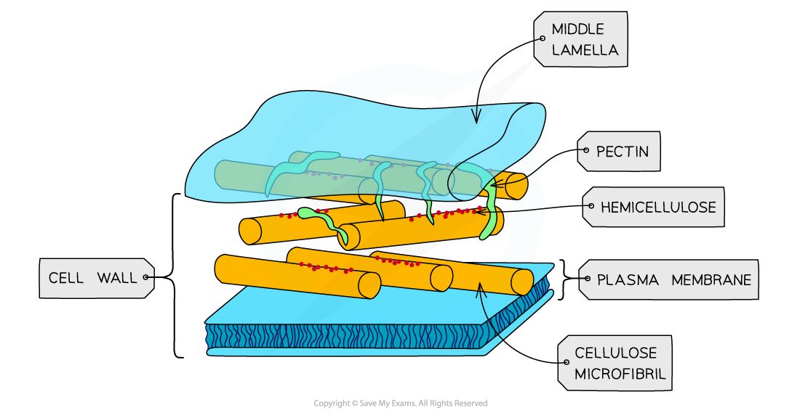
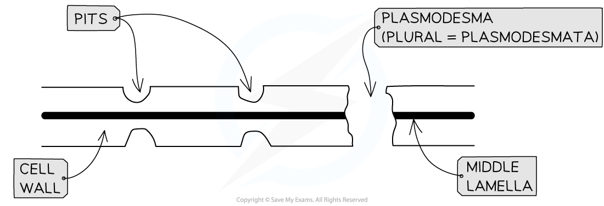
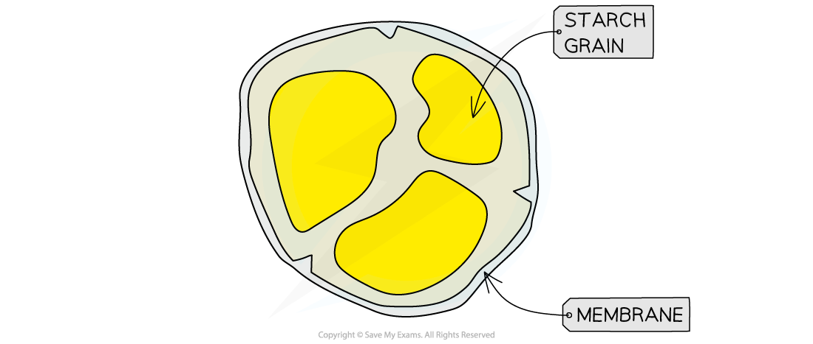
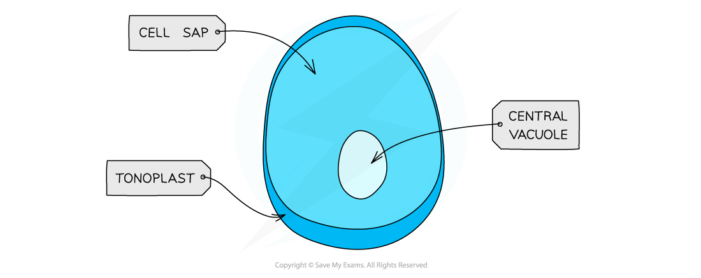

# Plant Cell Structure

## Plant Cell Structure & Ultrastructure

> **Spec point** — `spcpt_KDmGMBN4wNCk7MF6`

## Plant Cell Structure & Ultrastructure

- The structure of plant cells is made up of a complex system of organelles and ultrastructures
- Plant cells contain many of the organelles found in animal cells, along with a few other organelles that are **only** found in plant cells

#### Cell wall

- Cell walls are formed outside of the cell membrane and offer **structural support** to the cell

  - This structural support is provided by the polysaccharide **cellulose**
- Cell walls are **freely permeable**, and will allow most substances to enter the plant cell

#### Middle lamella

- This forms the **outermost layer** of the plant cell and acts like glue to stick adjacent plant cells together
- It is mainly composed of a polysaccharide called **pectin**

***A diagram to show the cell wall and middle lamella of one plant cell***

#### Plasmodesmata

- Narrow threads of cytoplasm (surrounded by a cell membrane) called **plasmodesmata** connect the cytoplasm of neighbouring plant cells
- This interconnected system of cytoplasm between plant cells is known as the **symplast**

#### Pits

- These are **very thin** regions of the cell wall
- The pits in adjacent plant cells are lined up in **pairs**
- They are formed due to the absence of secondary thickening in the cell walls in the areas where plasmodesmata are present

***Detailed structure of plant cell wall***

#### Chloroplasts

- Chloroplasts are larger than mitochondria
- Surrounded by a **double-membrane**
- Within the chloroplast there are membrane-bound compartments called **thylakoids** containing *chlorophyll* stack to form structures called **grana** (singular = granum)
- Grana are joined together by **lamellae** (thin and flat thylakoid membranes)
- Chloroplasts also contain small circular pieces of **DNA **and ribosomes used to synthesise proteins needed in chloroplast replication and photosynthesis

***Chloroplasts are found in the green parts of plants - the green colour is due to the presence of the pigment chlorophyll***

#### Amyloplasts

- Small, membrane bound organelle containing **starch granules**
- Large numbers are found in plant storage organs, such as potato tubers

***Structure of an amyloplast***

#### Vacuole and tonoplast

- The vacuole is a sac in plant cells surrounded by the **tonoplast **(selectively permeable membrane)
- They are large, permanent structures in a plant cell
- Contains cell sap, which is a mixture of different substances such as water, minerals, waste and enzymes
- The concentration of the cell sap enables water to enter the vacuole by osmosis

***The structure of the vacuole***

## Plant Cell Structure & Ultrastructure: Function

> **Spec point** — `spcpt_ZpgzY5Jws3K34WFf`

## Plant Cell Structure & Ultrastructure: Function

- The ultrastructures and organelles listed above each perform a specific function in a plant cell

#### Cell wall

- The cellulose component of cell walls provides **structural support** to the cell
- Due to its rigid nature, it is responsible for the **regular shape** of a plant cell

#### Middle lamella

- It provides **stability** to the plant by ensuring that adjacent plant cells are **adhered** together

#### Plasmodesmata

- The cytoplasmic strands **connect** the contents of adjacent plant cells
- This allows substances to be **transported** between cells and facilitates **cell to cell communication**

#### Pits

- Since the cell wall is very thin in these regions, it allows for the **transport of substances **between cells
- This is particularly useful in **xylem vessels**, where it allows for the **lateral flow** of water and mineral ions between adjacent vessels

#### Chloroplasts

- Due to the presence of chlorophyll and thylakoids, chloroplasts are the **site of photosynthesis**

  - Certain parts of the process occur in **thylakoid membranes**, while other parts happen in the **stroma**

#### Amyloplasts

- They are responsible for **storing starch** in plants and converting it back to glucose when the plant needs it

#### Vacuole and tonoplast

- Vacuoles have several functions in plant cells:

  - They keep cells *turgid*, which stops the plant from wilting
  - **Store various substances**, such as pigments and waste products
  - **Break down** and **isolate** unwanted chemicals in plant cells
  - The tonoplast **controls** what can enter and leave
