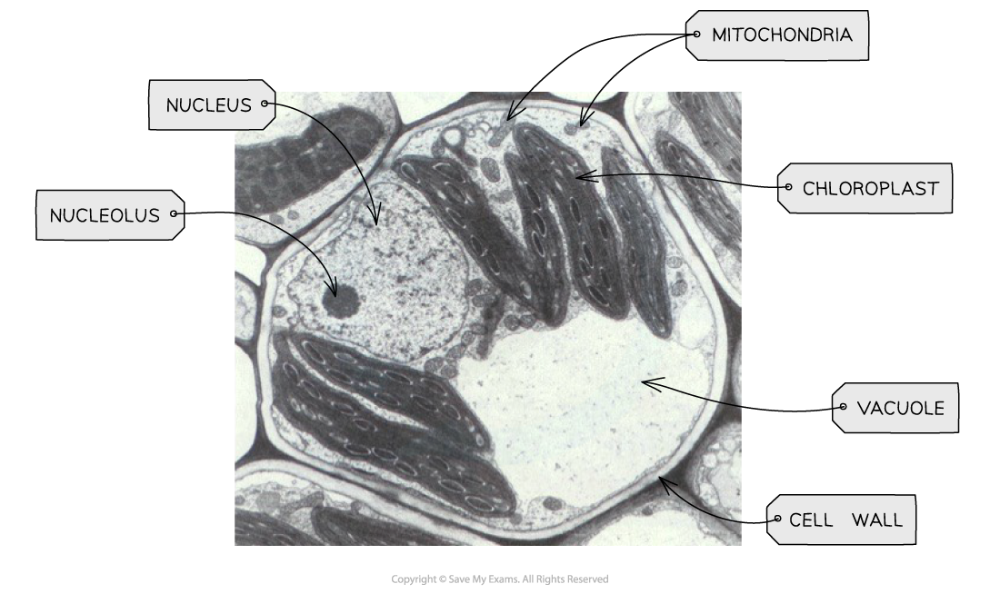

# Electron Microscopy of Plant Cells

## Electron Microscopy of Plant Cells

> **Spec point** — `spcpt_KqTHjY9VKc28tGVP`

## Electron Microscopy of Plant Cells

- It is important to be able to recognise various plant organelles from electron microscope images

  - Chloroplast
  
    - Has** distinctive stacks** of thylakoids
    - Double membrane
    - Has a roughly oval shape
    - Larger than mitochondria
    - Indicates the cell is a plant cell
  - Nucleus
  
    - Has a nuclear membrane and a **dark nucleolus** within
    - It has a roughly spherical shape
  - Vacuole
  
    - Occupies a large space within a cell
    - Often shows up as a very light shade (white) within an electron micrograph
    - Indicates the cell is a **plant cell**
  - Cell wall
  
    - Located around the perimeter of the cell
  - Mitochondria
  
    - Roughly oval-shaped
    - **Double membrane**
    - Sometimes observed with visible **cristae **(foldings of the inner membrane)
  - **Cell membrane (plasma membrane)**
  
    - Located just inside the cell wall, pressed against it
    - Appears as a thin, dark line following the inner edge of the cell wall
    - Often difficult to distinguish from the cell wall at low magnification, as the two run parallel and close together
    - Encloses the cytoplasm and all the cell's content

***TEM electron micrograph of a plant cell showing key features***
