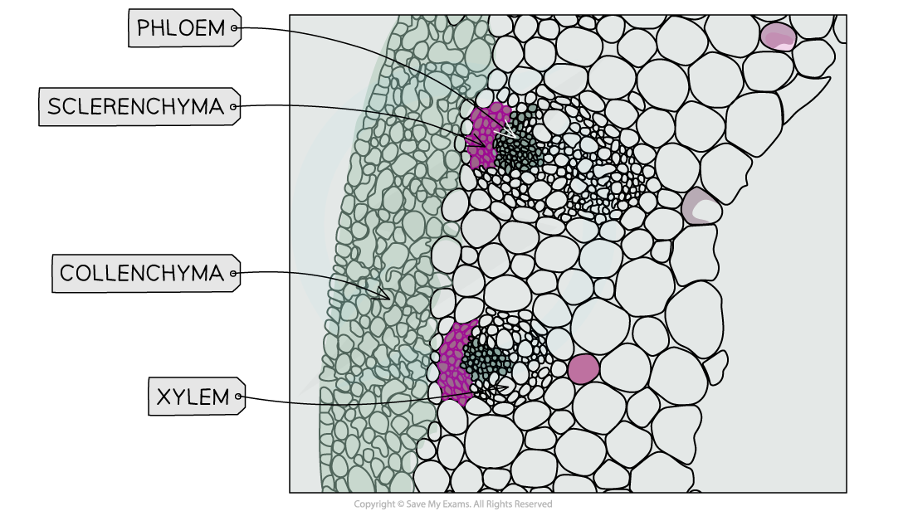
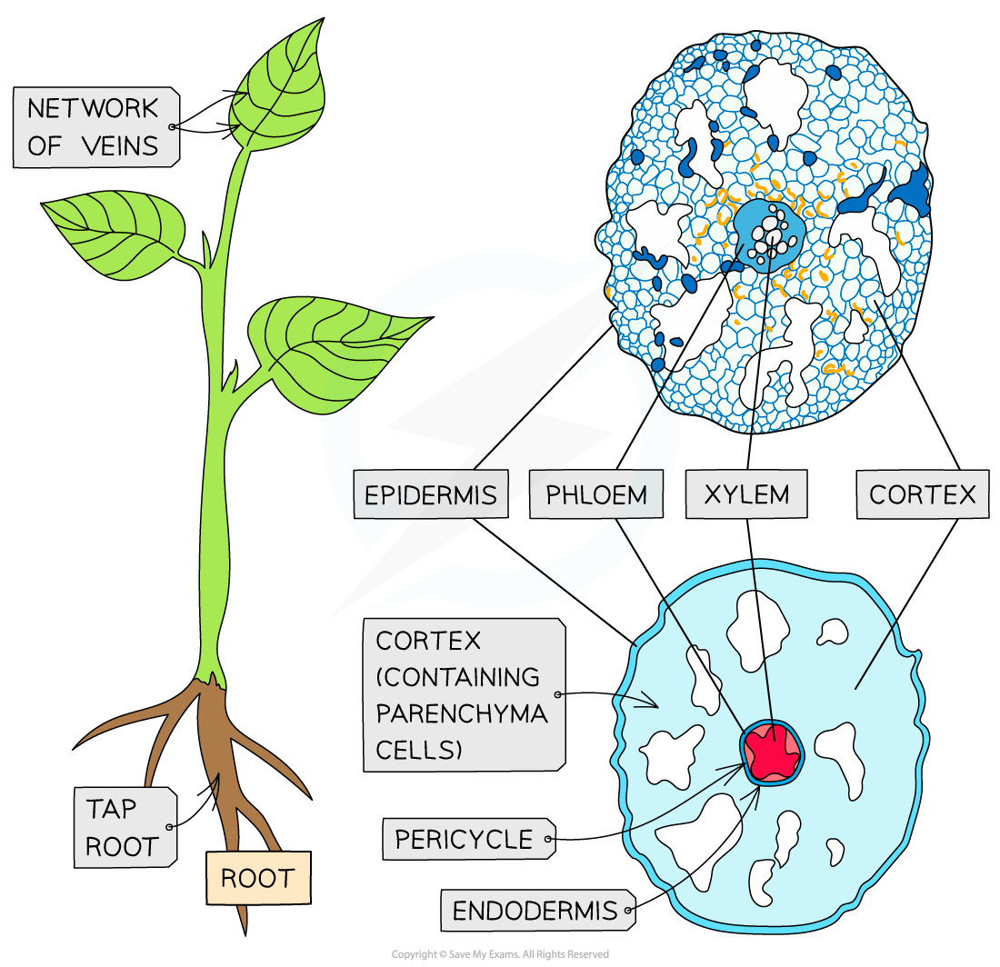
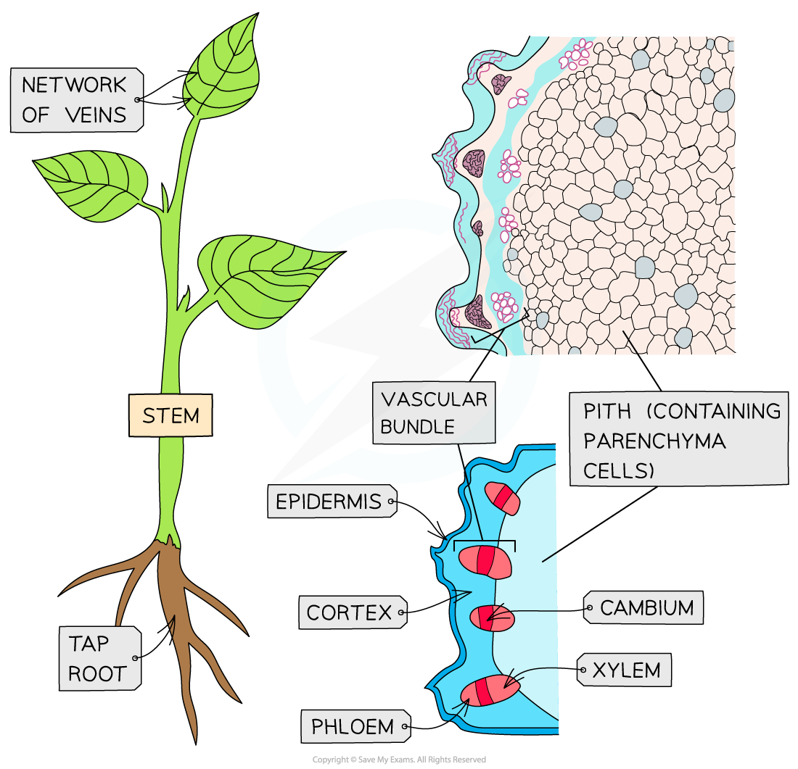
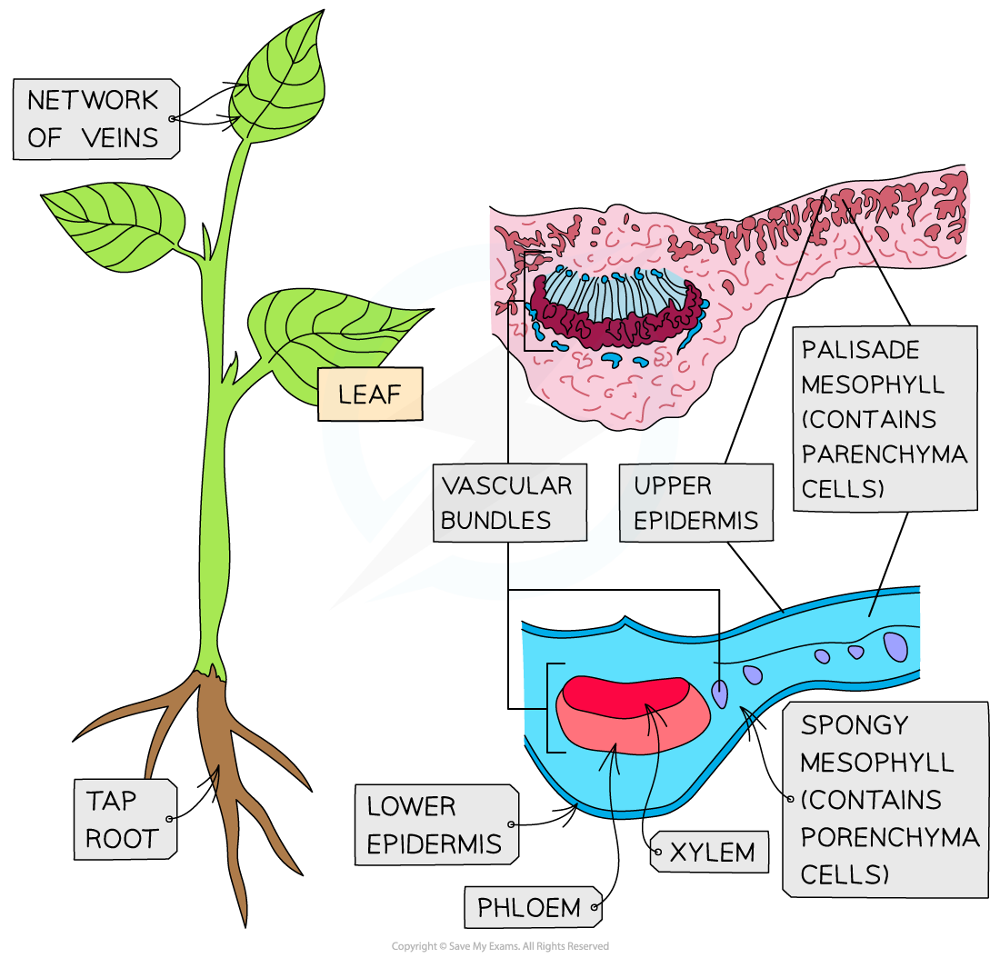

# Core Practical 7: Identifying Tissue Types Within Stems

## Identifying Tissue Types Within Stems

> **Spec point** — `spcpt_4d7KK2kNqkwnj8Sx`

## Identifying Tissue Types Within Stems

- In order to identify tissue types within stems, a **permanent pre-prepared slide** could be used
- Alternatively, a section of a plant stem could be cut and stained before preparing a **temporary slide**

#### Apparatus

- Plant stem
- Scalpel
- Suitable stain
- Microscope slide
- Cover slip
- Forceps
- Dissecting needle
- Light microscope
- Gloves

#### Method

1. Cut a **very thin** cross-section of the stem using a scalpel
2. Carefully transfer each section into a dish containing a **suitable stain **and leave for one minute

  - E.g. toluidine blue O (TBO) stains xylem and sclerenchyma fibres blue-green, and phloem will appear pinkish purple
3. Rinse off each section in water and mount onto a microscope slide, before adding a cover slip

  - take care to lower the coverslip **slowly** over the sample **from one side to the other** to **avoid trapping air bubbles**, which could be mistaken for plant tissue structures
4. View under a microscope and adjust the focus to form a clear image
5. Make a labelled drawing of the positions of the xylem vessels, phloem sieve tubes and sclerenchyma fibres

*Microscopes can be used to view the location of different plant tissues within a cross-section; note that the stain used to generate this image is not the TBO stain described in the method above*

#### Plan diagrams

- When drawing **tissue plan diagrams** you need to:

  - Read the instructions carefully
  - Draw a large diagram
  - Use a sharp pencil and do not shade (including the nucleus)
  - Use clear, continuous lines (no sketching)
  - When using an eyepiece graticule, use it to ensure you have correct proportions or if you are not using a microscope then endeavour to keep the proportions between tissues to scale
- If drawing from a **low-power image**:

  - Do not draw individual cells
  - Read the question carefully as you may only have to draw a portion of the image
  - Include the magnification on the drawing
- If drawing from a **high-power image**:

  - Draw only a few of the required cells
  - Draw the cell wall of the plant cells
  - Include the magnification on the drawing
- When **labelling**, remember:

  - Use a ruler for label lines (and scale lines if appropriate)
  - Label lines should stop exactly at the structure (do not use arrows)
  - Don't cross label lines over each other
  - Label all tissues and relevant structures that are requested

*Tissue plan drawings can be produced from cross-sections of roots (top), stems (middle) and leaves (bottom)*
