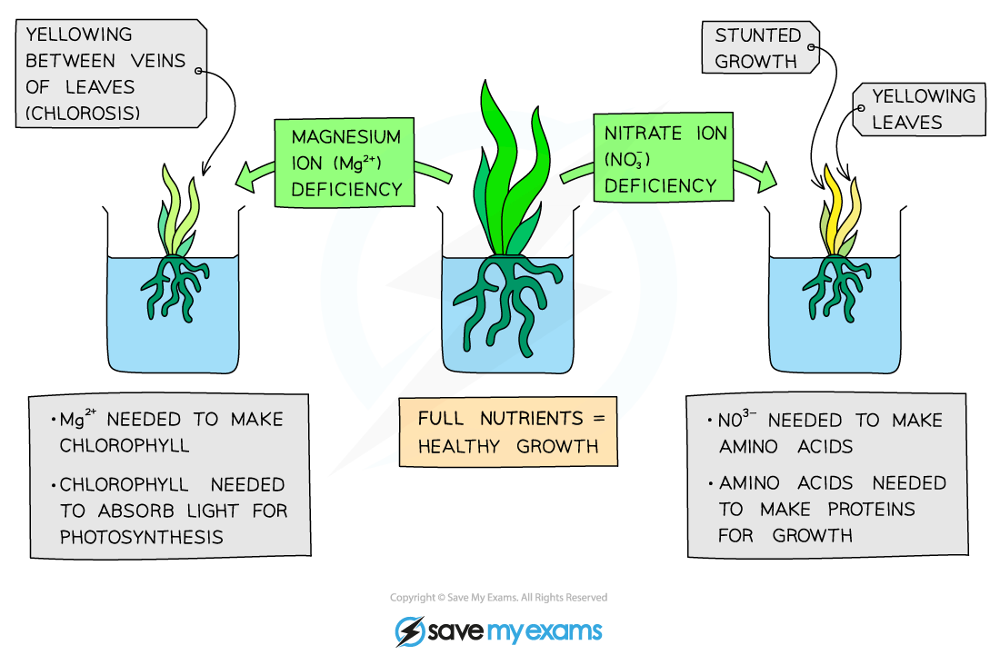

# Water & Inorganic Ions in Plants

## Roles of Water & Ions in Plants

> **Spec point** — `spcpt_S2pjfQK53brzgC3C`

## Roles of Water & Ions in Plants

- Plant cells perform a variety of different functions
- In order to perform these functions efficiently, the plant requires** water** and **inorganic ions** (minerals)
- They are absorbed through the **root hairs** on the root and travel up the stem in **xylem vessels**
- A plant will show certain **symptoms** (e.g. yellow leaves, stunted growth) when there is a **deficiency** in any one of these substances

#### Water

- Important component required for **photosynthesis**
- Provides a **transport medium** for minerals
- Maintains **turgidity** in plant cells though pressure in cell vacuoles
- **Regulates temperature** - to ensure that enzymes can function at their optimum rate

#### Magnesium ions

- Important requirement for the **production of chlorophyll**
- This provides the green colour of stems and leaves and is essential for photosynthesis

#### Nitrate ions

- Without nitrate ions, the plant would be unable to **synthesise DNA**, **proteins** and **chlorophyll**

  - **Enzymes** are important proteins for which nitrate ions are needed
- These molecules are essential for **plant growth**, as well as the production of **fruit** and **seeds**

#### Calcium ions

- These form important **cell wall components**
- Plants require calcium ions for proper **growth**

***Diagram showing the importance of magnesium and nitrate ions for plants***
