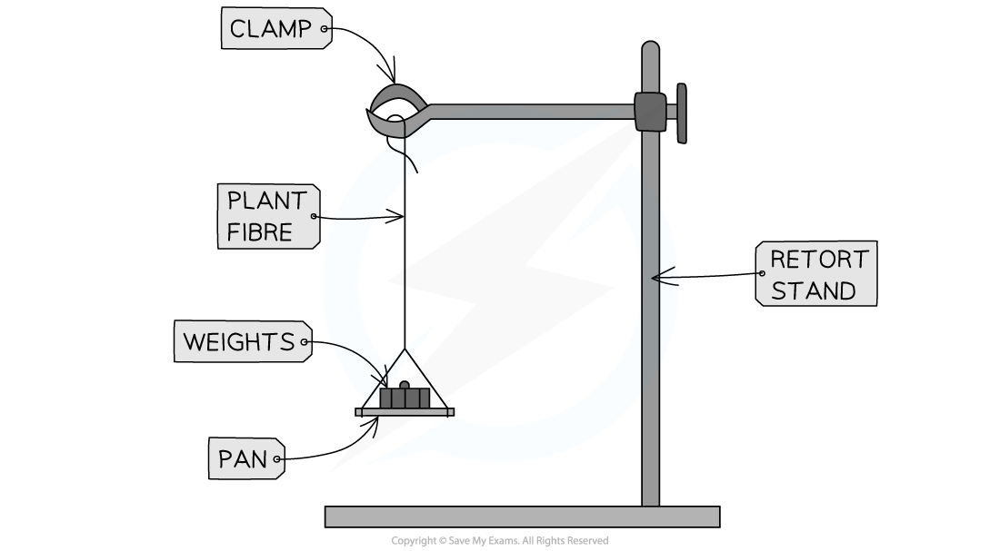

# Core Practical 8: Determining the Tensile Strength of Plant Fibres

## Determining the Tensile Strength of Plant Fibres

> **Spec point** — `spcpt_mXfyZwjxRXC3k4RK`

## Determining the Tensile Strength of Plant Fibres

- The **tensile strength** of a fibre refers to the **maximum load** it can carry **before breaking**

  - For example, this information would be important when determining the strength of a rope made of plant fibres

#### Apparatus

- Plant fibres
- Retort stand (clamp stand)
- Clamp
- Weights

#### Method

1. The fibre should be attached to a **clamp stand**
2. Attach a **weight** on the other end of the plant fibre
3. Carefully continue to **add one weight** at a time until the **fibre breaks**
4. **Record the mass** at which the fibre **broke**
5. This represents the **tensile strength**
6. To increase the **accuracy** of your results, this process should be **repeated** with more samples of the same plant fibre

  - These values can be used to **calculate the mean** tensile strength for the fibre
  - It is important to ensure that the fibres are all of the **same length** and that all other **variables are kept constant**

***Apparatus used to determine the tensile strength of plant fibres***
