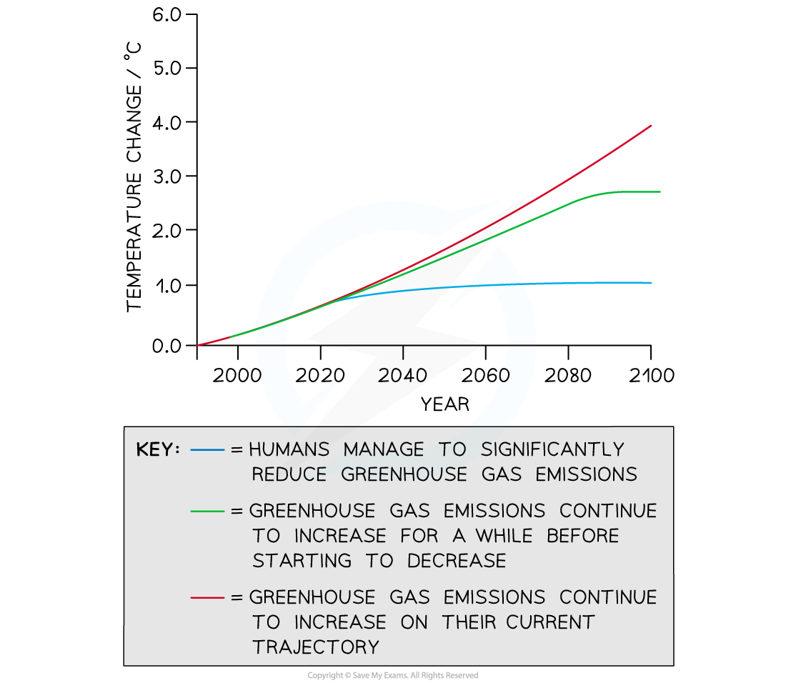

# Models for Predicting Climate Change

## Models for Predicting Climate Change

> **Spec point** — `spcpt_t26zQW8fjT6TZhJX`

## Models for Predicting Climate Change

- It is possible to use existing data relating to global warming to **make predictions about global temperatures** in the future

  - Using data in this way is known as **extrapolating from data**
  - Extrapolated data can be used to **produce models **that show how the climate may change in the future
- Global warming predictions can be used to

  - **Plan** for the future e.g.
  
    - Building flood defences
    - Funding scientific research into climate change technologies
  - Encourage people to **change their activities** e.g.
  
    - Reduce the burning of fossil fuels
    - Increase the use of renewable energy sources such as solar and wind energy
    - Reduce meat consumption
- The Intergovernmental Panel on Climate Change, or IPCC, is a group of climate scientists around the world that has used existing data to **extrapolate **how global temperatures might change in the future** **under** different human activity scenarios** e.g.

  - If humans manage to immediately begin reducing fossil fuel use, global temperature change could be limited to around 2°C hotter than pre-industrial times
  - If humans do nothing to change their fossil fuel use, global temperature increase may exceed 4°C
- The IPCC data can be added to other computer models on climate change to see how different parts of the world might be affected under the different scenarios

***Future predictions of temperature change can be modelled on a range of scenarios***

## Limitations of Climate Change Prediction Models

> **Spec point** — `spcpt_GzNYHStN2gwxpNVf`

## Limitations of Climate Change Prediction Models

- There are **limitations to models based on extrapolated data**

  - The IPCC has produced models based on several emissions scenarios, and we **do not know which of these scenarios is most likely**
  
    - I.e. we don't know how successful humans will be at cutting greenhouse gas emissions
  - We do not know whether **future technologies** will be successful at removing greenhouse gases from the atmosphere e.g. carbon capture technologies may or may not be effective
  - It is unknown **exactly how** atmospheric gas concentrations might affect global temperatures
  - Global **climate patterns are complex** and therefore predictions are difficult
  
    - It is possible that a certain** tipping point **in global temperatures could lead to a sudden acceleration in global warming e.g. permafrost melting may cause a sudden increase in atmospheric methane
    
      - Permafrost is ground that is frozen all year round
  - We don't know exactly how **factors other than human activities** may affect climate in the future e.g. a volcanic eruption could increase ash in the atmosphere, reflecting radiation back into space and cooling the earth
