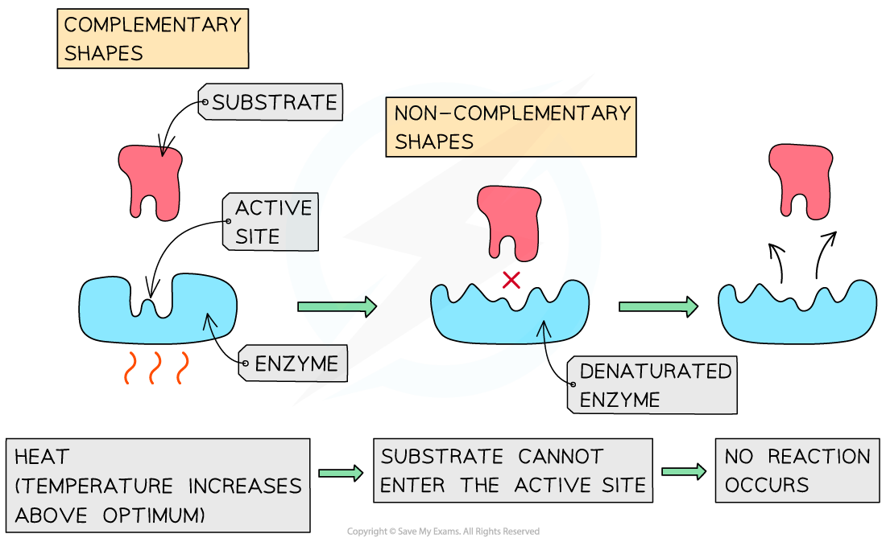

# The Effect of Temperature on Enzyme Reactions

## The Effect of Temperature on Enzyme Reactions

> **Spec point** — `spcpt_GFnzKwM8WfHx2j3h`

## The Effect of Temperature on Enzyme Reactions

- Changing air temperature can have a **significant impact on the ***metabolism* of living organisms due to the effect of **temperature on enzyme activity**
- Enzymes have a specific** optimum temperature**

  - This is the temperature at which they *catalyse* a reaction at the **maximum rate**
- **Lower temperatures** either **prevent** reactions from proceeding or **slow them down**

  - Molecules move relatively **slowly **as they have **less ***kinetic energy*
  - Less kinetic energy results in a **lower frequency** of **successful collisions** between *substrate* molecules and the *active sites* of the enzymes which leads to less frequent **enzyme-substrate complex** formation
  - Substrates and enzymes also collide with **less energy**, making it less likely for bonds to be formed or broken
- **Higher temperatures **cause **reactions** to **speed up**

  - Molecules move **more** **quickly **as they have **more kinetic energy**
  - Increased kinetic energy results in a** higher** **frequency** of** successful collisions** between substrate molecules and the active sites of the enzymes which leads to more frequent **enzyme-substrate complex** formation
  - Substrates and enzymes also collide with **more energy**, making it more likely for bonds to be formed or broken

#### Denaturation

- If temperatures continue to increase **past a certain point**, the rate at which an enzyme catalyses a reaction **drops sharply** as the enzymes begin to **denature**

  - The increased **kinetic energy** and **vibration** of an enzyme puts a **strain** on its bonds, eventually causing the** weaker hydrogen and ionic bonds** that hold the enzyme molecule in its **precise shape** to start to **break**
  - The breaking of bonds causes the *tertiary structure* of the enzyme to **change**
  - The **active site** is **permanently damaged** and its shape is no longer **complementary to the substrate**, preventing the **substrate** from **binding**
  - **Denaturation** has occurred if the substrate can no longer bind

***At high temperatures enzymes can denature***

***The rate of an enzyme catalysed reaction is affected by temperature. Note that 35 ***$^{\circ}$***C is not the optimum temperature for all enzyme-controlled reactions.***

#### Calculating the temperature coefficient

- The **temperature coefficient**, represented by **Q****10**, calculates the increase in rate of reaction when the temperature is increased by 10 $^{\circ}$C
- Q10 can be calculated using the following equation

**Q****10 ****= rate at higher temperature **$\div$**rate at lower temperature**

- A Q10 value of 2 indicates that the reaction rate doubles with an increase in temperature of 10 $^{\circ}$C, while a value of 3 indicates that it trebles with every 10 $^{\circ}$C increase

> **Worked Example**
> In an enzyme catalysed reaction the rate of reaction can measured by recording the volume of product produced per unit time at different temperatures.
> 
> At 30 $^{\circ}$C 3.5 cm3 s-1 of product was recorded and at 40 $^{\circ}$C 6.8 cm3 s-1 was recorded. Calculate Q10 for this reaction.
> 
> **Answer:**
> 
> **Step 1: Write out the relevant equation**
> 
> Q10 = rate at higher temperature $\div$ rate at lower temperature
> 
> **Step 2: Substitute numbers into the equation**
> 
> Q10 = 6.8 $\div$3.5
> 
> **Step 3: Complete calculation**
> 
> Q10 = 1.94
> 
> This value is close to 2, indicating that the rate of reaction has almost doubled

#### Enzyme activity and living organisms

- Changes to enzyme activity that result from changing global temperatures can affect living organisms
- Some chemical reactions take place **faster at higher temperatures**

  - Photosynthesis is essential for **converting carbon dioxide into carbohydrates, **the process which **produces food for producers and other organisms** higher up the food chain; it relies on the function of proteins in the electron transport chain and that of **enzymes** such as rubisco
  
    - E.g. blue-green algae, also known as cyanobacteria, photosynthesise at a higher rate in warmer water due to increased enzyme activity; this increases the formation of potentially harmful algal blooms
- Some chemical reactions are** slowed down** at higher temperatures

  - At high temperatures plants carry out a reaction called **photorespiration** at a faster rate; this reaction uses the enzyme rubisco and so **slows down photosynthesis**
  
    - This can **reduce crop yields** as temperatures rise
  - Some fish eggs have been shown to develop **more slowly at higher temperatures**
  
    - Many species' successful egg development is dependent on temperature, with impacts such as
    
      - Extreme temperature fluctuations can **reduce hatching rates** in some invertebrates
- The sex of the young inside the egg of some species is determined by temperature, so **increasing temperatures can affect the sex ratios** in a species

  - E.g. in alligators
- Species may have to change their *distribution* in response to changing temperatures in order to survive

  - Species may **migrate to higher altitudes** or **further from the equator** to find cooler temperatures
