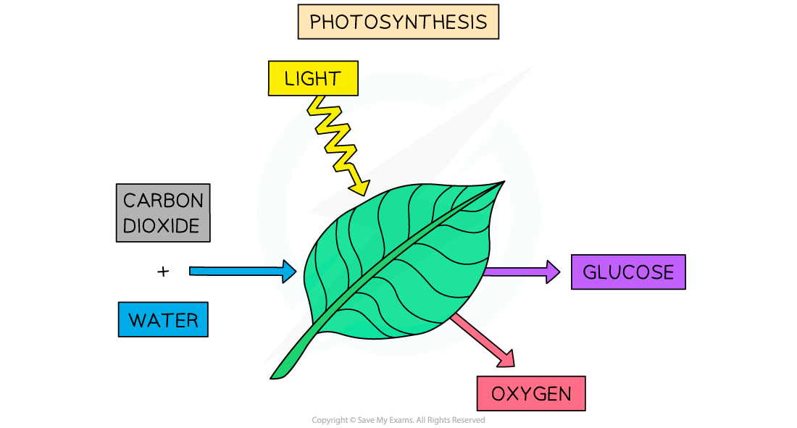
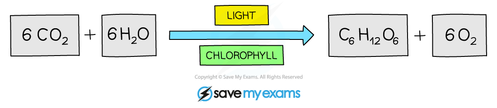

# Photosynthesis: Overview

## Photosynthesis: Overview

> **Spec point** — `spcpt_SxfGrBh4bKNNfN24`

## Photosynthesis: Overview

- **Photosynthesis** is a series of chemical reactions that occurs in **producers **such as plants and algae

  - Producers are also known as **autotrophs**; organisms that make their own organic compounds
- Photosynthesis converts **light energy** into **chemical energy** which is then stored in the *biomass* of producers
- The light energy is used to **split strong bonds** in **water molecules** (H2O), releasing **hydrogen** and **oxygen**
- Oxygen is **released into the atmosphere** as a waste product
- Hydrogen is** combined with carbon dioxide** to produce **glucose**

  - **Chemical energy is stored** within the **bonds** in glucose molecules; glucose can therefore function as a **fuel** for *respiration*
  - It can be said that **hydrogen is stored in glucose** molecules

***Photosynthesis requires energy from light to split water molecules. The resulting hydrogen combines with carbon dioxide and is stored in glucose, which fuels respiration. Oxygen is released as a waste product.***
