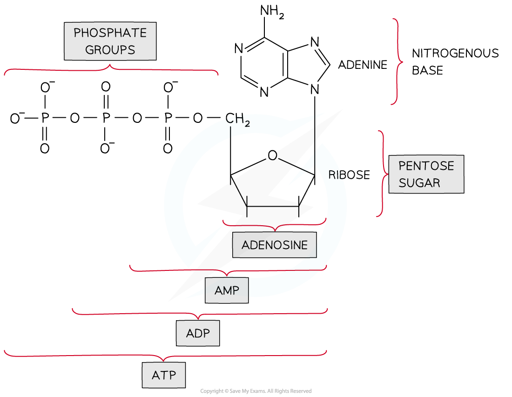
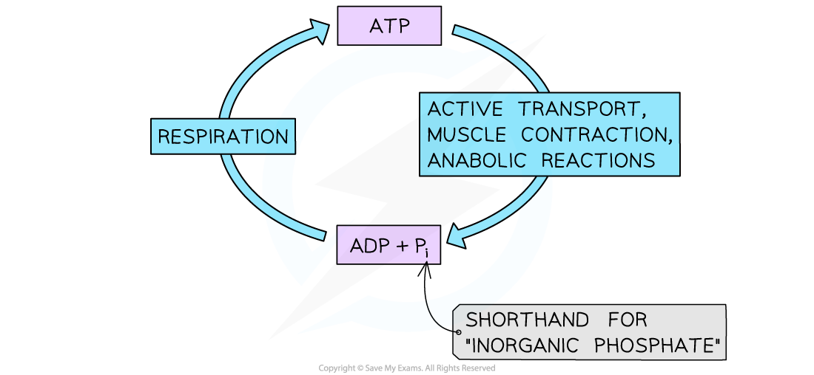

# The Role of ATP in Photosynthesis

## ATP as an Energy Carrier in Photosynthesis

> **Spec point** — `spcpt_YsPRtK9wkNDX4Bhk`

## ATP as an Energy Carrier in Photosynthesis

- All organisms require a **constant supply of energy** to maintain their cells and stay alive
- This energy is required e.g.

  - For building new molecules from the products of digestion during *anabolic* reactions
  - To move substances across cell membranes in active transport or to move substances within cells
  - For muscle contraction
  - In the conduction of nerve impulses
- In all known forms of life the molecule** adenosine triphosphate**, or **ATP**, is used to transfer and supply energy within cells

  - ATP is therefore known as the **universal energy currency**
  - ATP **diffuses** within cells to where it is needed

- ATP is a** **type of** nucleic acid** and is structurally very similar to the nucleotides that make up DNA and RNA

  - It is a *phosphorylated*** nucleotide**
  
    - A nucleotide consists of a nitrogenous base, a sugar, and a **single** phosphate group
    - ATP contains **three** phosphate groups, hence **tri**phosphate

***ATP contains adenine, a ribose sugar, and three phosphates molecules. Removal of one phosphate creates ADP, and removal of two phosphates creates AMP.***

- ATP is produced by the **addition of inorganic phosphate** (**P****i**), a type of phosphate group, to **adenosine diphosphate**, or **ADP**

**ADP + P****i **$\rightarrow$**ATP **

  - ADP contains **two** phosphate groups, hence **di**phosphate
- ATP can be produced when the passage of electrons along a series of proteins known as the **electron transport chain **releases energy for the **phosphorylation of ADP**

  - This process occurs in the mitochondria during *respiration* and in chloroplasts during **photosynthesis **
  
    - In photosynthesis the energy originally gained by the electrons in this process comes from light, so this method of ATP production is known as **photophosphorylation**
    
      - Photo = light

- The **hydrolysis**, or breakdown, of ATP releases an inorganic phosphate as well as a **small amount of energy** which can be used by the cell

**ATP **$\rightarrow$** ADP + P****i **

- The removal of a phosphate group is known as **dephosphorylation**

  - The hydrolysis of ATP is catalysed by the enzyme **ATPase**
- The ADP and inorganic phosphate produced by the hydrolysis of ATP can be **recycled to make more ATP**

**ADP + P****i **$\rightarrow$** ****ATP **

***ATP is formed during respiration and can be hydrolysed to release energy for processes such as active transport, muscle contraction, and building new molecules (anabolic reactions). ATP can then be regenerated from ADP and phosphate.***
