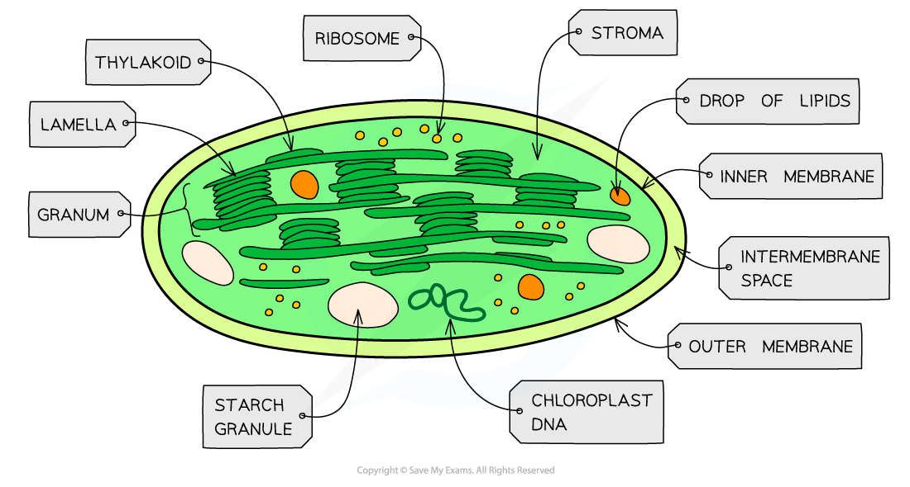

# Chloroplasts

## Chloroplasts: Structure & Function

> **Spec point** — `spcpt_KnVj2XQTbX9Sr3Km`

## Chloroplasts: Structure & Function

- Chloroplasts are the organelles in plant cells where **photosynthesis **occurs
- Each chloroplast is surrounded by a **double-membrane **known as the **chloroplast envelope**

  - Each of the envelope membranes is a *phospholipid* bilayer
- Chloroplasts are filled with a **cytoplasm-like** fluid known as the **stroma**

  - The stroma contains **enzymes** and **sugars**, as well as **ribosomes** and **chloroplast DNA**
  - If the chloroplast has been photosynthesising there may be **starch grains** or **lipid droplets** in the stroma
- A **separate system of membranes** is found in the stroma

  - This membrane system consists of a series of flattened fluid-filled sacs known as **thylakoids**, each surrounded by a **thylakoid membrane**
  - Thylakoids stack up to form structures known as **grana** (singular granum)
  - Grana are connected by membranous channels called **lamellae **(singular lamella), which ensure the stacks of sacs are connected but distanced from each other
- Several components that are essential for photosynthesis are** embedded in the thylakoid membranes**, including:

  - **ATP synthase enzymes**
  - Proteins called **photosystems** that contain **photosynthetic pigments** such as chlorophyll a, chlorophyll b, and carotene

***Chloroplasts are the site of photosynthesis***

#### Chloroplast structure is related to function

- **Chloroplast envelope**

  - The double membrane **encloses the chloroplast**, keeping all of the components needed for photosynthesis close to each other
  - The transport proteins present in the inner membrane control** **the flow of molecules between the stroma and cytoplasm
- **Stroma**

  - The gel-like fluid contains **enzymes **that catalyse the reactions of photosynthesis
- **DNA**

  - The chloroplast DNA contains **genes** that code for some of the proteins used in photosynthesis
- **Ribosomes**

  - Ribosomes enable the *translation*** of proteins **coded by the chloroplast DNA
- **Thylakoid membrane**

  - There is a space between the two thylakoid membranes known as the **thylakoid space**, in which conditions can differ from the stroma e.g. a **proton gradient** can be established between the thylakoid space and the stroma
  - The space has a very small volume so a proton gradient can develop very **quickly**
- **Grana**

  - The grana create a **large surface area, **maximising the number of photosystems and allowing **maximum **light absorption
  - Grana also provide **more membrane area** for proteins such as electron carriers and ATP synthase enzymes, which together enable the **production of ATP**
- **Photosystems**

  - There are two types of photosystems; **photosystem I** and **photosystem II**, containing **different combinations of photosynthetic pigments** such as chlorophyll a, chlorophyll b, and carotene
  - Each photosystem absorbs** light of a different wavelength**, maximising light absorption e.g. photosystem I absorbs light at a wavelength of 700 nm while photosystem II absorbs light at a wavelength of 680 nm
