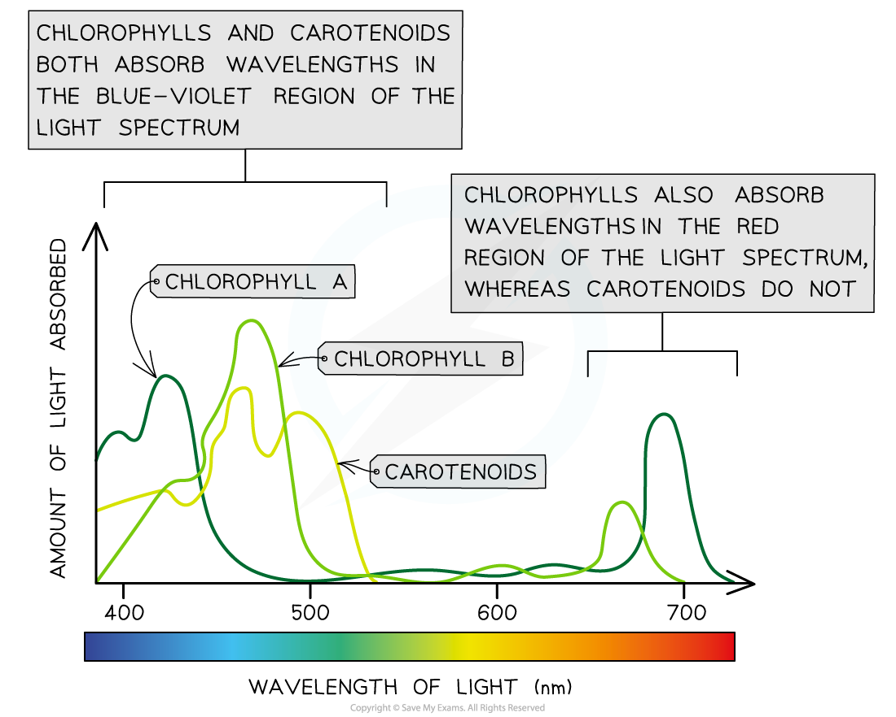
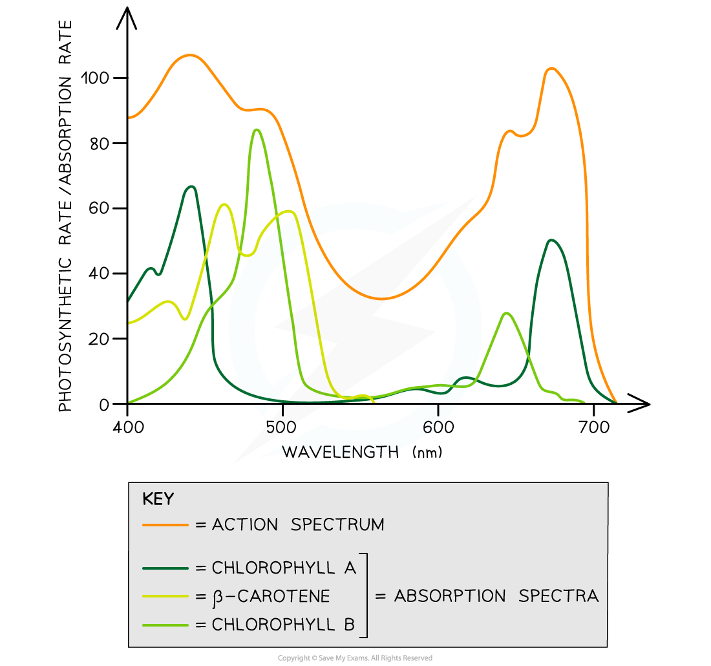

# Absorption & Action Spectra

## Absorption & Action Spectra

> **Spec point** — `spcpt_TWP8qMmFbzmNJnFK`

## Absorption & Action Spectra

- Chloroplasts contain several different **photosynthetic pigments** within **photosystems** embedded in the** thylakoid membranes**
- Different pigments absorb light of different wavelengths

  - **Chlorophylls** absorb wavelengths in the **blue-violet and red regions** of the light spectrum, reflecting green light and appearing green in colour
  - **Carotenoids** absorb wavelengths of light mainly in the **blue-violet region** of the spectrum, reflecting yellow and orange light
  
    - Carotenoids often remain in leaves after the breakdown of chlorophyll in the autumn, giving some leaves their yellow, orange, and red autumn colours

**Examples of Photosynthetic pigments Table**

| **Pigment group** | **Name of pigment** | **Colour of pigment** |
|---|---|---|
| Chlorophylls | Chlorophyll a | Blue-green |
| Chlorophyll b | Yellow-green |   |
| Carotenoids | β Carotene | Orange |
| Xanthophyll | Yellow |   |

- The **amount of light at different wavelengths absorbed** by a particular pigment gives that pigment's **absorption spectrum** (plural spectra)

  - Because each type of pigment absorbs light at different wavelengths the absorption spectrum of each pigment is different

***Different photosynthetic pigments absorb light of different wavelengths, giving different absorption spectra***

- A plant's **rate of photosynthesis varies** depending on the **wavelengths of light available**
- The changing rate of photosynthesis at different wavelengths is known as an **action spectrum**
- Action spectra are very **closely correlated** to the absorption spectra of the different pigments

  - Having several different pigments with different absorption spectra allows plants to **photosynthesise under a wider variety of light wavelengths**; this **extends the action spectra** of plants and maximises rates of photosynthesis

***Plant action spectra are closely related to the absorption spectra of the different photosynthetic pigments***
