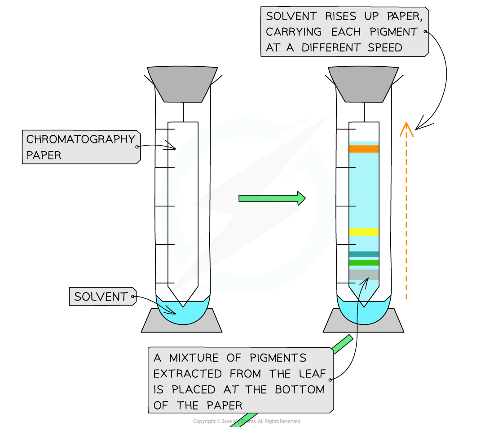
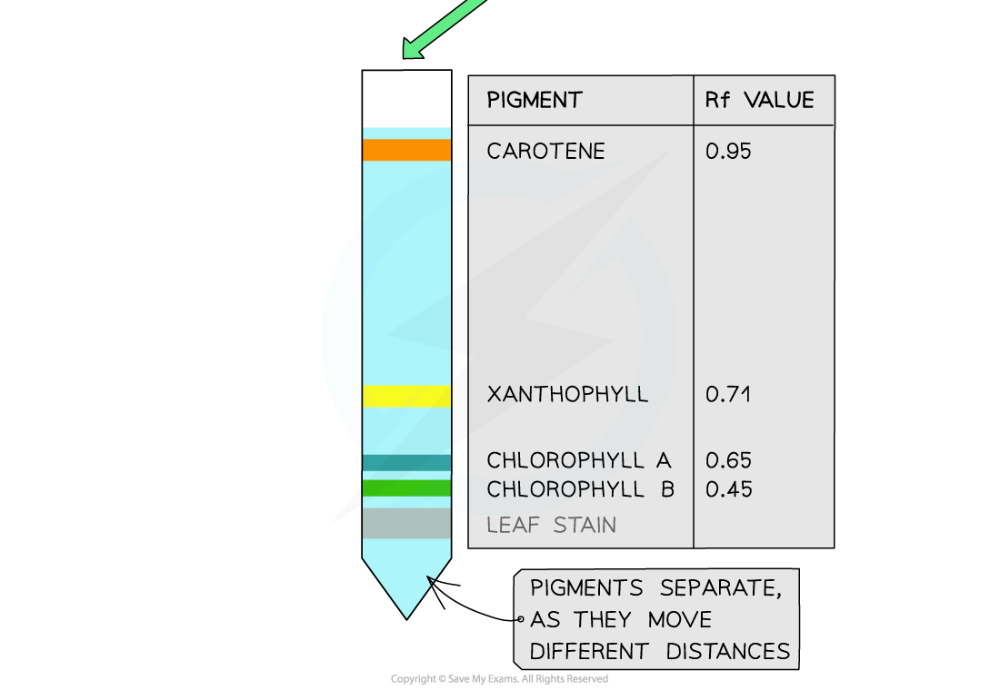

# Separation of Photosynthetic Pigments with Chromatography

## Separation of Photosynthetic Pigments with Chromatography

> **Spec point** — `spcpt_RtMTBS8n7VYb6Zh8`

## Separation of Photosynthetic Pigments with Chromatography

- Chloroplasts contain several different **photosynthetic pigments** within **photosystems **embedded in their** thylakoid membranes**
- Photosynthetic pigments **absorb different wavelengths of light**, so are different in colour

  - The colour of a pigment is due to the wavelengths of light **reflected** by that pigment, e.g. chlorophylls absorb light at the red and blue ends of the visible spectrum and reflect light in the green part of the spectrum, so appear as green pigments
- Chromatography can be used to **separate and identify chloroplast pigments** that have been extracted from a leaf

#### Chromatography

- **Chromatography** is a technique that is used to **separate mixtures**

  - **Different components** within a mixture travel through materials at **different speeds due to their size or charge**
  - This causes different components to **separate**
  - An **R****f ****value** can be calculated for each component of the mixture on the basis of its rate of movement
- Two of the most common techniques for separating photosynthetic pigments are

  - **Paper chromatography**
  
    - The mixture of pigments is passed through paper made of cellulose
  - **Thin-layer chromatography** (**TLC**)
  
    - The mixture of pigments is passed through a thin layer of an adsorbent, e.g. silica gel
    - The pigments travel faster than through paper, so they separate more distinctly

#### Apparatus

- Leaf sample
- Dropping pipette
- Acetone
- Pestle and mortar
- Filter paper or TLC paper
- Pencil
- Ruler
- Capillary tube
- Beaker or boiling tube
- Chromatography solvent

#### Method

1. Draw a straight line in pencil approximately 1cm above the bottom of the paper being used, and use the pencil to draw a dot in the middle of the line; this marks where you will place the leaf sample

  - **Do not use a pen** as the ink will separate into pigments within the experiment and obscure the results
2. Cut a section of leaf and place it in a mortar

  - It is important to choose a healthy leaf that has been in direct sunlight so you can be sure it contains many active photosystems
3. Add 20 drops of acetone and use the pestle to grind up the leaf sample and release the pigments

  - Acetone is an organic solvent and therefore fats, such as the phospholipid membranes in plant cells, dissolve in it
  - Acetone and mechanical pressure are used to break down the cell, chloroplast and thylakoid membranes to release the pigments
4. Extract some of the pigment using a capillary tube and spot it onto the dot in the centre of the pencil line you have drawn
5. Suspend the paper over a beaker containing a small amount of chromatography solvent; the end of the paper closest to the pigment extract needs to touch the chromatography solvent, but the level of the solvent should be below the pencil line at this stage

  - The solvent will move up the paper
  - The pigment mixture will be **dissolved** in the **solvent **and carried with the solvent as it moves
6. Leave the paper suspended in the solvent until the solvent has almost reached the top of the paper
7. Remove the paper from the solvent and draw a pencil line marking the level of the solvent on the paper

  - The solvent may continue moving after the paper is removed from it, so it is important to draw a pencil line immediately
  - The pigments should have separated out and there should be different spots on the paper at different heights above the pencil line; these are the separate pigments
8. Calculate the Rf value for each pigment spot

**R****f**** value = distance travelled by pigment ÷ distance travelled by the solvent**

- Always measure to the centre of each spot of pigment

#### Results

- Chromatography can be used to **separate and identify chloroplast pigments** that have been extracted from a leaf as each pigment will have a **unique R****f** value
- The Rf value is a measure of how far a dissolved pigment travel

  - Larger, less soluble molecules will travel more slowly and therefore have a **smaller R****f**** value**
  - Smaller, more soluble molecules will travel faster and therefore have a** larger R****f**** value**
- Although specific Rf values depend on the solvent that is being used, in general

  - **Carotenoids** have the **highest R****f**** values, **usually close to 1
  - **Chlorophyll *****b*** has a **much lower R****f**** value**
  - **Chlorophyll *****a*** has an Rf value somewhere **between** those of carotenoids and chlorophyll *b*

***Chromatography can be used to separate photosynthetic pigments, which can then be identified by their R******f****** values. ***
