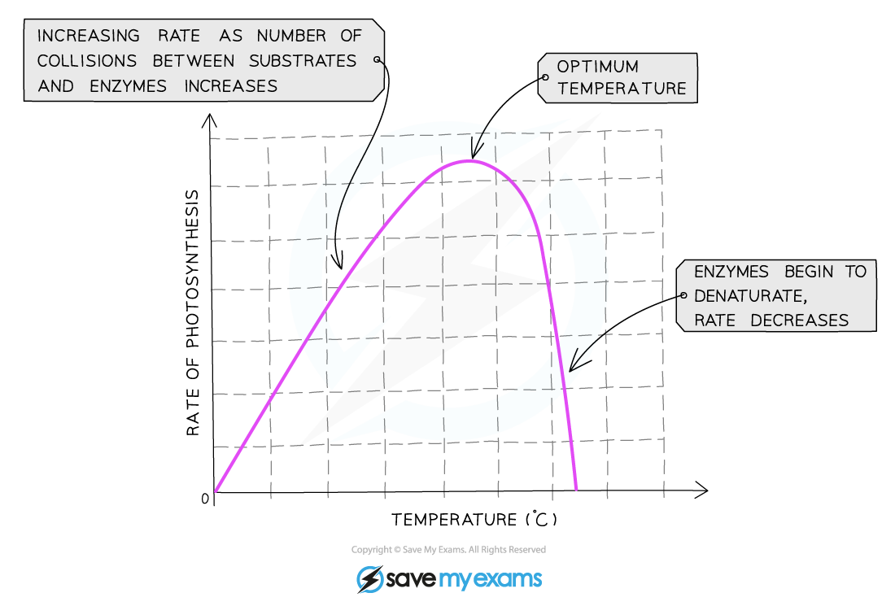
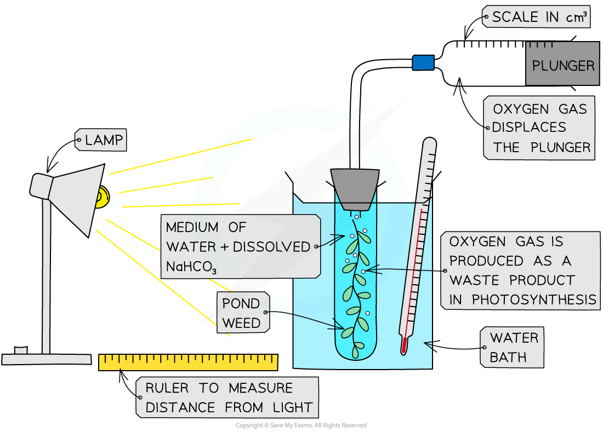

# Core Practical 10: Rate of Photosynthesis

## Rate of Photosynthesis

> **Spec point** — `spcpt_r7rbhbYjFWmkC2XG`

## Rate of Photosynthesis

- For **photosynthesis** to occur the following are required

  - The presence of **photosynthetic pigments**
  - A supply of **carbon dioxide**
  - A supply of **water**
  - **Light** energy
  - A **suitable** **temperature**
- If there is a **shortage** of any of these factors, photosynthesis cannot occur at its **maximum possible rate**
- The main external factors that affect the rate of photosynthesis are

  - **Light intensity and wavelength**
  - **Carbon dioxide concentration**
  - **Temperature**
- These are known as **limiting factors **of photosynthesis
- If any one of these factors is **below the optimum level **for the plant, its rate of photosynthesis will be **reduced**, even if the other two factors are at the optimum level

  - Note that although a lack of water can reduce the rate of photosynthesis, water shortages usually affect other processes in the plant before affecting photosynthesis and water is therefore not one of the main limiting factors

#### Light intensity

- **The rate of photosynthesis increases as light intensity increases**

  - The greater the light intensity, the more energy supplied to the plant and therefore **the faster the light-dependent stage** of photosynthesis can occur
  - This **produces more ATP and reduced NADP for the Calvin cycle**, which can then also occur at a greater rate
  - During this stage, light intensity is said to be a limiting factor of photosynthesis
- At some point, if light intensity continues to increase, the relationship above will no longer apply and the rate of photosynthesis will reach a **plateau**
- At this point **light intensity is no longer a limiting factor** of photosynthesis; another factor is limiting the rate

  - E.g. **temperature** being too low or too high, or not enough **carbon dioxide**

***Light intensity can be a limiting factor for photosynthesis***

#### Carbon dioxide concentration

- **The rate of photosynthesis increases as carbon dioxide concentration increases**

  - Carbon dioxide is one of the raw materials required for photosynthesis
  - It is required for the** light-independent stage of photosynthesis;** CO2 is combined with the five-carbon compound ribulose bisphosphate (RuBP) during **carbon fixation**
  - This means the more carbon dioxide that is present, the faster this step of the **Calvin cycle** can occur and **the faster the overall rate of photosynthesis**
- This trend will continue until some other factor, e.g. temperature or light intensity, prevents the rate from increasing further

***Carbon dioxide concentration can be a limiting factor for photosynthesis***

#### Temperature

- **As temperature increases the rate of photosynthesis increases up to a point, after which the rate decreases**

  - This is because many of the reactions of photosynthesis are **catalysed by enzymes**
  
    - At low temperatures enzyme-catalysed reactions **occur slowly** due to a lack of kinetic energy and therefore few collisions between enzyme and substrate molecules
    - At high temperatures enzymes *denature*
- The** Calvin cycle is affected by temperature, **e.g. rubisco catalyses the reaction between CO2 and the five-carbon compound ribulose bisphosphate

  - As long as there is enough light to produce ATP and NADPH in the light-dependent reaction, increasing temperature up to an **optimum temperature** will increase the rate of the light-independent reactions and therefore the rate of photosynthesis

***Temperature can be a limiting factor for photosynthesis***

#### Investigating the rate of photosynthesis

- Investigations to determine the effects of light intensity, light wavelength, carbon dioxide concentration, and temperature on the **rate of photosynthesis** can be carried out using **aquatic plants** such as *Elodea* or *Cabomba *

  - Aquatic plants are especially useful for investigating the rate of photosynthesis because the waste oxygen gas produced can be easily collected and measured underwater
- The effect of these limiting factors on the rate of photosynthesis can be investigated in the following ways

  - **Light intensity**
  
    - Change the distance of a light source from a plant
  - **Light wavelength**
  
    - Change a colour filter placed over a light source illuminating a plant
  - **Carbon dioxide concentration**
  
    - Add different quantities of sodium hydrogencarbonate (NaHCO3) to the water surrounding a plant; this dissolves to produce CO2
  - **Temperature**
  
    - Place boiling tubes containing submerged plants in water baths of different temperatures
- Whilst changing one of these factors during an investigation, **ensure that other factors remain constant**

  - E.g. when investigating the effect of light intensity on the rate of photosynthesis, a glass tank should be placed in between the lamp and the boiling tube containing the pondweed to absorb heat from the lamp; this prevents the solution surrounding the plant from changing temperature

#### Investigating the effect of light intensity on the rate of photosynthesis

#### Apparatus

- Distilled water
- Boiling tube
- Beaker
- Lamp
- Aquatic plant, algae or algal beads
- Metre ruler
- Sodium hydrogen carbonate solution
- Thermometer
- Boiling tube bung and delivery tube
- Measuring syringe

#### Method

1. Optional: ensure the water is** well aerated** before use by **bubbling air through it**

  - This will ensure that any oxygen gas given off by the plant during the investigation forms **bubbles** instead of dissolving
2. Ensure the plant has been **well illuminated** before use

  - This will ensure that the plant contains all the enzymes required for photosynthesis and that any changes of rate are due to changes in light intensity
3. Set up the apparatus in a **darkened room **with a 10 cm distance between the lamp and the boiling tube

  - This means that no external light sources will affect the rate of photosynthesis
4. Cut the stem of the pondweed **cleanly** just before placing into the boiling tube

  - This enables bubbles of oxygen to form from the cut plant stem
5. Submerge the sample of pondweed in **sodium hydrogen carbonate solution**

  - This ensures that the pondweed has a controlled **supply of carbon dioxide**
6. Measure the volume of gas collected in the gas syringe over a **set period of time,** e.g. 1 minute; repeat this measurement e.g. 3 times
7. **Change the independent variable** by moving the light source 10 cm further away from the plant and repeat step 6
8. Repeat step 7 several more times, moving the lamp 10 cm further away from the plant each time
9. Record the results in a table and plot a graph of volume of oxygen produced per minute against the distance from the lamp

***The effect of light intensity on the rate of photosynthesis can be investigated by measuring the volume of oxygen produced as a lamp is moved further away from an aquatic plant***

#### Results

- The closer the lamp, the higher the light intensity, therefore **the volume of oxygen produced should increase as the light intensity is increased**
- At a point the volume of oxygen produced will stop increasing even if the light is moved closer

  - This is the point at which light intensity stops being the limiting factor and, e.g. temperature or concentration of carbon dioxide becomes limiting
