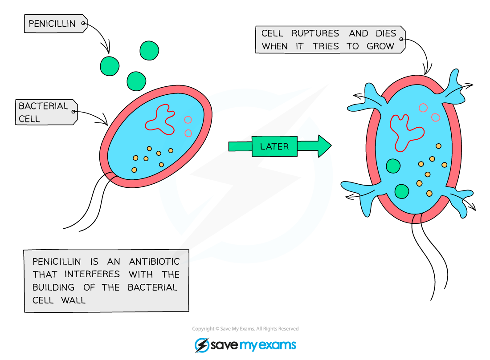

# Antibiotics

## Antibiotics

> **Spec point** — `spcpt_8w5nvYr9jDnqfq5h`

## Antibiotics

- When humans experience a bacterial infection they are often prescribed **antibiotics **
- Antibiotics are chemical substances that** damage bacterial cells** with little or no harm to human tissue

  - **Penicillin** is a well-known example; it was discovered in 1928 by Sir Alexander Fleming
- Antibiotics are either

  - **Bactericidal; **they kill bacterial cells
  - **Bacteriostatic; **they inhibit bacterial growth processes
  
    - Note that bacteriostatic antibiotics given at a high enough dose will result in the death of bacterial cells
- Antibiotics work by **interfering with the growth or metabolism of the target bacterium **e.g.

  - **Inhibiting bacterial enzymes** needed to form bonds in the cell walls; this prevents bacterial growth and can cause death
  
    - Cell walls are weakened and burst under the pressure of water entering the cell by osmosis
  - Binding to ribosomes and **preventing protein synthesis;** this inhibits enzyme production, stopping metabolic processes in the bacterial cell
  - Damaging cell membranes, leading to **loss of useful metabolites** or **uncontrolled entry of water**
  - Preventing bacterial DNA from coiling into rings, meaning that it **no longer fits into the bacterial cell**
- Since mammalian cells are **eukaryotic,** they **will not be damaged **by antibiotics

  - They do not have cell walls
  - They have different enzymes
  - They have different ribosomes
- **Viruses** do not have cellular structures such as enzymes, ribosomes, and cell walls so they **are not affected** by antibiotics

***Penicillin prevents the formation of a strong cell wall in prokaryotes, ultimately leading to the death of the cell by lysis***
