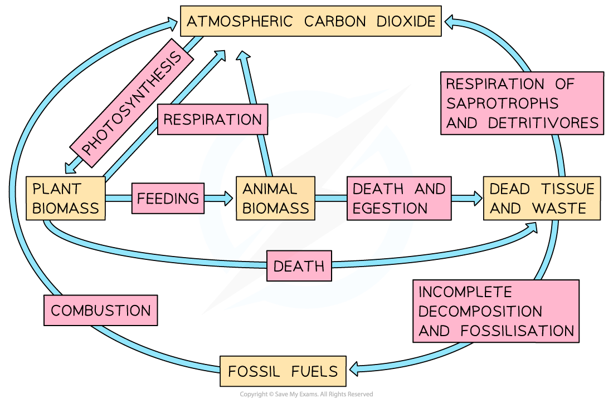

# The Role of Microorganisms

## Microorganisms & Decay

> **Spec point** — `spcpt_VmcWYn3FgQMjwDg4`

## Microorganisms & Decay

- Dead plants and animals are **broken down** by microorganisms such as **bacteria** and **fungi**

  - These organisms are known as decomposers
  - They play an important role in recycling the chemical components needed by living organisms
- These decomposers **secrete enzymes** that break **large organic molecules**,** **such as cellulose, down into **smaller ones**

  - These small molecules, such as glucose, can be broken down further during **respiration**
  - During decomposition they also **release waste products** which **provides nutrients** to plants
- The microorganisms involved in decomposition produce **CO****2**** **and **methane** which are **released** into the atmosphere
- Carbon dioxide can then be **absorbed **by green plants which will **fix the carbon** back into carbohydrates during **photosynthesis**

***Microorganisms use biological molecules within dead tissue to fuel their respiration, releasing carbon back into the atmosphere in the process***
