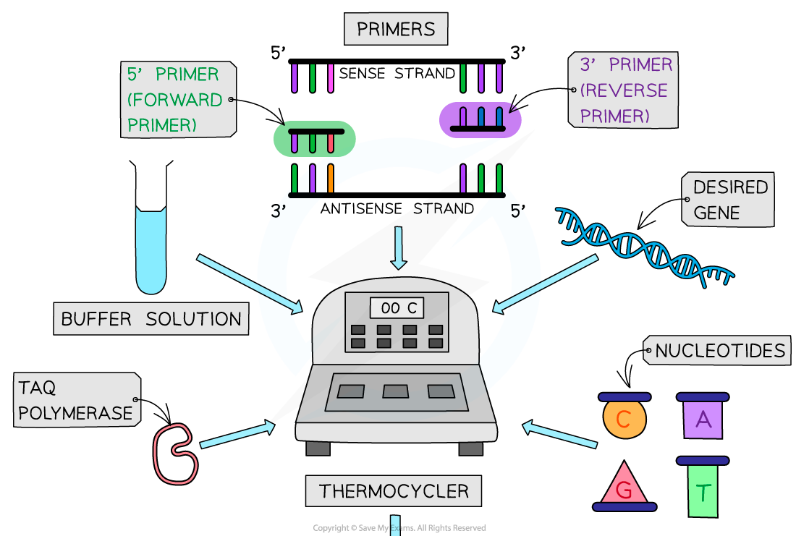
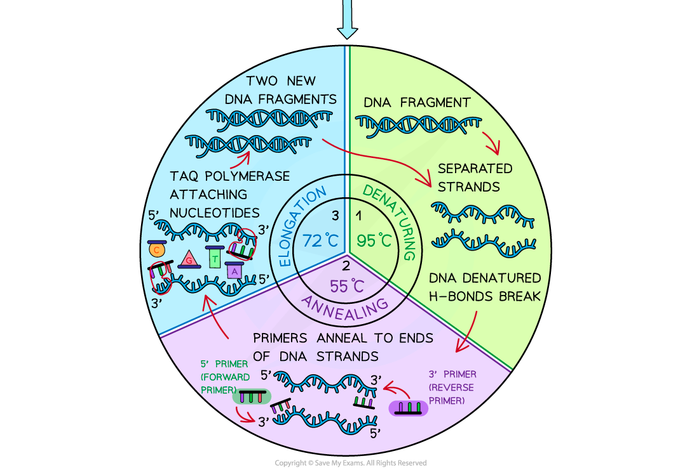

# Polymerase Chain Reaction

## Polymerase Chain Reaction

> **Spec point** — `spcpt_KKZbPFjycC3hH8fB`

## Polymerase Chain Reaction

- Every person, with the exception of identical twins, has a **unique DNA sequence** which can be used to create a **DNA profile**

  - This is very useful in forensic science as it provides a way to **identify individuals**
  - DNA profiling can also be used to determine the **genetic relationships** between different organisms e.g.
  
    - Paternity and maternity testing
    - Ancestry kits
    - Determining evolutionary relationships between different species
- DNA profiles can be created using the following steps

  - Isolating a **sample of DNA** e.g. from saliva, skin, hair, or blood
  - Producing more copies of the DNA fragments in the sample using the **polymerase chain reaction** (PCR)
  - Carrying out **gel electrophoresis** on the DNA produced by PCR
  - **Analysing the resulting pattern **of DNA fragments

#### The polymerase chain reaction

- PCR is a common molecular biology technique used in most applications of gene technology e.g.

  - DNA profiling
  - Genetic engineering
- It can be described as an **in vitro**** method of DNA replication**
- PCR produces many copies of a piece of DNA; this can be referred to as DNA **amplification**

  - It is used to produce **large quantities** of specific fragments of DNA or RNA from very small quantities; even just one molecule of DNA or RNA is enough to run PCR
  - By using PCR scientists can produce billions of **identical copies** of the DNA or RNA sample within a few hours
  - In each PCR cycle the DNA is doubled, so in a standard run of 20 cycles a million DNA molecules are produced.
- The process is carried out in a PCR machine, or **thermal cycler,** which automatically provides the **optimal temperature** for each stage and controls the **length of time** spent at each stage

- Each PCR reaction requires

  - **DNA** or **RNA** to be amplified
  - **Primers**
  
    - These are short sequences of single-stranded DNA that have base sequences complementary to the 3’ end of the DNA or RNA being copied; they define the region that is to be amplified, identifying where the DNA polymerase enzyme needs to bind
  - **DNA polymerase**
  
    - The enzyme used to build the new DNA or RNA strand.
    - The most commonly used polymerase is ***Taq***** polymerase, **which comes from thermophilic bacterium *Thermus aquaticus*
    
      - *Taq* polymerase **does not denature** at the** high temperature** required during the first stage of the PCR reaction
      - The optimum temperature of *Taq *polymerase is high enough to prevent *annealing* of the DNA strands that have not been copied yet
  - **Free nucleotides**
  
    - Enable the construction of new DNA or RNA strands
  - **Buffer solution**
  
    - Ensures the optimum pH for the reactions to occur in

- There are three main stages of the PCR reaction

  - **Denaturation**
  
    - The double-stranded DNA is heated to 95 °C which breaks the hydrogen bonds that hold the two DNA strands together
  - **Annealing**
  
    - The temperature is decreased to 50-60 °C so that primers can anneal to the ends of the single strands of DNA
  - **Elongation / Extension**
  
    - The temperature is increased to 72 °C, as this is the optimum temperature for *Taq *polymerase to build the complementary strands of DNA to produce the new identical double-stranded DNA molecules
- These three stages make up a single PCR cycle, and **many cycles can be completed**

  - Each PCR cycle **doubles the amount of DNA**

***PCR can be used to amplify a fragment of DNA. Note that you don't need to know about forward and reverse primers***

- After PCR is completed the DNA is treated with *restriction endonuclease*** enzymes** and a **fluorescent tag** can be added; both in preparation for **gel electrophoresis**

  - Restriction endonucleases break the DNA up into fragments of different length
  - Fluorescent tags enable the DNA fragments to be seen under UV light
