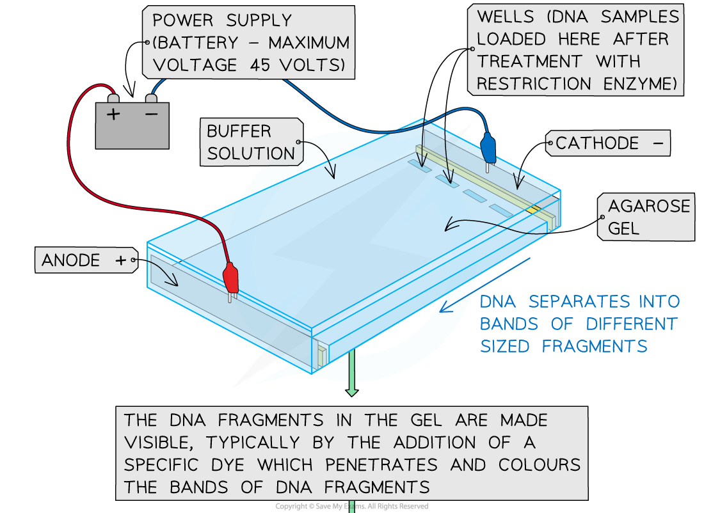
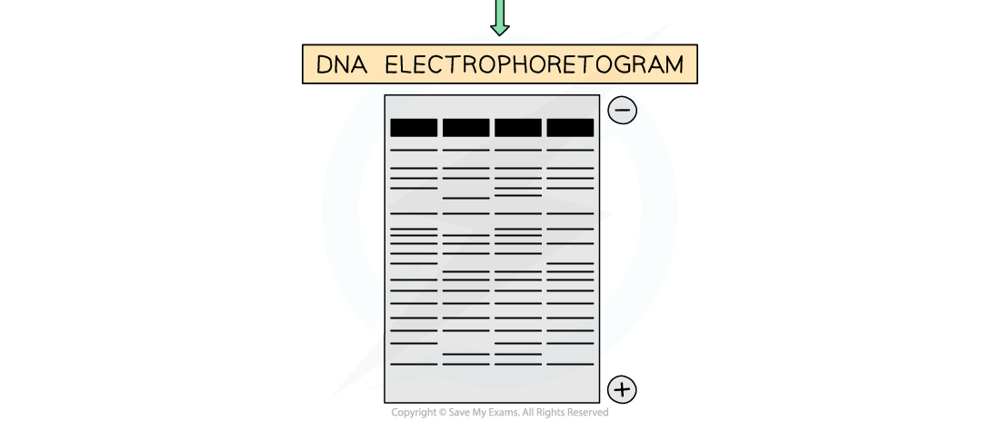

# Gel Electrophoresis in Forensics

## Gel Electrophoresis in Forensics

> **Spec point** — `spcpt_t8kMbGgstZgsMw57`

## Gel Electrophoresis in Forensics

- Gel electrophoresis is a technique used widely in the analysis of DNA, RNA and proteins

  - DNA fragments are created, e.g. using enzymes known as **restriction endonucleases **that cut DNA at specific restriction sites
  - The resulting fragments are inserted into a well at the end of a piece of agar gel, before a current is passed through the gel
- Molecules move through the agar due to the difference in charge across the gel

  - **Positively charged molecules** will move towards the **cathode** (negative pole) while **negatively charged molecules** will move towards the **anode** (positive pole)
  - DNA is negatively charged due to the phosphate groups and so when placed in an electric field the molecules **move towards the anode**
- The **molecules are separated** according to their **size / mass **

  - **Different sized molecules** move through the gel at different rates
  - The tiny pores in the gel allow smaller molecules to move quickly, whereas larger molecules move more slowly

- The process of gel electrophoresis involves the following stages

  - An **agarose gel plate** is created and **wells** are cut into the gel at one end
  - The gel is submerged in a tank containing **electrolyte solution; **this is** **a salt solution that conducts electricity
  - **The DNA samples are transferred into the wells** using a micropipette, ensuring that a sample of DNA standard is loaded into the first well
  
    - The purpose of the standard is to produce a set of known results with which to **compare **any new results
  - The negative electrode is connected to the end of the plate with the wells and the positive anode is connected at the far end
  
    - The **DNA fragments** move towards the **anode **due to the attraction between the negatively charged phosphates of DNA and the anode
    - The **smaller mass / shorter pieces** of DNA fragments move **faster and therefore further** from the wells than the larger fragments
  - **Probes are then added**, after which an **X-ray image** is taken or **UV-light is shone** onto the paper producing a **pattern of bands** which can be compared to the control, or standard, fragments of DNA
  
    - Probes are single-stranded DNA sequences that are complementary to the regions of interest; they can be
    
      - A radioactive label which causes the probes to emit radiation that makes the X-ray film go dark, creating a pattern of dark bands
      - A **fluorescent dye **which fluoresces when exposed to UV light, creating a pattern of coloured bands

***Gel electrophoresis can be used in DNA profiling***

#### Analysing the results of gel electrophoresis

- Gel electrophoresis produces a **pattern of bands** on the gel that represent DNA fragments of different length

  - The fragments were produced after PCR by cutting the DNA samples into pieces using **restriction endonuclease enzymes**
  - Restriction endonucleases cut DNA at **specific locations** in the DNA base sequence, so will always cut in between sections of repeated bases known as variable number tandem repeats (VNTRs)
  
    - VNTRs are known as micro- or mini-satellites depending on the number of repeats that occur; micro-satellites have fewer repeats than mini-satellites
  - Different people have different numbers of repeats in their VNTR regions, so the **fragments will differ in length** depending on whether there are few or many repeats
- Different individuals will have **different lengths of DNA fragments**, so a **different pattern of banding** will form on each profile
- Every banding pattern will be** unique to an individual**, so comparisons of DNA from crime scenes with that of suspects is a reliable way of finding out who was present at a crime scene

> **Exam Hint**
> Don't get too bogged down in the details regarding restriction enzymes and VNTRs, but you should be able to explain how gel electrophoresis works to separate DNA fragments of different length.
