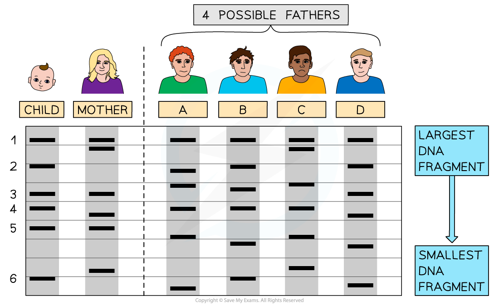
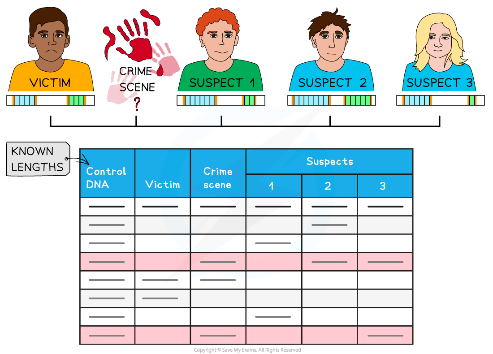

# DNA Profiling

## DNA Profiling 

> **Spec point** — `spcpt_zjykqtxNndYYxhZm`

## DNA Profiling

- A **DNA profile** can be produced using the process of **gel electrophoresis**; the result is a **series of bands of DNA **of different length which can be seen due to the addition of radioactive or fluorescent labels
- DNA profiles can be used to determine the **genetic relationships** between people, e.g. in **paternity tests**

  - During a paternity test the **DNA profile of a child** is compared with a **variety of candidates** that could be the potential father
  - If **many bands** of the child's DNA profile **match with the bands in a paternity candidate's profile**, this could indicate that they are the **most likely** biological father
  
    - During fertilisation **half** of the DNA comes from each parent, so a child will share **half of their DNA with a parent**
    - When comparing DNA profiles the **more bands that match** between the profiles, the **greater the genetic similarity **between those individuals and the closer the relationship

***DNA profiles can be compared to determine relationships in paternity testing. Here the child shares bands 1, 3 and 5 with the mother and bands 2, 4 and 6 with candidate B, so he is the most likely father***

- DNA profiling is a useful tool in **forensic science** where it can be used to link possible suspects to a crime scene

  - Regions of DNA, known as **short tandem repeats**, are examined
  
    - These short tandem repeats are a type of non-coding, repeated sequence of bases known as a variable number tandem repeat, or VNTR; short tandem repeats consist of **short** repeating sections, and are also known as micro-satellites
  - The greater the number of these regions examined, the more reliable the evidence provided
  
    - If only a few regions are analysed then there is a greater chance that closely related individuals will have an identical profile; an analysis of 11 or more sites is considered to be reliable evidence in a law court

***DNA profiles can be created using DNA samples found at crime scenes and then compared with the profiles of suspects to show who was present at a crime scene. VNTRs are shown beneath each individual in blue and green; different individuals have different numbers of VNTRS. In this example the DNA profile of suspect 3 is the closest match with the DNA found at the crime scene, though none of the suspects is a perfect match.***

- DNA profiling can also be useful in **selective or captive breeding programmes** of animals or **cultivation of plants**

  - DNA profiles of the particular organisms can be **compared** to determine which are **genetically the most different** from each other
  - These organisms will then be crossbred, ensuring that the individuals that breed together are** not** closely related
  
    - Breeding between closely related individuals is known as **inbreeding**, and can cause genetic problems at an individual and population level
    
      - In individuals there can be an accumulation of harmful recessive alleles that might otherwise have been masked by healthy dominant alleles
      - Inbreeding leads to a **smaller gene pool** within a population, which can reduce a population's ability to adapt to change
