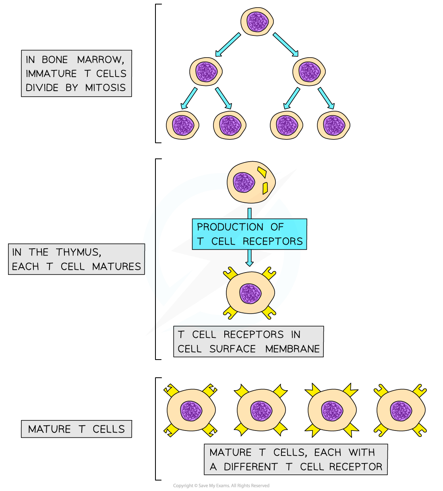
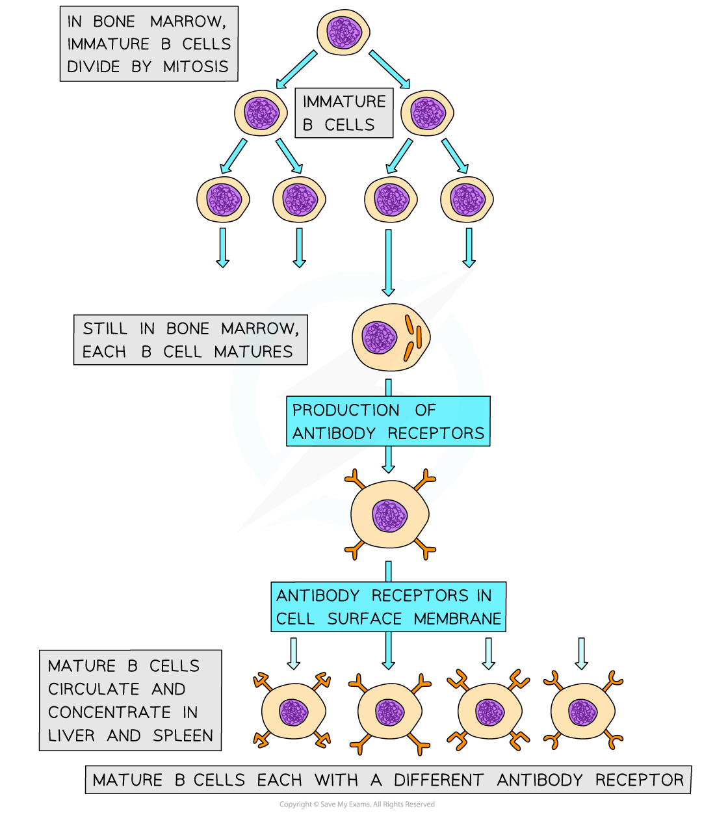
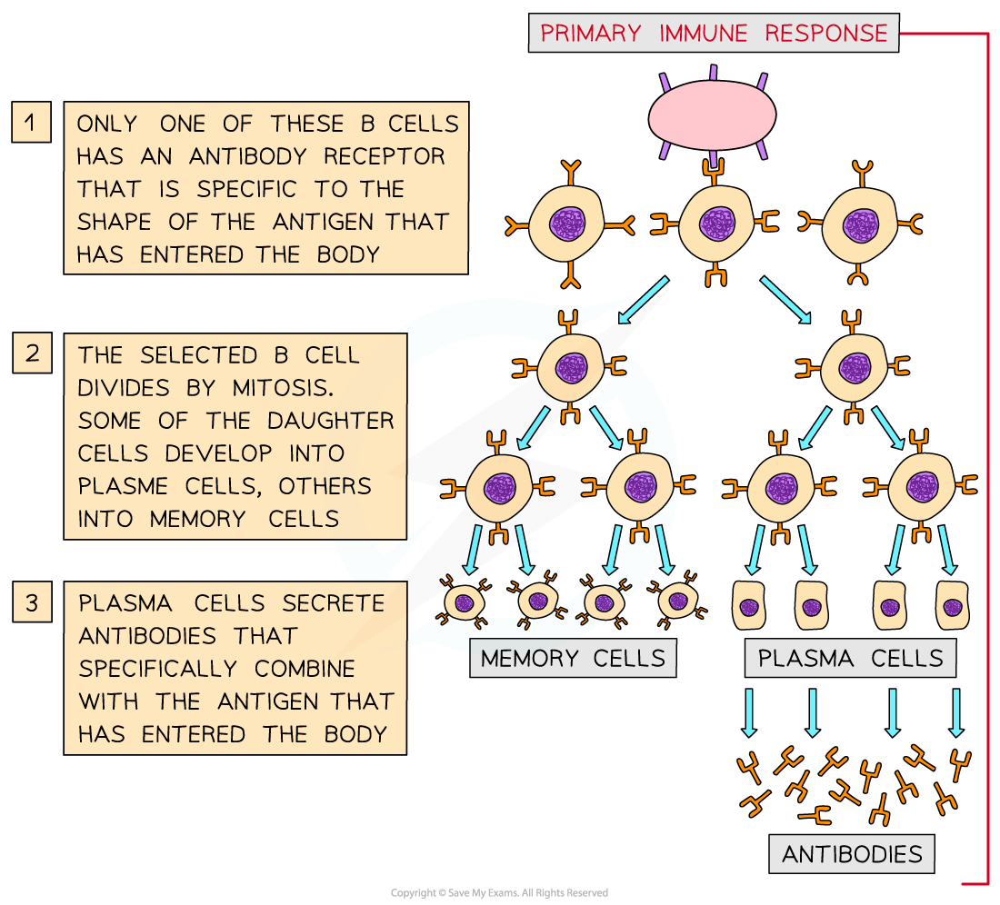

# Lymphocytes: Types & Roles

## Lymphocytes: Types & Roles

> **Spec point** — `spcpt_MhZCf7bs2fd9p3QH`

## Lymphocytes: Types & Roles

- There are two types of **lymphocyte **that play a particular role in the specific immune response

  - T cells
  - B cells
- Note that lymphocytes are a type of **white blood cell**

#### T cells

- **T cells**, sometimes known as T lymphocytes, are produced in the bone marrow and finish maturing in the **t**hymus, which is where the **T **in their name comes from
- Mature **T cells** have specific cell surface receptors called **T cell receptors**
- These receptors have a **similar structure to antibodies** and are each **specific to a particular type of antigen**

***Mature T cells have many different types of receptor on the cell surface membrane; these receptors will bind to different antigens on antigen presenting cells***

- T cells are **activated** when they encounter and **bind to their specific antigen** on the surface of an antigen presenting cell

  - This **antigen-presenting **cell might be a **macrophage, **an **infected body cell**, or the **pathogen** itself
- These activated T cells **divide** **by** **mitosis** to increase in number

  - Dividing by mitosis produces **genetically identical cells**, or **clones**, so all of the daughter cells will have the **same type of T cell recepto**r on their surface
- There are **three main types **of T cell

  - **T helper cells**
  
    - Release chemical signalling molecules that help to **activate B cells**
    - Release chemical signalling molecules that help to **activate T killer cells**
    - Release chemicals called cytokines, that **label pathogens and infected cells for phagocytosis**
  - **T killer cells**
  
    - Bind to and **destroy infected cells** displaying the relevant specific antigen
  - **T memory cells**
  
    - **Remain in the blood** and enable a faster specific immune response if the same pathogen is encountered again in the future

#### B cells

- **B cells,** also known as B lymphocytes, are a second type of white blood cell in the specific immune response

  - B cells remain in the **b**one marrow as they mature, hence the **B** in their name
- B cells have many **specific receptors** on their cell surface membrane

  - The receptors are in fact **antibodies**, and are known as **antibody receptors**
  - Each B cell has a **different type of antibody receptor**, meaning that each B cell can **bind to a different type of antigen**

***Mature B cells each have different types of antibody receptors on their cell surface membrane***

- If the corresponding antigen enters the body, B cells with the correct cell surface antibodies will be able to **recognise** it and bind to it

  - When the B cell binds to an antigen it forms an **antigen-antibody complex**
- The **binding of the B cell to its specific antigen**, along with the **cell signalling molecules produced by T helper cells**, **activates** the B cell
- Once activated the B cells divide repeatedly by mitosis, producing many clones of the original activated B cell
- There are **two main types of B cell**

  - **Effector cells, **which differentiate into **plasma** **cells**
  
    - Plasma cells produce specific antibodies to combat non-self antigens
  - **Memory cells**
  
    - Remain in the blood to allow a faster immune response to the same pathogen in the future

***During a primary immune response B cells divide by mitosis to form plasma cells and memory cells. Note that a primary response occurs the first time an individual comes into contact with a particular pathogen***
