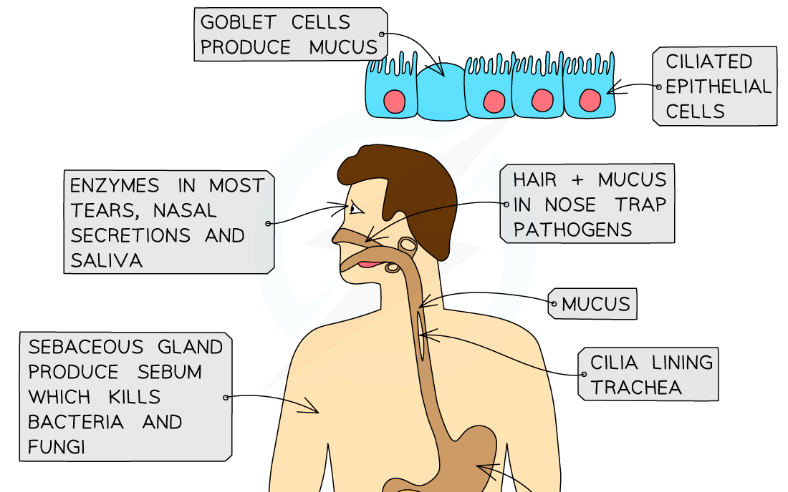
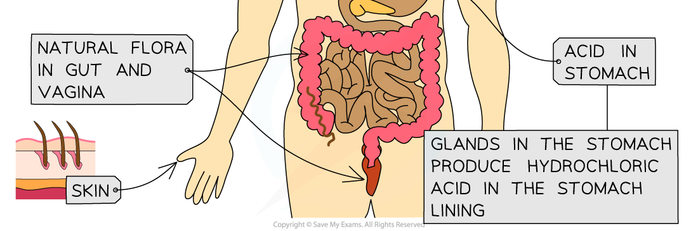

# Pathogens: Routes of Entry

## Pathogens: Routes of Entry

> **Spec point** — `spcpt_ZwzDQ8kfKdr95Hhb`

## Pathogens: Routes of Entry

- In order for a pathogen to cause disease it must **enter** the body of the host

  - **Body openings,** e.g. the mouth, eyes, and urinary tract, provide easy access for pathogens to enter
  - Pathogens may enter **directly into the bloodstream** through breaks in the skin
- Pathogens may be transmitted in a variety of ways

#### Vectors

- These are **living organisms** that carry pathogens and **transmit** them between hosts
- **Insects**, such as flies and mosquitoes, are common vectors for diseases like malaria and yellow fever

#### Inhalation

- **Droplets** from the respiratory tract will be **suspended in the air** when an infected person coughs, sneezes or talks
- These droplets **contain pathogens** that can be **inhaled** by healthy people
- The airways provide an **entry point** into the respiratory system of a new host and another infection occurs, e.g. flu, measles, tuberculosis

#### Ingestion

- Pathogens can enter through the **digestive** system when we **ingest contaminated **food or drink
- This is especially probable if food is **undercooked**, as heat destroys most of the pathogens
- These pathogens can make their way through the lining of the gut and cause disease (e.g. cholera, *Salmonella* poisoning)

#### Indirect contact

- **Inanimate objects** can contain large numbers of pathogens that may be transferred between hosts

  - An infected individual may touch or cough on an object which is later touched by a healthy individual who transfers the pathogens to their mouth or nose by touching their face
- Examples include bedding, towels, and surfaces

#### Direct contact

- Pathogens that spread this way will require some part of the host, e.g. skin, body fluids, to come into **direct contact** with a healthy individual
- Pathogens that spread by this route can then pass through the **mucous membranes** and enter the bloodstream, e.g.

  - When shaking hands with another person who then puts their hand to their nose or mouth
  - During sexual transmission
- Examples include HIV, ebola, syphilis

#### Inoculation

- This typically occurs when a pathogen enters the body through **broken skin**, providing it with a **direct route** into the bloodstream
- Transmission could be through sexual contact, sharing needles during drug use, or bites or scratches from infected animals
- Examples include hepatitis B, HIV, tetanus, and rabies

## Barriers to Pathogenic Entry

> **Spec point** — `spcpt_h948zdbB6vGgzjnR`

## Barriers to Pathogenic Entry

#### Skin

- The skin provides a **physical barrier** against infection
- If the skin is damaged it leaves the exposed tissue beneath vulnerable to pathogens
- The **blood clotting mechanism** of the body plays an important role in preventing pathogen entry in the case of damage to the skin
- Blood clotting takes time, however, so a few pathogens may still enter before a clot forms

#### Microorganisms of the gut and skin

- Collectively these **harmless** microorganisms are known as the **gut **or **skin** **flora**
- They **compete** with pathogens for resources, thereby **limiting** their numbers and therefore their ability to infect the body

#### Stomach acid

- The **hydrochloric acid** that makes up a large part of the gastric juices in the stomach creates an **acidic environment** that is **unfavourable **to many pathogens present on food and drink
- Sometimes a few of these pathogens may survive and make their way to the intestines where they infect the gut wall cells and cause disease

#### Lysozyme

- Secretions of the **mucosal surfaces, **e.g. tears, saliva, and mucus, contains an enzyme called **lysozyme**
- This enzyme will **damage bacterial cell walls**, causing them to burst, or lyse

***The body has various barriers that prevent the entry of pathogens***
