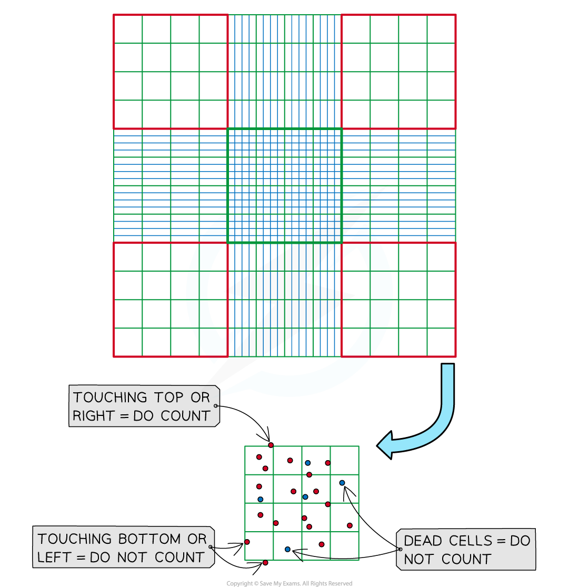
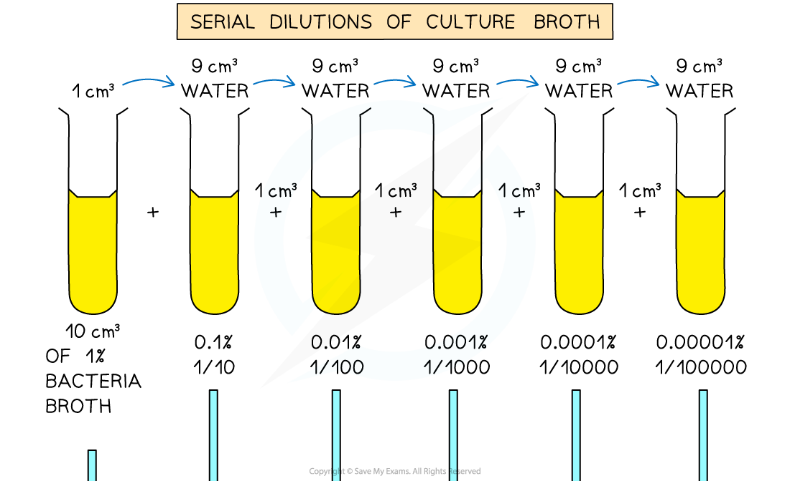
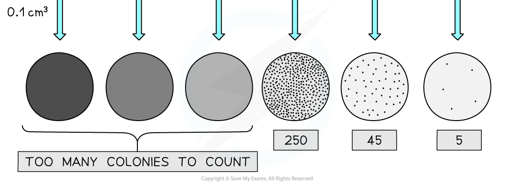

# Measuring the Growth of Microorganisms

## Measuring the Growth of Microorganisms

> **Spec point** — `spcpt_jND2nyH9H9VHgV35`

## Measuring the Growth of Microorganisms

- Bacteria and most other microorganisms are **too small** to count with the naked eye
- There are a **variety of methods **that can be used to** count** microorganisms and it is important to be able to make an appropriate choice when conducting investigations
- These methods include

  - Cell counts
  - Dilution plating
  - Measuring area and mass
  - Optical methods

#### Cell counts

- A **microscope** and **haemocytometer** can be used to count **single-celled microorganisms**

  - A haemocytometer is a microscope slide with a rectangular chamber that is marked with grid lines
  - The chamber can hold a standard volume of 0.1 mm3
  - Haemocytometers were originally used to count blood cells
  
    - Haemo = blood
- Counting cells using a haemocytometer involves the following

  - A nutrient broth is diluted with an equal volume of **trypan blue**
  
    - This is a dye that will **stain dead cells blue**
    - It enables the investigator to only count the **living cells**
  - The chamber of the haemocytometer is filled with the stained nutrient broth
  - The number of living cells in the **four corner squares** of the grid are counted
  
    - Each corner square consists of **16 smaller squares**
    - Consistency needs to be used when deciding whether to count cells that are on the lines that border the corner squares
    
      - E.g. Counting cells on the top and right-hand borders and ignoring cells on the bottom and left-hand borders
  - The **mean number of cells **from the four corner squares can be calculated
- The haemocytometer is **calibrated **to allow the calculation of the number of cells in a known volume of broth

  - Because the haemocytometer chamber can hold exactly 0.1 mm3 of liquid, it is possible to estimate of the cell count in 1 ml of nutrient broth using the following calculation

**No. of cells per ml nutrient broth = mean cell count x dilution factor x 10****4**

- Multiplying by the dilution factor enables calculation of the bacterial cell count in the original broth rather than the diluted broth

  - The multiplication by 104 enables calculation of the bacterial cell count in 1 ml rather than in 0.1 mm3
  
    - 1 ml = 1 cm3
    - 1 cm3 = 0.1 mm3 x 10 000
    - 10 000 = 1 x **10****4**
- E.g. in a scenario where a nutrient broth is diluted by a factor of 100 and the four corner grid squares contain 20, 14, 19, and 16 cells

  - This gives a mean cell count of 17.25
  - No. cells per ml nutrient broth = 17.25 x 100 x 104 = 17 250 000

***The living cells in the corner squares of a haemocytometer grid can be counted to determine the number of microorganisms in a standard volume of nutrient broth***

#### Dilution plating

- This method can be used to determine the **total viable cell count** in a nutrient broth

  - The nutrient broth is transferred to agar where the bacteria use nutrients in the agar gel to reproduce
  - A single cell that lands on agar reproduces by cloning itself, resulting in a **mass of identical cells known as a colony**
  - **Each microbial colony** that grows on agar gel originated with one viable microorganism, so can be counted as **one viable cell**
- Individual microbial colonies can be difficult to identify on an agar plate as they tend to form one large mass
- This problem can be overcome by **diluting the original cultures **before transferring the samples to agar; this reduces the number of cells in the original sample so that individual colonies are visible on an agar plate

  - This is why the technique is known as **dilution plating**
- To calculate the total viable cell count, the **number of colonies** are **multiplied by the dilution factor**
- A **mean** can be determined if more than one plate is used

***Dilution plating can provide a way to determine the total viable cell count of a microbial culture***

#### Area and mass of fungi

- Fungi do not always live as single-celled organisms, but can form a mass of elongated cells known as a **fungal mycelium **(plural mycelia); this means that the methods described above can be unsuitable for measuring the growth of some fungi
- Measuring the **diameter of individual areas of the mycelium** can be used to determine the growth of fungi

  - Petri dishes of agar are inoculated with fungal spores and incubated at a suitable temperature
  - The resulting areas of fungal mycelia are then measured
- This can be used to **compare growth rates** in different conditions, e.g. at different temperatures

  - The **larger** the mean diameter, the **greater the growth** of the fungi
- **Testing the dry mass** of fungi is another effective way to measure fungal growth

  - A liquid nutrient broth is inoculated with fungal spores
  - Samples of the nutrient broth are removed at set time intervals
  - The fungal mycelia are removed by filtering or *centrifugation*
  - The material is dried in an oven overnight and its mass measured
- The **higher the mass**, the **more fungal growth** has occurred

#### Optical methods

- **Turbidimetry** is a specialised form of colorimetry that can be used as an **alternative method** to measure the number of cells in a sample

  - **Turbidity** is a measure of **how cloudy **a solution is
  
    - More turbid = more cloudy
    - Less turbid = less cloudy
  - Colorimetry uses a machine called a **colorimeter **to shine a beam of light at a sample and measure the amount of light that is either transmitted through or absorbed by the sample
- The **higher the number of cells** the **more turbid** the solution becomes
- More turbid solutions will **absorb more light **and **allow less light through**; this can be measured by a colorimeter
- This provides an **indirect measure** of the number of microorganisms present
- A **calibration curve** can be constructed by measuring the turbidity of a series of control cultures while also counting the cells in each culture using a **haemocytometer**; the results are plotted in a graph of **turbidity against cell count**
- This curve can then be used to **estimate** the cell count of unknown samples by measuring their turbidity and then reading their cell count from the graph

***A colorimeter can be used to determine the turbidity of a solution containing microorganisms. The solution containing bacteria is placed into a container called a cuvette and the amount of light that can pass through, or is absorbed by, the solution can be measured.***
