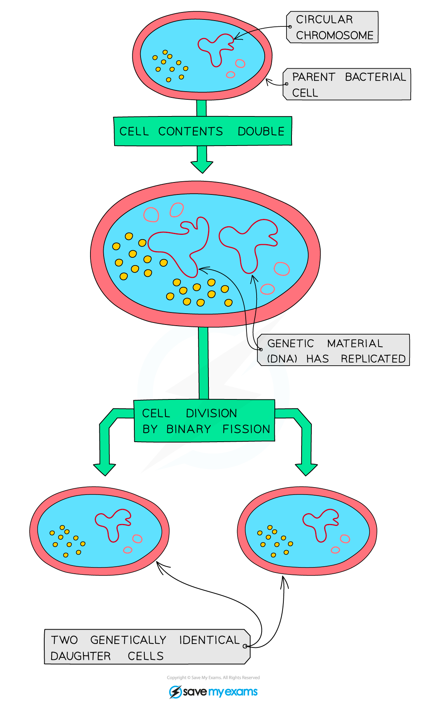
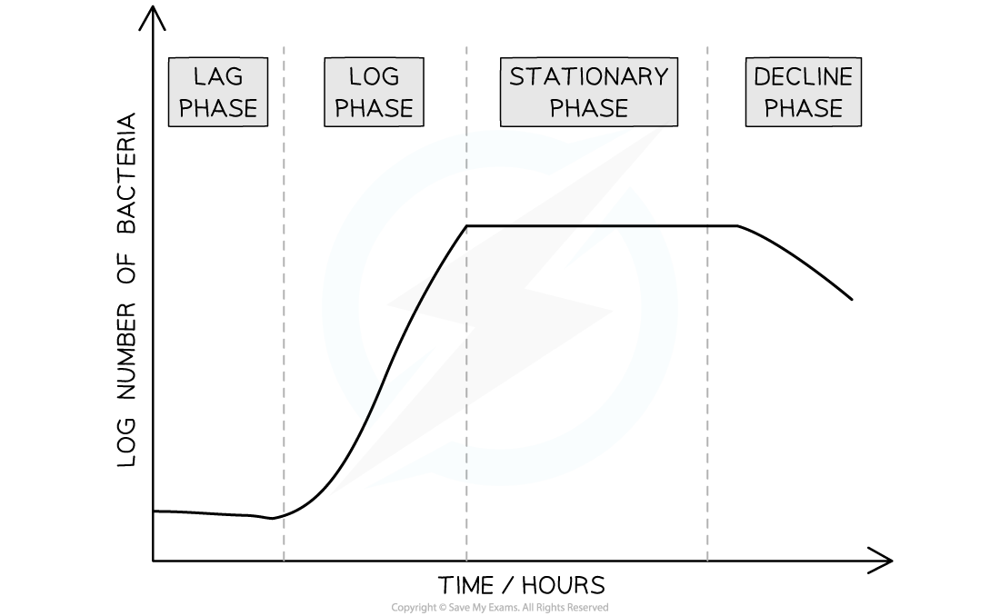

# The Bacterial Growth Curve

## The Bacterial Growth Curve

> **Spec point** — `spcpt_w2RGCnrj9SJkFh7c`

## The Bacterial Growth Curve

- Bacteria divide using the process of **binary fission** during which one cell will divide into two identical cells
- The process is as follows

  - The single, circular DNA molecule undergoes DNA replication
  - Any plasmids present undergo DNA replication
  - The parent cell divides into two cells, with the cytoplasm roughly halved between the two daughter cells
  - The two daughter cells each contain a single copy of the circular DNA molecule and a variable number of plasmids

***The process of binary fission produces two identical daughter cells***

#### Bacterial growth curve

- The growth of a bacterial population follows a specific pattern over time; this is known as a **growth curve**
- There are 4 phases in the population growth curve of a microorganism population

  - **Lag phase**
  
    - The population size **increases slowly** as the microorganism population adjusts to its new environment and gradually starts to reproduce
  - **Exponential phase**
  
    - With high availability of nutrients and plenty of space, the population moves into **exponential growth**; this means that the population **doubles with each division**
    - This phase is also known as the **log phase**
  - **Stationary phase**
  
    - The population reaches its maximum as it is **limited by its environment**, e.g. a lack of resources and toxic waste products.
    - During this phase the number of microorganisms dying equals the number being produced by binary fission and the **growth curve levels off**
  - **Death phase**
  
    - Due to lack of nutrients and a build up of toxic waste build up, death rate exceeds rate of reproduction and the population **starts to decline**
    - This phase is also known as the **decline phase**

***There are four phases in the standard growth curve of a microorganism***

#### Using logarithms in growth curves

- During the **exponential growth phase** bacterial colonies can grow at rapid rates with very large numbers of bacteria produced within hours
- Dealing with experimental data relating to **large numbers** of bacteria can be difficult when using traditional linear scales

  - There can be a wide range of numbers reaching from single figures into millions
  - This makes it hard to work out a suitable scale for the axes of graphs
- **Logarithmic** scales can be very useful when investigating bacteria or other microorganisms

  - The numbers in a logarithmic scale represents logarithms, or powers, of a base number
  - If using a log10 scale, in which the base number is 10, the numbers on the y-axis represent a **power of 10**, e.g. **1**=101 (10), **2**=102 (100), **3**=103 (1000) etc.
- Logarithmic scales allow for a **wide range of values** to be displayed on a single graph

- For example, if yeast cells were grown in culture over several hours the number of cells would increase very rapidly from the original number of cells present
- The results from such an experiment are shown in the graph below using a log scale

  - The number of yeast cells present at each time interval was converted to a logarithm before being plotted on the graph
  
    - This can be done using a log function on a calculator
  - The log scale is easily identifiable as there are **not equal intervals** between the numbers on the y-axis
  - The **wide range of cell numbers fit **easily onto the same scale

***When a log******10****** scale is used, the scale increases by a factor of 10 each time; this allows large increases in numbers to be shown on a single graph***

> **Exam Hint**
> You won’t be expected to convert values into logarithms or create a log scale graph in the exam. Instead you might be asked to interpret results that use logarithmic scales or explain the benefit of using one! Remember that graphs with a logarithmic scale have **uneven intervals** between values on one or more axes.

#### Exponential growth rate constants

- To calculate the number of bacteria in a population the following formula can be used

$N_{t}=N_{0}x2^{kt}$

- *Where*

  - ***N******t*** = the number of organisms at time *t*
  - ***N******0*** = the number of organisms at time *0*
  - ***k*** = the exponential growth rate constant
  - ***t*** = the time for which the colony has been growing
- To use this equation the exponential growth rate constant ***k*** must be calculated

  - This refers to the **number of times the population doubles in a given time period**
- The following formula can be used to calculate the exponential growth rate constant

$k=\frac{\mathrm{log}_{10}N_{t}-\mathrm{log}_{10}N_{0}}{\mathrm{log}_{10}2xt}$

> **Worked Example**
> A bacterial colony started with 2 individuals and after 3 hours of growing there were 926 bacteria in the colony.
> 
> 1. Calculate the exponential growth rate constant of this colony
> 
> 2. Calculate the number of bacteria in the colony after 5 hours
> 
> **Answer:**
> 
> **Step 1: Calculate the exponential growth rate constant**
> 
> $k=\frac{\mathrm{log}_{10}N_{t}-\mathrm{log}_{10}N_{0}}{\mathrm{log}_{10}2xt}$
> 
> $k=\frac{\mathrm{log}_{10}(926)-\mathrm{log}_{10}(2)}{\mathrm{log}_{10}2x3}$
> 
> $k=\frac{2.67}{0.30x3}$
> 
> $k=3$
> 
> **Step 2: Calculate the number of bacteria after 5 hours**
> 
> $N_{t}=N_{0}x2^{kt}$
> 
> $N_{t}=2x2^{(3)(5)}$
> 
> $N_{t}=2x2^{15}$
> 
> $N_{t}=65536$
