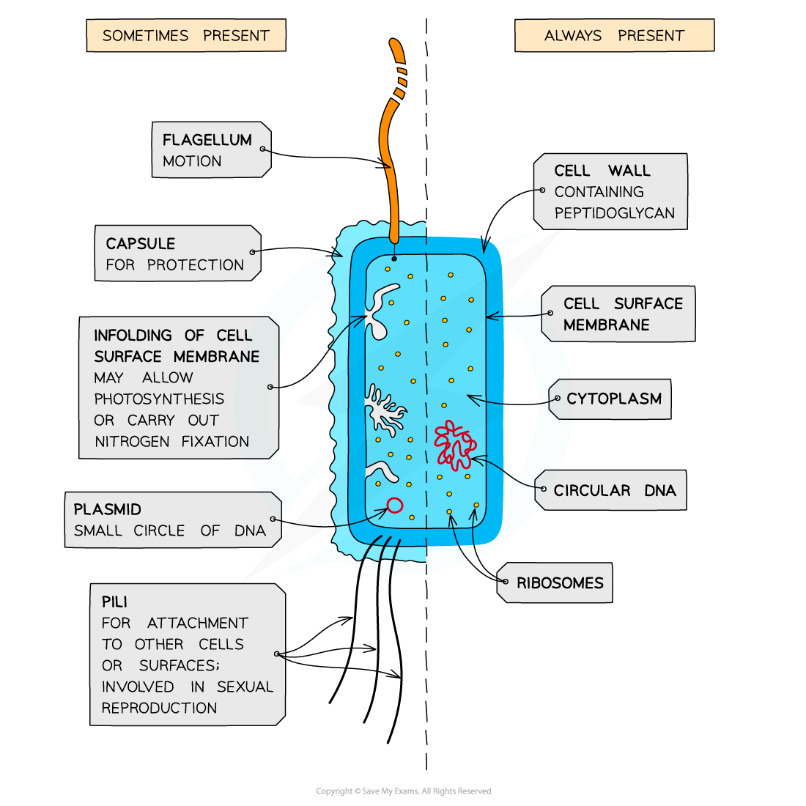
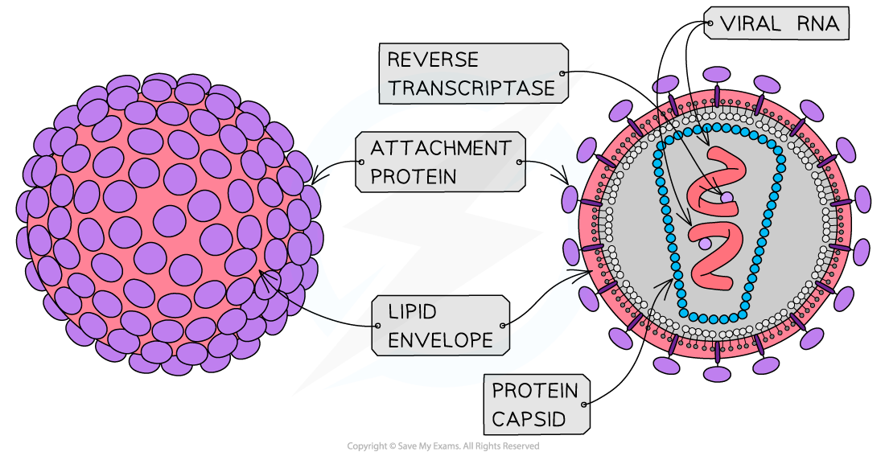
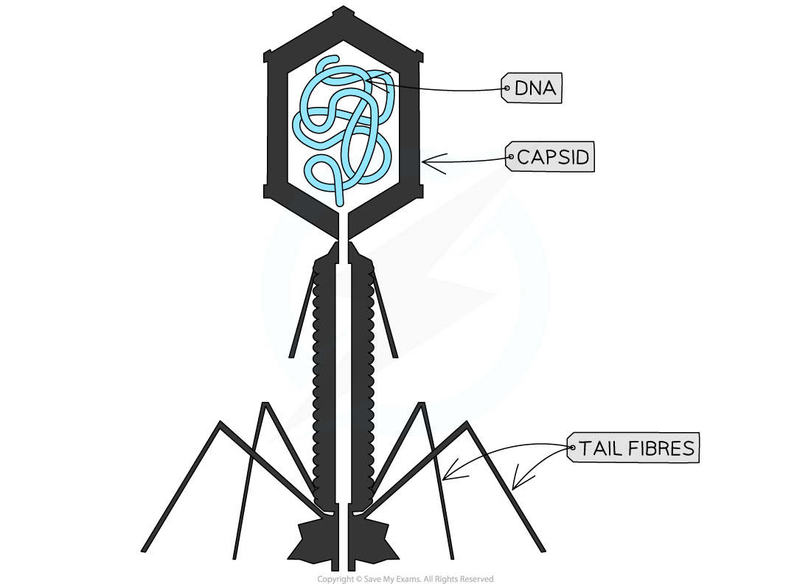
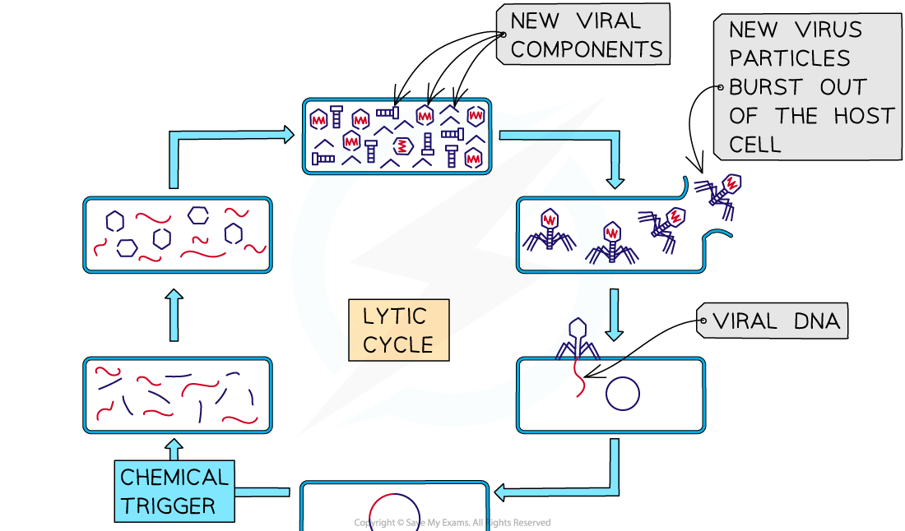
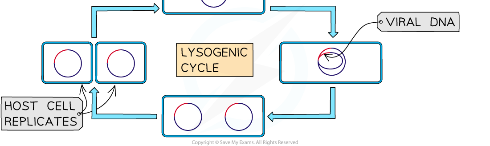

# Comparison of Bacterial & Viral Structure

## Comparison of Bacterial & Viral Structure

> **Spec point** — `spcpt_YjgFFrHTWRTkqnkr`

## Comparison of Bacterial & Viral Structure

#### Bacteria

- Bacteria are single-celled **prokaryotes**
- Prokaryotic cells are much **smaller** than *eukaryotic* cells
- They also differ from eukaryotic cells in having

  - A **cytoplasm** that **lacks membrane-bound organelles**
  - **Ribosomes** that are smaller (70 S) than those found in eukaryotic cells (80 S)
  - **No nucleus, **instead having a **single circular bacterial chromosome** that is free in the cytoplasm and is **not associated with proteins**
  - A cell wall that contains the glycoprotein **murein**
  
    - Murein is sometimes known as **peptidoglycan**
- In addition, many prokaryotic cells also have the following structures

  - Loops of DNA known as** plasmids**
  - **Capsules**
  
    - This is sometimes called the **slime** capsule
    - It helps to **protect** **bacteria** from drying out and from attack by cells of the immune system of the host organism
  - Flagella (singular flagellum)
  
    - Long, tail-like structures that rotate, enabling the prokaryote to **move**
    - Some prokaryotes have **more than one**
  - Pili (singular pilus)
  
    - Thread-like structures** **on the surface of some bacteria that enable the bacteria to **attach **to other cells or surfaces
    
      - Involved in **gene transfer** during sexual reproduction
  - A cell membrane that contains folds known as **mesosomes; **these infolded regions can be the site of respiration
- Some bacteria are disease-causing, or **pathogenic**, but not all bacteria cause harm to other organisms

***Prokaryotic cells have a peptidoglycan cell wall, no membrane-bound organelles, a circular chromosome, and 70S ribosomes***

#### Viruses

- **Viruses** are **non-cellular infectious particles**
- They are relatively simple in structure, and much smaller than prokaryotic cells
- Structurally they have

  - **A nucleic acid core**
  
    - Their genomes are either DNA or RNA, and can be single or double-stranded
  - **A protein coat **called a** ‘capsid’** made of repeating units known as **capsomeres**
- They do not possess a plasma membrane, cytoplasm, or ribosomes
- Some viruses have an outer layer called an **envelope** formed from the **membrane-phospholipids** of the cell they were made in

  - The fact that lipid envelopes are formed from the membrane of a viral host cell means that very few plant viruses have lipid envelopes
- Some contain **proteins** inside the capsid which perform a variety of functions

  - E.g. HIV contains the enzyme **reverse transcriptase** which converts its RNA into DNA once it has infected a cell
- Viruses also contain **attachment proteins, **also known as **virus attachment particles,** that stick out from the capsid or envelope

  - These enable the virus to attach itself to a host cell
- Viruses can only reproduce by **infecting living cells** and using the **protein-building machinery** of their host cells to produce new viral particles
- Viruses are classified on the basis of the **genetic material they contain** and how they replicate

  - They can be classified into the following categories
  
    - DNA viruses
    - RNA viruses
    - Retroviruses

***HIV contains RNA as its genetic material. It is surrounded by a protein capsid, as well as having an outer lipid envelope and attachment proteins***

#### DNA viruses

- They contain **DNA** as genetic material
- Viral DNA acts as a **direct template** for producing new viral DNA and mRNA for the synthesis of viral proteins
- Examples: smallpox, adenoviruses, and bacteriophages

  - Bacteriophages are viruses that infect bacteria, such as the **λ (lambda) phage**

***Bacteriophage viruses, such as the λ phage, are examples of DNA viruses***

#### RNA viruses

- They contain **RNA** as genetic material

  - Most have a **single strand** of RNA
  - They **do not **produce DNA at all
- Mutations are **more likely** to occur in RNA viruses than DNA viruses
- Examples:** tobacco mosaic virus (TMV)**, **ebola virus**

#### Retroviruses

- **Special type** of RNA virus that **does produce DNA**
- They contain a **single strand of RNA** surrounded by a protein capsid and lipid envelope
- Viral RNA controls the production of an enzyme called **reverse transcriptase**
- This enzyme catalyses production of** viral DNA** from the **single strand of RNA **
- The new viral DNA is incorporated into the **host DNA **using** integrase **enzymes** **where it acts as a **template** to produce viral proteins and RNA
- Example: **HIV** (Human Immunodeficiency Virus)

## Lytic & Latency

> **Spec point** — `spcpt_qgvQfd5WwjMYjP3N`

## Lytic & Latency

- Viruses can only reproduce **within a host cell** as they lack the cellular machinery to do so on their own
- They can enter a host cell in a variety of different ways

  - Bacteriophages **inject** their genetic material into bacteria
  - Some animal viruses enter the cell via *endocytosis* by fusing their viral envelope with the host cell surface membrane
  - Plant viruses will often use a **vector** such as an insect to breach the cell wall
- Once inside the host cell one of the following pathways can occur

  - Lysogenic
  - Lytic

#### Lysogenic pathway

- Some viruses will **not immediately** cause disease once they infect a host cell
- Viral DNA known as a **provirus** is inserted into the host DNA, but a viral gene coding for a **repressor protein** prevents the viral DNA from being transcribed and translated

  - Every time the host DNA copies itself, the **inserted viral DNA will also be copied**
- This is called **latency** and the time during which it occurs is known as a **period of lysogeny**
- Viruses in a lysogenic state may become **activated** and enter the **lytic pathway**

  - Activation may occur as a result of, e.g. host cell damage or low nutrient levels inside a cell

#### Lytic pathway

- The viral genetic material is **transcribed and translated** to produce new viral components
- These components are assembled into **mature viruses** that accumulates inside the host cell
- Eventually the **host cell bursts** which releases large numbers of viruses, each of which can infect a new host cell

  - Cell bursting is known as cell **lysis**
- This typically results in **disease**

***The life cycle of the λ bacteriophage includes a lysogenic and a lytic pathway***
