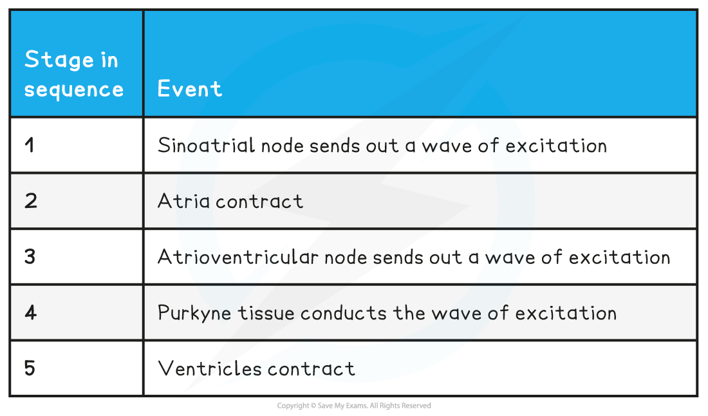
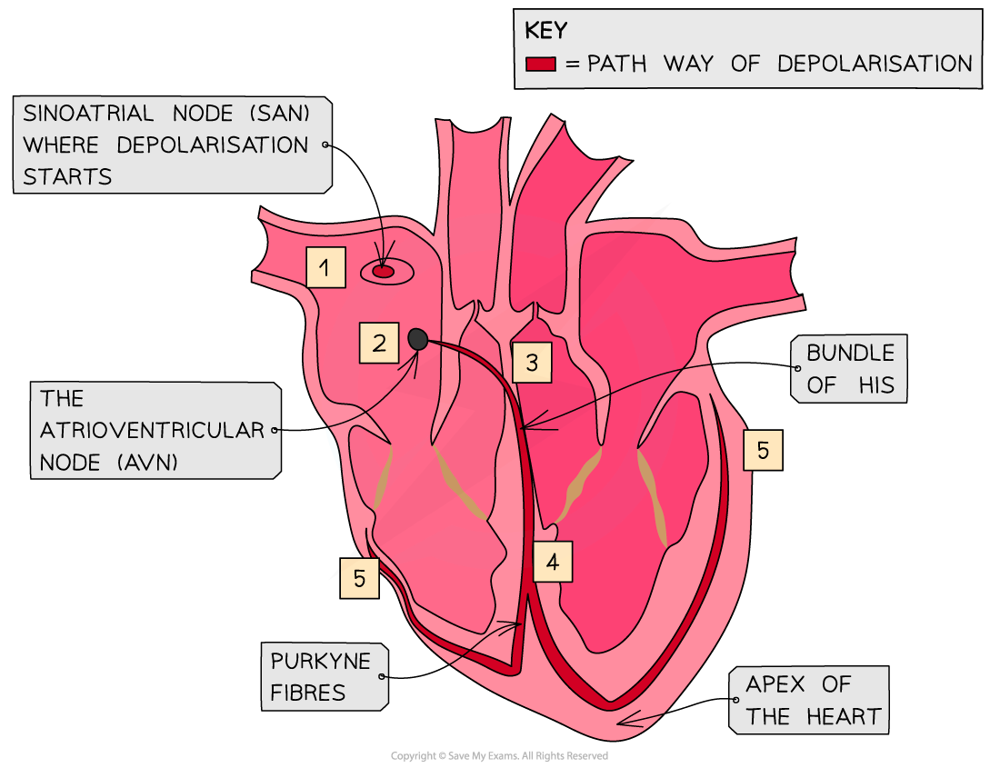
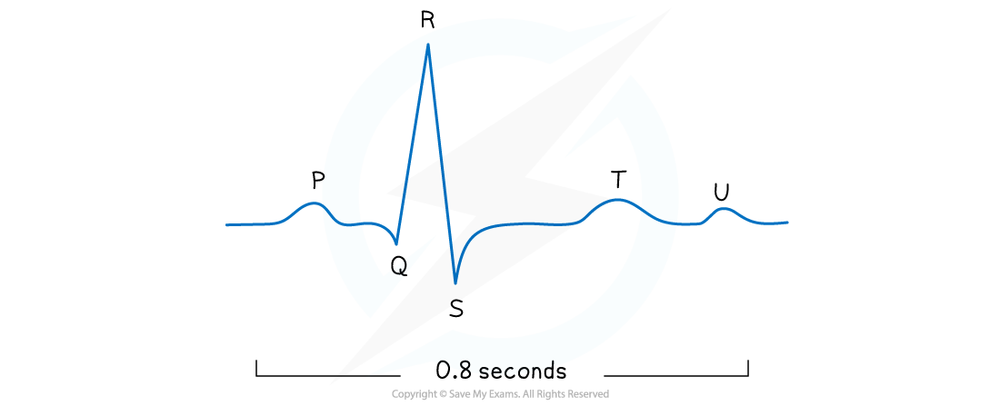
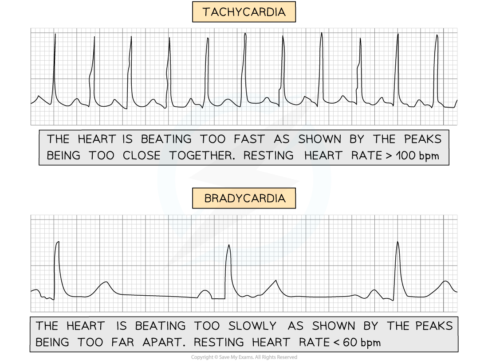
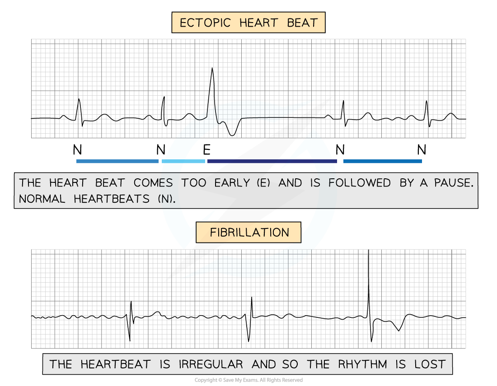

# The Role of Muscle in the Cardiac Cycle

## The Role of Muscle in the Cardiac Cycle

> **Spec point** — `spcpt_Mq5FYWJwq4D5HYYW`

## The Role of Muscle in the Cardiac Cycle

- The cells making up cardiac muscle are **myogenic**, which means they contract without any external stimulus
- This intrinsic rhythm means the heart beats at around 60 times per minute
- The** sinoatrial node (SAN)** is a group of cells in the wall of the right atrium

  - The SAN initiates a wave of *depolarisation* that causes the **atria to contract**
- There is a region of non-conducting tissue which prevents the depolarisation spreading straight to the ventricles

  - Instead, the depolarisation is carried to the **atrioventricular node (AVN)**
  - This is a region of conducting tissue between atria and ventricles
- After a slight delay, the AVN is stimulated and passes the stimulation along the **bundle of His**

  - This delay means that the ventricles contract after the atria
- The bundle of His is a collection of conducting tissue in the **septum** (middle) of the heart

  - The bundle of His divides into two conducting fibres which carry the impulse to the **Purkyne** **fibres**
  
    - Purkyne fibres are also known as Purkinje fibres
- Purkyne fibres spread around the ventricles and initiate the **depolarisation of the ventricles** from the **apex** (bottom) of the heart
- This makes the **ventricles contract** **from the bottom upward **and **blood is forced out **of the ventricles into the pulmonary artery and aorta

**Stages in the Cardiac Cycle Table**

***The wave of depolarisation spreads across the heart in a co-ordinated manner***

> **Exam Hint**
> Remember that the heart is **myogenic**, which means that the heart will generate a heartbeat by itself and without any other stimulation. Instead, the electrical activity of the heart regulates the heart rate. Be aware that you may sometimes see an alternative spelling of "Purkyne" as "Purkinje" they mean the exact same thing!

## The Use of ECGs

> **Spec point** — `spcpt_8rxYCjhDhyJQgB4x`

## The Use of ECGs

- Electrocardiography can be used to monitor and investigate the electrical activity of the heart
- **Electrodes** that are capable of detecting electric signals are placed on the skin
- These electrodes produce an **electrocardiogram** (ECG)

  - An ECG shows a number of distinctive **electrical waves produced by the activity of the heart**
- A healthy heart produces a distinctive shape in an ECG

***The ECG of a healthy heart***

- **The P wave**

  - Caused by the depolarisation of the atria, which results in atrial contraction (systole)
- **The QRS complex**

  - Caused by the depolarisation of the ventricles, which results in ventricular contraction (systole)
  - This is the largest wave because the ventricles have the largest muscle mass
- **The T wave**

  - Caused by the repolarisation of the ventricles, which results in ventricular relaxation (diastole)
- **The U wave**

  - Scientists are still uncertain of the cause of the U wave, some think it is caused by the repolarisation of the Purkyne fibres
- The **bigger** the wave, the **greater** the electrical activity passing through the heart, which results in a **stronger contraction**

#### Using ECGs to diagnose heart problems

- If someone has a suspected heart problem a doctor will often use an ECG as a diagnostic tool
- Some heart problems produce certain shapes or waves in an ECG which allow for a diagnosis
- **Tachycardia**

  - When the **heart beats too fast** it is tachycardic
  - An individual with a resting heart rate of over 100 bpm is said to have tachycardia
- **Bradycardia**

  - When the **heart beats too slow **it is bradycardic
  - An individual with a resting heart rate below 60 bpm is said to have bradycardia
  - A lot of fit individuals or athletes tend to have lower heart rates and it is usually not dangerous
- **Ectopic heartbeat**

  - This condition is caused by an **early heartbeat followed by a pause**
  - This could be due to an earlier contraction of either the atria or ventricles
  - It is common in the population and usually requires no treatment unless very severe
- **Fibrillation**

  - An **irregular heartbeat **will disrupt the rhythm of the heart
  - The atria or ventricles stop contracting properly
  - Severe cases of fibrillation can be very dangerous, even fatal

***Each of these ECGs shows different faulty heartbeats. The speed or rhythm/regularity of the heartbeat is very important***
