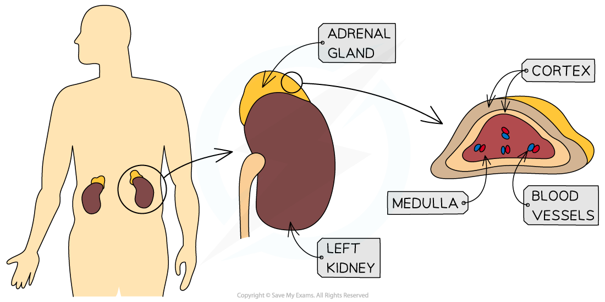

# The Role of Adrenaline

## The Fight or Flight Response

> **Spec point** — `spcpt_dnkHRWcsDvG3SdR4`

## The Fight or Flight Response

- During situations that creates stress, fear or excitement, the neurones of the *sympathetic* nervous system will stimulate the adrenal medulla (of the adrenal gland) to secrete **adrenaline**

  - Adrenaline is a **hormone** that will prepare your body for reacting to a stressful situation
  - This reaction is often called the "**fight or flight**" response
  
    - It is the **effects of adrenaline** that lead to the typical symptoms we experience during stressful situations such as increased heart rate, dry mouth, increased sweating etc.

***The adrenal medulla is responsible for releasing the hormone adrenaline into the bloodstream to prepare the body for the "fight or flight" response***

- Since adrenaline is a hormone, it is transported around the body in the **bloodstream**
- It will bind to receptors on its target organs
- One of the targets of adrenaline is the ***SAN***, leading to an increase in the frequency of excitations

  - This in turn, will **increase the heart rate** to supply blood to the muscle cells at a faster rate
  - More blood means more oxygen and glucose that reaches the muscle cells, which in turn, **increases** the **rate of aerobic respiration**
  - This releases **more energy** that will be used during the response to the stressful or dangerous situation
- Adrenaline will also **stimulate** the **cardiovascular control centre** in the medulla oblongata

  - This **increases** the impulses travelling along the sympathetic neurones affecting the heart, further speeding up the** heart rate**
- Blood vessels to **less important** organs (such as the digestive system and skin) **constrict** so that **more blood** can be **diverted** to organs that will be involved in the "fight or flight" response

  - Note that blood flow to the **brain remains constant**, regardless of whether the body is in a state of stress or relaxation
  
    - The brain is one of the most important organs in the body and needs a constant blood supply in order to function properly
- The changes experienced by the body during the "fight or flight" response are controlled by a combination of nervous and hormonal responses
