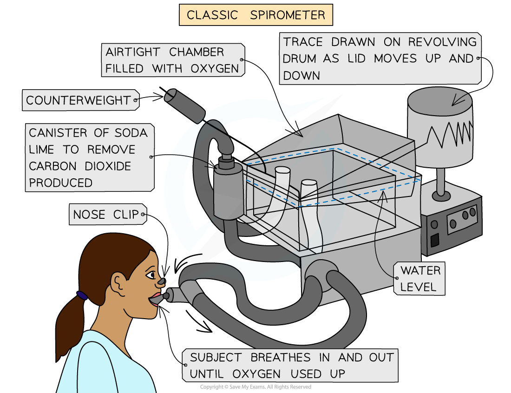
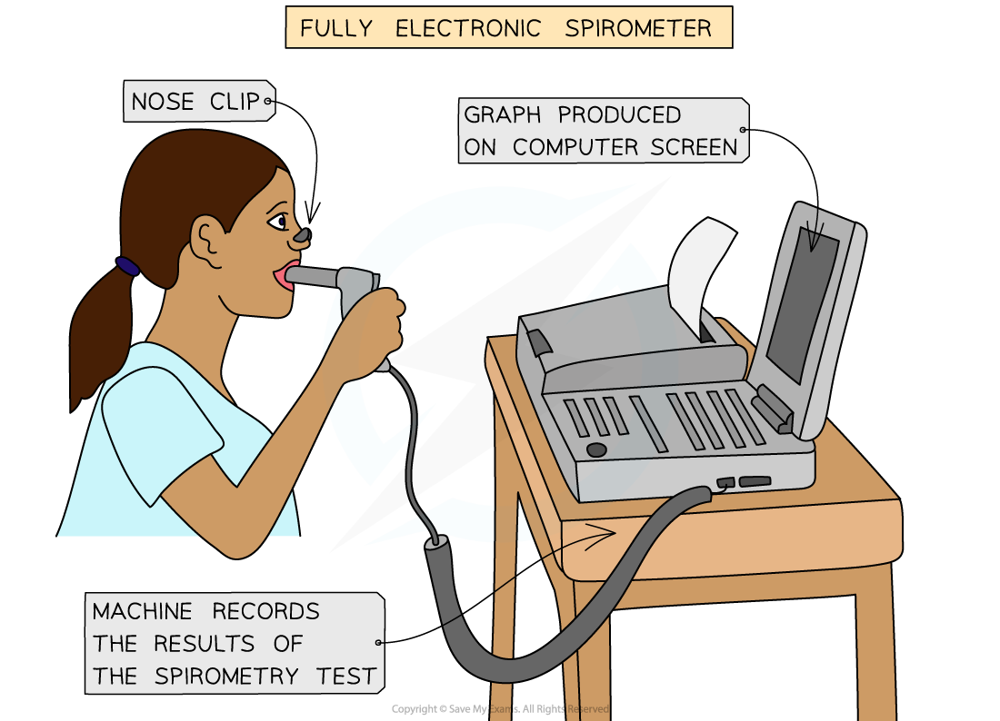
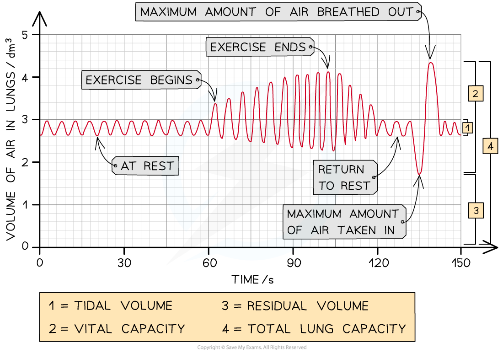

# Core Practical 17: The Effects of Exercise

## The Effects of Exercise

> **Spec point** — `spcpt_KSDzWm2wnDBvRNfw`

## The Effects of Exercise

#### Measuring breathing

- There are **four** main ways that breathing can be **scientifically measured**. These include:

  - **Tidal volume** - this is the **volume of air that is breathed in or out **during **normal breathing** (at rest)
  - **Breathing rate** - this is the **number of breaths taken in one minute** (one breath = taking air in and breathing it back out again)
  - **Oxygen consumption** - this is the **volume of oxygen** used up by someone **in a given time**
  - **Respiratory minute ventilation** - this is the **volume** **of air** that can be breathed **in** or **out** in a minute and can be calculated by means of the following formula:

**Respiratory minute ventilation = tidal volume x breathing rate** (breaths per minute)

#### Spirometers

- The breathing measurements described above can all be taken using a piece of apparatus known as a **spirometer**
- The person (subject) being examined breathes in and out **through** the spirometer
- **Carbon dioxide** is **absorbed** from the **exhaled air** by soda lime in order to stop the concentration of carbon dioxide in the rebreathed air from getting too high, as this can cause respiratory distress
- As the subject breathes through the spirometer, a **trace** is drawn on a rotating drum of paper or a **graph** is formed digitally, which can be viewed on a computer
- From this trace, the subject's **respiratory minute ventilation**, **tidal volume** and **breathing rate** can all be **calculated**

***Spirometers are used to measure different aspects of breathing. There are different types of spirometers***

#### Investigating the effects of exercise

- Exercise can cause an increase in breathing rate and tidal volume, including an increase in oxygen consumption and ventilation rates.

#### Apparatus

- Spirometer
- Treadmill
- Stopwatch

#### Method

1. A person at rest will breathe into the spirometer for one minute
2. Record the results
3. The person will then exercise for two minutes while the spirometer chamber is refilled with oxygen
4. After they stop exercising, they will immediately breathe into the spirometer for one minute
5. Record the results
6. Compare the recordings taken before and after exercise

#### Analysing data from a spirometer

- The results from a spirometer (either in the form of a trace drawn on graph paper or a digital graph created by a computer) can be used to** calculate respiratory minute ventilation, tidal volume and breathing rate**

  - A small amount of air, known as the **residual volume**, is always retained in the lungs
- The following readings and calculations can be made:

  - To calculate the **breathing rate,** count the number of peaks on the trace in a minute
  - **Tidal volume** can be determined by calculating the average difference in the volume of gas between each peak and trough
  - **Oxygen consumption** can also be calculated using a spirometer
  
    - Carbon dioxide is removed from the exhaled air, meaning that the total volume of air available in the spirometer gradually **decreases**, as oxygen is extracted from it by the subject's breathing
    - This change in volume is used as a measure of oxygen consumption

***The changes in the volume of air present in the lungs are shown here. Note the vital capacity; this is the maximum volume of air that can be breathed in or out in one breath***

> **Worked Example**
> From the spirometer data in the image above, calculate the breathing rate during the first minute and then calculate the breathing rate during the second minute.
> 
> **Answer:**
> 
> **Step 1: Count the number of breaths in the first 60 seconds**
> 
> One breath is shown by the trace going up and then down, so there are 12 breaths in the first 60 seconds.
> 
> **Step 2: Give appropriate units**
> 
> Breathing rate should be given in breaths min⁻¹ (breaths per minute), so the breathing rate during the first minute
> 
> = 12 breaths min⁻¹
> 
> **Step 3: Count the number of breaths in the second 60 seconds**
> 
> There are 14 breaths in the second 60 seconds
> 
> **Step 4:** **Give appropriate units**
> 
> The breathing rate during the second minute = **14 breaths min⁻¹**

> **Worked Example**
> Calculate the tidal volume during rest and the peak tidal volume during exercise.
> 
> **Answer:**
> 
> **Step 1: For the 'at rest' phase of the trace, measure the difference between the top and bottom of the trace in terms of the volume of air in the lungs**
> 
> During rest, the tidal volume = 3 dm³ - 2.6 dm³
> 
> = 0.4 dm³
> 
> **Step 2: At the peak tidal volume during exercise, measure the difference between the top and bottom of the trace in terms of the volume of air in the lungs**
> 
> The peak tidal volume during exercise occurs right at the end of the exercise period (at around 100 seconds):
> 
> = 4.1 dm³ - 2.3 dm³
> 
> = **1.8 dm³**

> **Worked Example**
> Calculate the respiratory minute ventilation during the first minute.
> 
> **Answer:**
> 
> **Step 1: Use the formula**
> 
> Respiratory minute ventilation = tidal volume x breathing rate
> 
> **Step 2: Substitute the values calculated from the first minute**
> 
> Respiratory minute ventilation = 0.4 x 12
> 
> = **4.8 dm****3**** min****-1**
