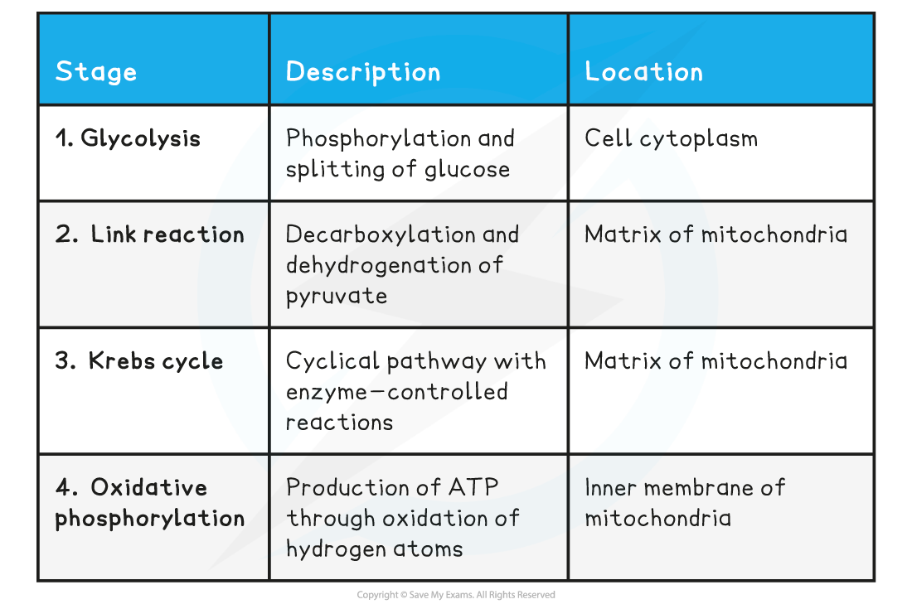
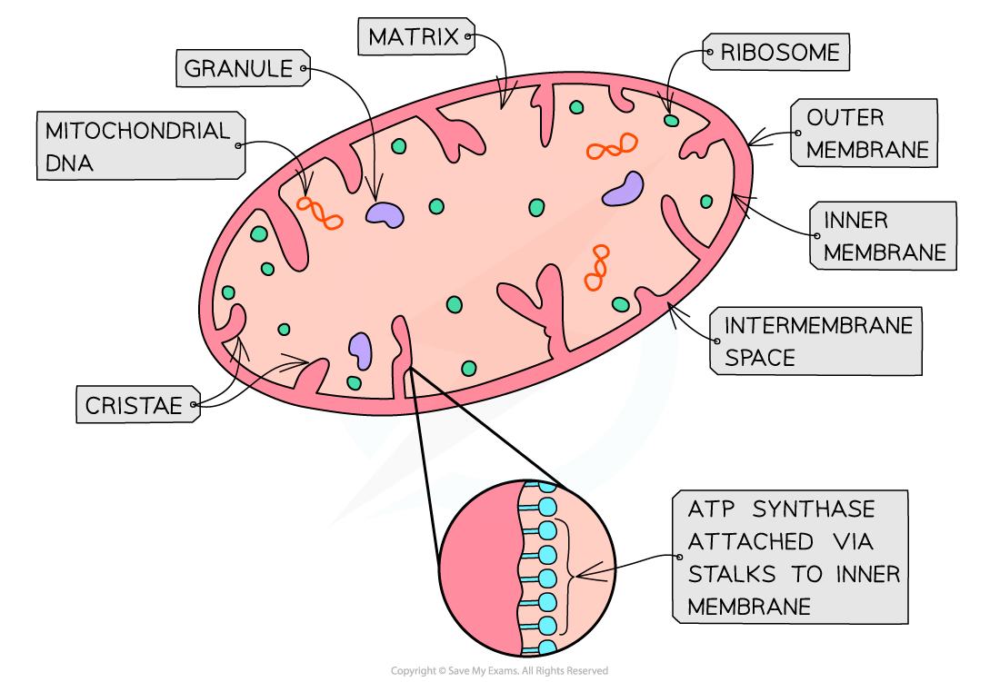

# Overview of Respiration

## Overview of Respiration

> **Spec point** — `spcpt_tYRXVWYg4Tc4rZ3B`

## Overview of Respiration

- **Glucose** is the main respiratory substrate used by cells
- Aerobic respiration is the process of breaking down a respiratory substrate in order to **produce ATP using oxygen**
- The equation for aerobic respiration:

**glucose + oxygen →  carbon dioxide + water + energy**

**C****6****H****12****0****6**** + 6 O****2**** →  6 CO****2**** + 6 H****2****0 + 2870kJ**

- The energy that is released during the process is used to phosphorylate (add a phosphate) ADP to form ATP
- ATP provides energy for other biological processes in cells
- The process of aerobic respiration using glucose can be split into four stages which each occurs at a particular location in a eukaryotic cell:

  - **Glycolysis** takes place in the cell cytoplasm
  - The **Link reaction** takes place in the matrix of the mitochondria
  - The **Krebs cycle** takes place in the matrix of the mitochondria
  - **Oxidative phosphorylation** occurs at the inner membrane of the mitochondria
- These chemical reactions are controlled by **intracellular enzymes** that catalyses reactions within the cell

  - Ensuring that the energy trapped within the chemical bonds of the glucose molecule is **released gradually** and not all at once
- A sudden release of such a large amount of energy would result in an increase in body temperature to levels that would ***denature***** enzymes**
- The enzyme that catalyses these reactions the **slowest** will determine the **overall rate of aerobic respiration**
- Several ***coenzymes*** are required during respiration to **transfer** various molecules involved in the process

  - **NAD** and **FAD** are the coenzymes responsible for **transferring hydrogen** between molecules
  - Depending on whether they give or take hydrogen, they are able to ***reduce*** or ***oxidise*** a molecule
  - **Coenzyme A** is responsible for the **transfer of acetate **(also known as acetic acid) from one molecule to another
- Although glucose is the main fuel for respiration, organisms can also break down other molecules (such as fatty acids or amino acids) to be respired

**Four Stages of Respiration Table**

#### Structure of mitochondria

- Mitochondria have two phospholipid membranes
- The **outer membrane** is:

  - Smooth
  - Permeable to several small molecules
- The** inner membrane** is:

  - Folded (cristae)
  - **Less permeable**
  - The site of the **electron transport chain **(used in oxidative phosphorylation)
  - Location of** ATP synthase enzymes **(used in oxidative phosphorylation)
- The** intermembrane space**:

  - Has a low pH due to the **high concentration of protons**
  - The concentration gradient across the inner membrane is formed during oxidative phosphorylation and is **essential for ATP synthesis**
- The **matrix**:

  - Is an aqueous solution within the inner membranes of the mitochondrion
  - Contains ribosomes, enzymes and circular mitochondrial DNA necessary for mitochondria to function

***The structure of a mitochondrion***

> **Exam Hint**
> It’s important to know the exact locations of each stage. It is not enough to say the Krebs cycle takes place in the mitochondria, you need to say it takes place in the **matrix** of the mitochondria.
