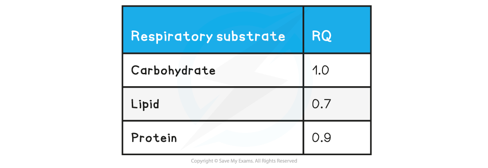

# Respiratory Quotient

## Respiratory Quotient

> **Spec point** — `spcpt_K4Hf4mqC2mfpqZx6`

## Respiratory Quotient

- The **respiratory quotient **(**RQ**) is the ratio of carbon dioxide molecules produced to oxygen molecules taken in during respiration

**RQ = CO****2**** ÷ O****2**

***The formula for the Respiratory Quotient***

#### RQ values of different respiratory substrates

- **Carbohydrates**, **lipids** and **proteins** have different typical RQ values
- This is because of the** number of carbon-hydrogen bonds** differs in each type of biological molecule

  - More carbon-hydrogen bonds means that more hydrogen atoms can be used to create a proton gradient
  - More hydrogens means that more ATP molecules can be produced
  - More oxygen is therefore required to breakdown the molecule (in the last step of oxidative phosphorylation to form water)
- When **glucose** is **aerobically respired** equal amounts of carbon dioxide are produced to oxygen taken in, meaning it has an RQ value of 1

***During the breakdown of glucose, six molecules of oxygen is used and six molecules of carbon dioxide is produced. This results in an RQ value of 1 (6CO******2****** ÷ 6O******2******)***

**RQ Values For Different Respiratory Substrates Table**

- Some questions may ask you to suggest what substrate is being respired during an experiment based on the RQ value – so make yourself familiar with the values in the table

#### Calculating RQ values

- The respiratory quotient is calculated from respiration equations
- It involves comparing the ratios of carbon dioxide given out to oxygen taken in
- The formula for this is:

***Equation to calculate the RQ value of a respiratory substrate***

- For **aerobic respiration** the RQ will typically be less than 1 since oxygen is being used to break down the substrate
- Should the RQ of an organism be greater than 1, it may indicate that **anaerobic respiration** is occurring, since very little to no oxygen is used
- If you know the **molecular formula** of the substrate being aerobically respired then you can create a balanced equation to calculate the RQ value
- In a **balanced** equation the **number before the chemical formula** can be taken as the **number of molecules/moles** of that compound

  - This is because the same number of molecules of any gas take up the same volume e.g. 12 molecules of carbon dioxide take up the same volume as 12 molecules of oxygen
- **Glucose has a simple 1:1 ratio** and RQ value of 1 but other substrates have more complex ratios leading to different RQ values

> **Worked Example**
> Linoleic acid (a fatty acid found in nuts) has the molecular formula C18H32O2. Calculate the RQ value of this lipid.
> 
> Answer:
> 
> **Step 1: Write down the respiration equation**
> 
> C18H32O2 + O2 → CO2 + H2O
> 
> **Step 2: Balance the equation**
> 
> C18H32O2 + 25O2 → 18CO2 + 16H2O
> 
> **Step 3: Use the RQ formula**
> 
> RQ = CO2 ÷ O2
> 
> RQ = 18 ÷ 25
> 
> RQ = 0.72

> **Worked Example**
> During ethanol fermentation in lettuce roots, glucose is partially broken down. This process is represented by the following equation:
> 
> **glucose → ethanol + carbon dioxide**
> 
> Calculate the RQ value.
> 
> **Answer:**
> 
> **Step 1: Write down the respiration equation**
> 
> C6H12O6 → C2H5OH + CO2
> 
> **Step 2: Balance the equation**
> 
> C6H12O6 → 2C2H5OH + 2CO2
> 
> **Step 3: Use the RQ formula**
> 
> RQ = CO2 ÷ O2
> 
> RQ = 2 ÷ 0
> 
> RQ = ∞ (infinity)

> **Exam Hint**
> Make sure the respiration equation you are working with is **fully balanced** before you start doing any calculations to find out the RQ value.
