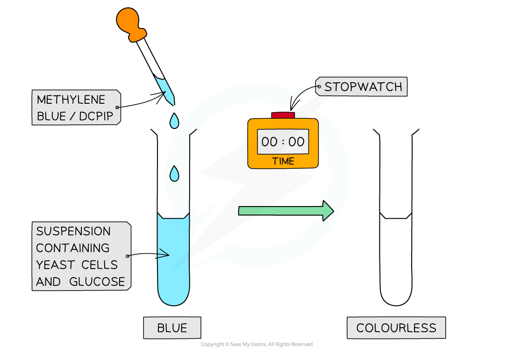

# Core Practical 15: Investigation of Respiration in Yeast

## Investigation of Respiration in Yeast

> **Spec point** — `spcpt_G5wkRhrTQyjTrBJN`

## Investigation of Respiration in Yeast

- A **redox indicator** is a substance that changes colour when it is reduced or oxidised
- **DCPIP** and **methylene** blue are redox indicators

  - They are used to investigate the effects of **temperature and substrate concentration** on the **rate of anaerobic respiration **in yeast
- These dyes can be added to a suspension of living **yeast cells** as they don’t damage cells
- Yeast can respire both aerobically and anaerobically, in this experiment it is their rate of anaerobic respiration that is being investigated

#### Mechanism

- **Dehydrogenation** happens regularly throughout the different stages of aerobic respiration
- The hydrogens that are removed from substrate molecules are transferred to the final stage of aerobic respiration, oxidative phosphorylation, via the hydrogen carriers NAD and FAD
- The enzyme **dehydrogenase** catalyses the production of **reduced NAD** in **glycolysis**
- When DCPIP or methylene blue are present they take up hydrogens from the organic compounds and get reduced instead of NAD
- Both redox indicators undergo the same colour change when they are reduced

  - **Blue → colourless**
- The faster the rate of respiration, the faster the rate of hydrogen release and the faster the dyes get reduced and change colour

  - This means that the **rate of colour change** can correspond to the rate **dehydrogenase **would be working at and therefore,** the rate of respiration** in yeast
- The rate of respiration is inversely proportional to the time taken

**Rate of respiration (sec****-1****) = 1 ÷ time (sec)**

#### Apparatus

- Yeast
- Glucose solution
- Test tubes
- Stopwatch
- DCPIP

#### Method - Temperature

1. Add a set volume of yeast suspension to test tubes containing a certain concentration of glucose
2. Put the test tube in a** temperature-controlled water bath** and leave for 5 minutes to ensure the water temperature is correct and not continuing to increase or decrease
3. Add a set volume of DCPIP to the test tube and start the stopwatch immediately
4. Stop the stopwatch when the solution becomes colourless or lose all blue colour

  - This is subjective and therefore the same person should be assigned this task for all repeat experiments
5. Record the time taken for a colour change to occur once the dye is added

  - Repeat across a range of temperatures. For example, 30oC, 35oC, 40oC, 45oC
6. The effect of substrate concentration can be investigated by adding **different concentrations of a substrate** to the suspension of yeast cells and recording the time taken for a colour change to occur once the dye is added

  - For example, 0.1% glucose, 0.5% glucose, 1.0% glucose

***Methylene blue or DCPIP is added to a solution of anaerobically respiring yeast cells in a glucose solution. The rate at which the solution turns from blue to colourless gives the rate of dehydrogenase activity***

#### Controlling other variables

- It is important when investigating one variable to ensure that the other variables in the experiment are being controlled

  - **Volume of dye added**: if there is more dye molecules present then the time taken for the colour change to occur will be longer
  - **Volume of yeast suspension**: when more yeast cells are present the rate of respiration will be inflated
  - **Type of substrate**: yeast cells will respire different substrates at different rates
  - **Concentration of substrate**: if there is limited substrate in one tube then the respiration of those yeast cells will be limited
  - **Temperature**: an increase or decrease in temperature can affect the rate of respiration due to energy demands and kinetic energy changes. The temperature of the dye being added also needs to be considered
  - **pH**: a buffer solution can be used to control the pH level to ensure that no enzymes are denatured

#### Interpretation of results

- A **graph** should be plotted of temperature against time
- As the **temperature increases**, the rate of respiration also increases so the time taken for the solution to go colourless reduces

  - This means hydrogens are released by the reactions more quickly, hence the DCPIP accepts electrons/hydrogens more quickly until all molecules of DCPIP are reduced. This means that it will take less time to turn from blue to colourless
- At extreme **high** temperatures, the enzyme may **denature** and meaning the colour change may not occur

> **Exam Hint**
> Although the DCPIP and methylene blue undergo a colour change from blue to colourless it is important to remember that the **yeast suspension in the test tube may have a slight colour **(usually yellow). That means when the dye changes to colourless there may still be an overall yellow colour in the test tube. If this is the case it can be useful to have a control tube containing the same yeast suspension but with no dye added, then you can tell when the dye has completely changed colour.
