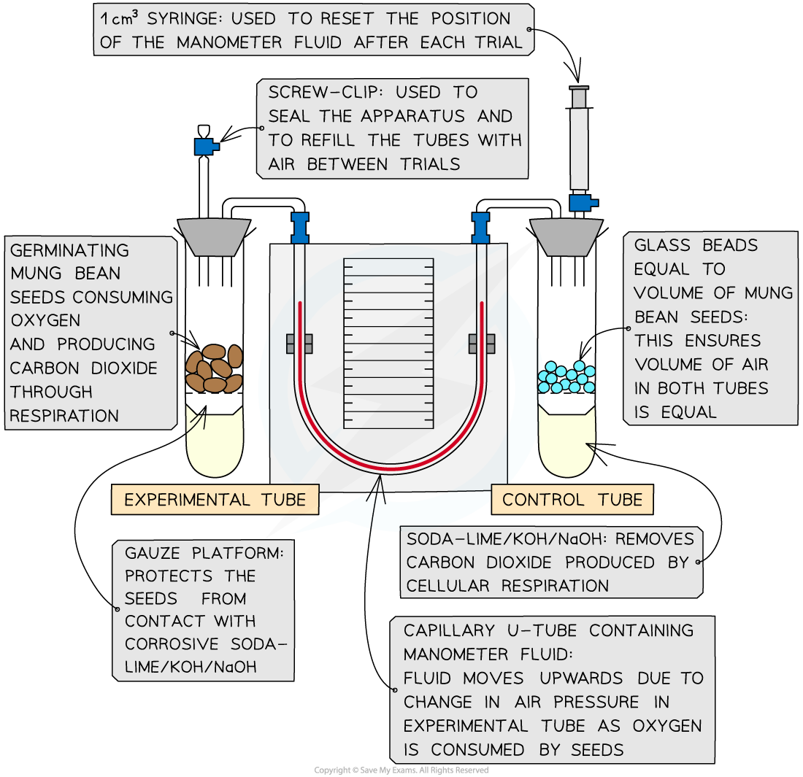

# Core Practical 16: Respirometer to Calculate RQ

## Using a Respirometer to Calculate RQ

> **Spec point** — `spcpt_mhYFqQT9k6H8Vx53`

## Using a Respirometer to Calculate RQ

- Respirometers are used to measure and investigate the **rate of oxygen consumption **during respiration in organisms
- They can also be used to calculate respiratory quotients
- The experiments usually involve organisms such as seeds or invertebrates

#### Apparatus

- Respirometer
- Glass beads
- Germinating seeds

  - These will be actively respiring and consuming oxygen
- Test tubes
- Soda-lime pellets (or potassium hydroxide)

  - To absorb the carbon dioxide produced
- Stopwatch

***A respirometer set up to measure the rate of respiration***

#### Method

1. **Measure oxygen consumption**: set up the respirometer and run the experiment with both tubes for a set amount of time (e.g. 30 minutes)
2. As the seeds consume oxygen, the **volume of air** in the test tube **will decrease** (CO2 produced during respiration is absorbed by soda lime or KOH)
3. This **reduces the pressure** in the capillary tube and **manometer fluid will move towards** the test tube containing the seeds
4. Measure the distance moved by the liquid in a given time
5. Use this measurement to calculate the change in gas volume within a given time, *x* cm3 min-1
6. **Reset the apparatus**: allow air to re-enter the tubes via the screw cap and reset the manometer fluid using the syringe
7. Run the experiment again: **remove the soda-lime** from both tubes and use the manometer reading to calculate the change in gas volume in a given time, *y* cm3 min-1

#### Equation for calculating change in gas volume

- The volume of oxygen consumed (cm3 min-1) can be worked out using the diameter of the capillary tube* r* (cm) and the distance moved by the manometer fluid *h* (cm) in a minute using the formula:

**πr****2****h**

#### Calculations

- *x* tells us the volume of oxygen consumed by respiration within a given time
- *y* tells us the volume of oxygen consumed by respiration within a given time minus the volume of carbon dioxide produced within a given time

  - ***y***** may be a positive or negative** value depending on the direction that the manometer fluid moves (up = positive value, down = negative value)
- The two measurements *x* and *y* can be used to calculate the RQ

***Equation to calculate RQ values using a respirometer***

> **Worked Example**
> During a respirometer experiment using blow fly larvae, the volume of oxygen consumed was 2.9 cm3min-1. The soda lime was removed from both test tubes and the experiment was repeated. The change in gas volume was -0.8 cm3min-1. Calculate the RQ value for the blow fly larvae.
> 
> **Answer:**
> 
> *x *= 2.9 cm3min-1
> 
> *y *= -0.8 cm3min-1
> 
> **Step 1: Write down equation**
> 
> $\mathrm{RQ}=\frac{x+y}{x}$
> 
> **Step 2: Substitute values**
> 
> $\mathrm{RQ}=\frac{2.9-0.8}{2.9}$
> 
> **Step 3: Calculate RQ**
> 
> $\mathrm{RQ}=0.72$

#### Interpretation of results

- Respirometers can be used in experiments to investigate how different factors affect the RQ of organisms over time

  - E.g. temperature – using a series of water baths
- When an **RQ value changes** it means **the substrate being respired has changed**
- Some cells may also be **using a mixture of substrates **in respiration e.g. An RQ value of 0.85 suggests **both** carbohydrates and lipids are being used

  - This is because the RQ of glucose is 1 and the RQ of lipids is 0.7
- Under normal cell conditions the order substrates are used in respiration: carbohydrates, lipids then proteins
- The RQ can also give an indication of under or overfeeding:

  - An RQ value of more than 1 suggests excessive carbohydrate/calorie intake
  - An RQ value of less than 0.7 suggests underfeeding

> **Exam Hint**
> There are several ways you can manage variables and increase the reliability of results in respirometer experiments:
> 
> - Use a controlled water bath to keep the **temperature** constant
> - Have a control tube with an equal volume of inert material to the volume of the organisms to compensate for changes in atmospheric **pressure**
> - Repeat the experiment multiple times and use an **average**
