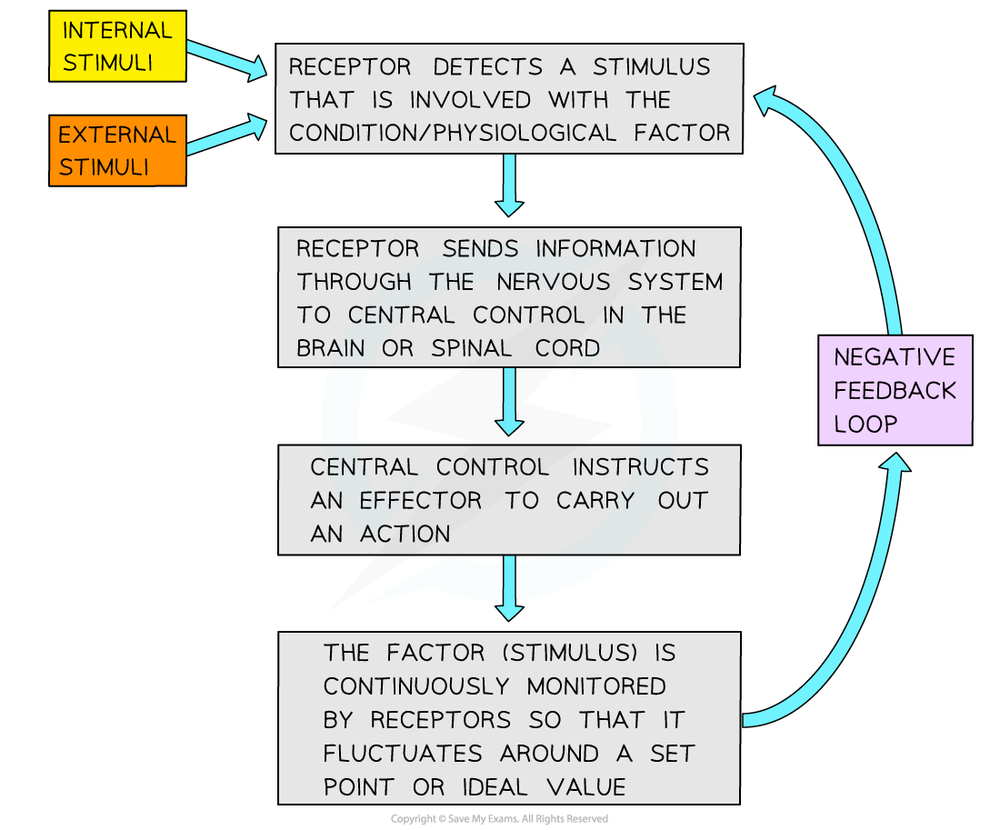
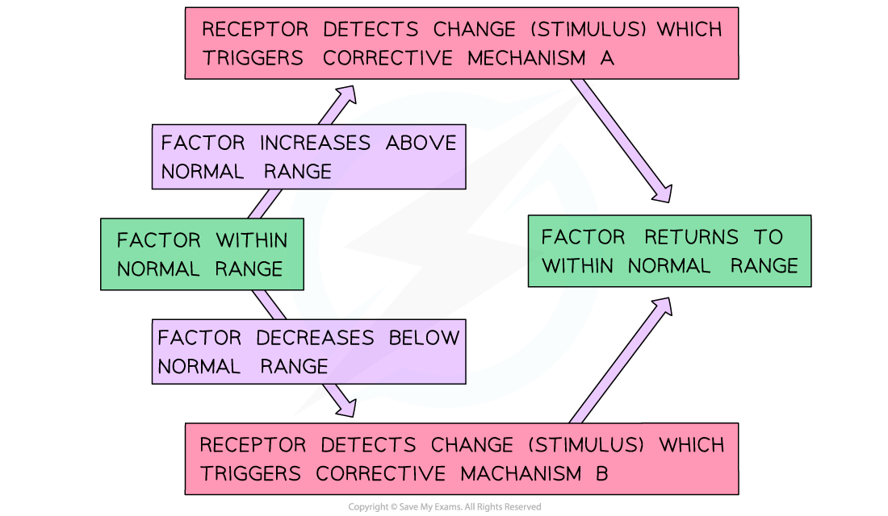

# Negative & Positive Feedback

## Negative & Positive Feedback

> **Spec point** — `spcpt_WP3bh9hh8ZMh78Q7`

## Negative & Positive Feedback

#### Negative feedback

- The majority of homeostatic control mechanisms in organisms use **negative feedback** to maintain **homeostatic balance, **i.e. to keep certain **physiological factors**, such as internal temperature or blood glucose concentration, **within certain limits**
- Negative feedback control loops involve

  - A **receptor** detects a **stimulus **that is involved with a **physiological factor**
  
    - E.g. a change in temperature or blood glucose level
  - A **coordination system** transfers information between different parts of the body
  
    - This could be the nervous system or the hormonal system
  - An **effector** carries out a** response**
  
    - Effectors are** muscles **or** glands**
- The outcome of a negative feedback loop is

  - If there is an **increase** in the factor the body responds to make the factor **decrease**
  - If there is a **decrease** in the factor the body responds to make the factor **increase**
- Negative feedback systems work by **reversing a change **in the body to bring it back within **normal limits, **e.g.

  - If body temperature rises a negative feedback system will act to lower body temperature, bringing it back to normal
  - If blood glucose levels drop a negative feedback system will act to raise blood glucose, bringing it back to normal

***Negative feedback loops involve the monitoring of physiological factors and act to reverse any changes, keeping the factors within normal limits. Information can be transferred via nerve signals, as shown here, or by hormonal signals.***

#### Positive feedback

- In **positive** feedback loops the original stimulus produces a response that causes the factor to **deviate even more** from the normal range

  - They **enhance **the effect of the original stimulus
- An example of this is the **dilation of the cervix** during labour

  - The cervix stretches as baby pushes against it
  - Stretch receptors in the cervix are stimulated and send impulses to the brain
  - The pituitary gland is stimulated to release oxytocin which increases the intensity of uterine contractions
  - This pushes the baby further down the birth canal and stretches the cervix even further
- Positive feedback loops are useful to **quickly activate** a process, e.g. blood clotting to close up a wound

  - When the body is injured, **platelets become activated**
  - They **release chemicals** which will **activate more platelets**, which in turn, will release chemicals that will activate even more platelets etc.
  - This ensures that the **wound is quickly closed up** by a blood clot before too much blood is lost or too many pathogens enter the bloodstream
  - The body will **revert to negative feedback mechanisms** once the blood clot has formed
- Positive feedback may also kick in when **homeostatic mechanisms break down**

  - E.g. during prolonged exposure to extreme cold hypothermia can occur; body temperature drops, resulting in decreased metabolism which in turn causes body temperature to drop further
- Since these mechanisms do not maintain a constant internal environment, they are **not involved in homeostasis**

## Negative Feedback in Maintaining Conditions

> **Spec point** — `spcpt_9Dbx4fqC2Hgqhh95`

## Negative Feedback in Maintaining Conditions

#### The control of negative feedback

- Negative feedback loops help maintain a normal range or balance within an organism

  - They **reduce **the initial effect of the stimulus
- **Receptors** detect any deviations in a factor from the normal range; this results in a **corrective mechanism** to return the factor back to its normal range
- In negative feedback loop there are usually **two corrective mechanisms**

  - One for when the factor becomes **too low**
  - One for when the factor becomes **too high**
- The corrective mechanisms may involve the **nervous system** or the **endocrine system**
- The **magnitude** of the correction required to bring a factor back within its normal range is monitored and **regulated** by negative feedback

  - As the factor gets closer to its normal value the level of correction reduces

***Two corrective mechanisms are involved in the negative feedback loop***
