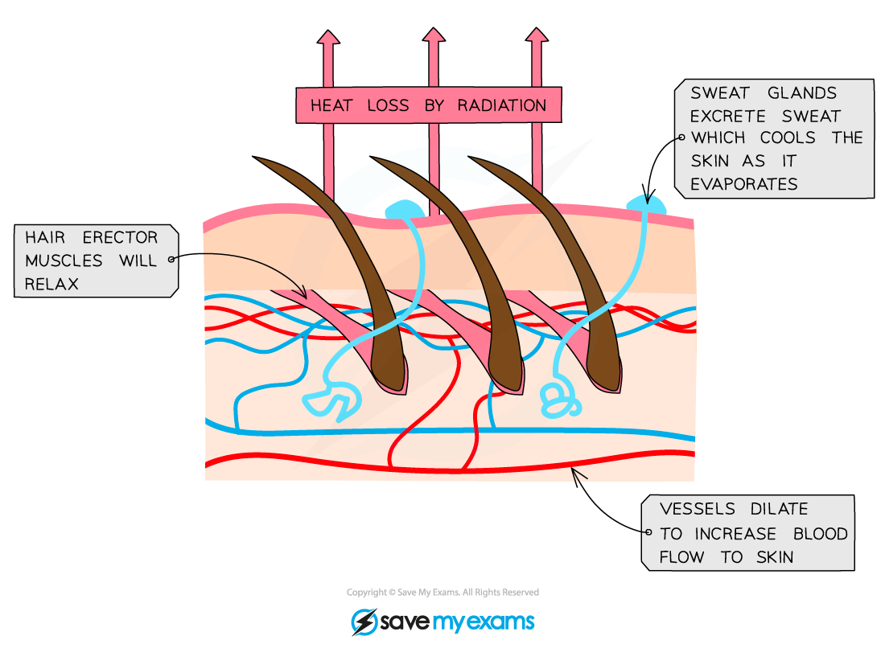
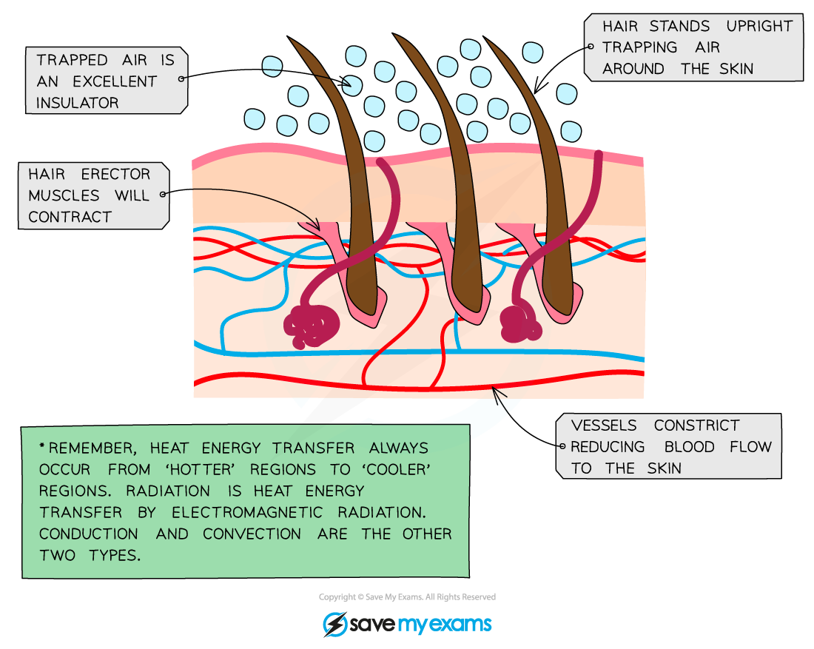
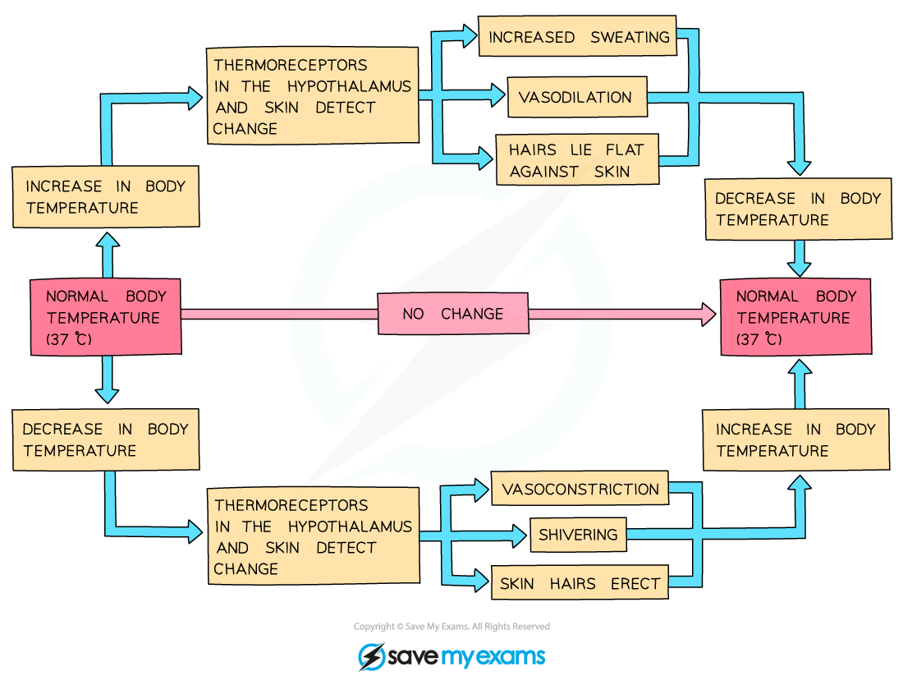

# Homeostasis

## Homeostasis

> **Spec point** — `spcpt_R39FfGfppHWnZv9q`

## Homeostasis

- In order to function properly and efficiently organisms have different control systems that ensure their **internal conditions are kept relatively constant**
- **Physiological control systems** maintain the internal environment within restricted limits through a process known as **homeostasis**
- This keeps the internal environment of the body **fluctuating around a specific normal level**

  - This is known as a **state of dynamic equilibrium**
- **Sensory cells** known as **receptors** can detect information about the conditions inside and outside the body

#### The importance of homeostasis

#### Temperature

- Homeostasis is critically important for organisms as it ensures the maintenance of **optimal conditions for enzyme** **action and cell function**

  - For example, an increase in body temperature above 40 °C would cause enzymes to **denature**
  
    - This is due to an **increase in kinetic energy** which would result in the **breakage of hydrogen bonds** holding the enzyme in a specific 3D shape
    - The **active site will change shape** and will no longer be **complementary** to the substrate molecule
    - An enzyme-substrate complex cannot form and the enzyme **cannot catalyse** that reaction anymore, leading to **less efficient** metabolic reactions

#### Blood glucose

- Cells also need a **constant supply of energy** in the form of ATP to work efficiently
- **Glucose** is respired to supply this ATP, meaning that the body needs to carefully monitor and control **blood glucose concentrations**

  - Cells in the **pancreas** monitor blood glucose concentrations

#### Water

- **Water** is another essential requirement for cells to function optimally; it makes up the cell cytoplasm and it takes part in metabolic reactions
- It is therefore crucial for the **amount of water in the blood** to remain constant

  - Water is lost during **excretion of waste products, **e.g. urine, and in **sweat**
  - The **kidneys **are responsible for regulating the amount of water in the blood

#### Control mechanisms for maintaining body temperature

- Maintenance of a constant internal body temperature is known as **thermoregulation**
- This process involves both **cooling** and **warming** **mechanisms** depending on whether there is an increase or decrease in body temperature

#### Cooling mechanisms

- **Vasodilation of the blood vessels that supply skin capillaries**

  - Heat exchange during both warming and cooling occurs at the body's surface as this is where the blood comes into close proximity to the environment
  
    - The warmer the environment, the less heat is lost from the blood at the body's surface
  - One way to **increase heat loss** is to **supply the capillaries in the skin with a greater volume of blood**, which then **loses heat to the environment via radiation**
  
    - *Arterioles* have muscles in their walls that can relax or contract to allow more or less blood to flow through them
    - During **vasodilation** these **muscles relax**, causing the **arterioles near the skin to dilate** and allowing **more blood to flow through skin capillaries**
    - This is why pale-skinned people go red when they are hot
- **Sweating**

  - Sweat is secreted by **sweat glands**
  - This cools the skin by **evaporation;** heat energy from the body converts liquid water into water vapour
  - Sweating is less effective as a cooling mechanism in humid environments; sweat evaporates more slowly due to a reduced concentration gradient between the sweat and the surrounding air
- **Flattening of hairs**

  - The hair **erector pili muscles** in the skin **relax**, causing hairs to lie flat
  
    - These muscles can be described as **effectors**, as they respond to a change in body temperature
  - This **stops them from forming an insulating layer** of trapped air and allows air to circulate over skin; heat can therefore leave by radiation

***Changes in the skin help to increase heat loss when body temperature rises***

#### Warming mechanisms

- **Vasoconstriction of blood vessels that supply skin capillaries**

  - One way to decrease heat loss is to **supply the capillaries in the skin with a smaller volume of blood**, minimising the loss of heat to the environment by **radiation**
  - During **vasoconstriction** the muscles in the arteriole walls contract, causing the** arterioles **near the skin to **constrict** and allowing** less blood to flow through skin capillaries**
  - Instead, the blood is diverted through **shunt vessels**, which are deeper in the skin and therefore do not lose heat to the environment
  - Vasoconstriction is not, strictly speaking, a 'warming' mechanism as it does not raise the temperature of the blood but instead **reduces heat loss from the blood** as it flows through the skin
- **Boosting metabolic rate**

  - Most of the metabolic reactions in the body are *exothermic* and this provides warmth to the body
  - In cold environments the **hormone thyroxine, **released from the thyroid gland, increases the *basal metabolic rate* (BMR), increasing heat production in the body
  - **Adrenaline **may also be released to speed up the metabolic rate and release more heat
- **Shivering**

  - This is a **reflex action** in response to a **decrease in core body temperature**
  
    - This means it is a nervous mechanism, not a hormonal one
  - In this case muscles are the *effectors* and they **contract in a rapid and regular manner**
  - The metabolic reactions required to power this shivering **generate sufficient heat** to warm the blood and raise the core body temperature
- **Erection of hairs**

  - The hair **erector pili muscles** in the skin **contract**, causing hairs to stand on end
  - This **forms an insulating layer** over the skin's surface by trapping air between the hairs and stops heat from being lost by radiation
  - Note that, like vasoconstriction, this is a heat retention mechanism rather than a warming mechanism
- **Less sweating**

  - The **sweat glands** will **secrete less sweat** when it is cold
  - This will **reduce** the amount of heat lost through the **evaporation** of sweat
  - This is a heat retention mechanism rather than a warming mechanism

***Changes in the skin reduce heat loss when the body cools***

#### The role of the hypothalamus in thermoregulation

- The hypothalamus is an area of the brain that is responsible for controlling many functions in the body, including

  - Hormones
  - Sleep
  - Growth
  - Body temperature
  - Blood pressure
- Mammals detect external temperatures via **thermoreceptors** found in the skin and mucous membranes

  - There are receptors for both heat and cold
  - These communicate with the **hypothalamus** along **sensory neurons**
  - The hypothalamus will send impulses along **motor neurons to effectors** to bring about a **physiological response** to changing external temperatures
- The hypothalamus also helps to regulate body temperature by **monitoring the temperature of the blood flowing through it** and **initiating** **homeostatic responses** when it gets too high or too low

***The regulation of body temperature involves communication between thermoreceptors, the hypothalamus and effectors to respond to change***

> **Exam Hint**
> Note that vasoconstriction and vasodilation occur in the **arterioles that supply the skin capillaries**, not the skin capillaries themselves; capillary walls are only one cell thick and do not contain any muscle fibres capable of contracting or relaxing.
> 
> Be careful with your use of language; muscles **contract**, arterioles **constrict**.
