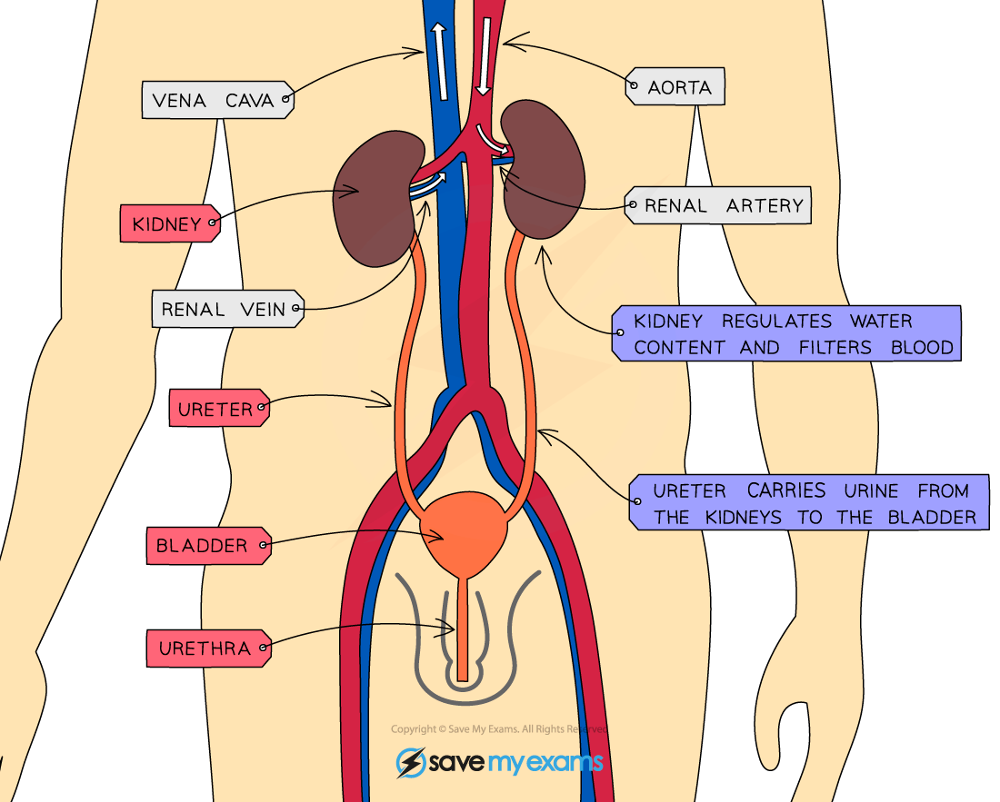
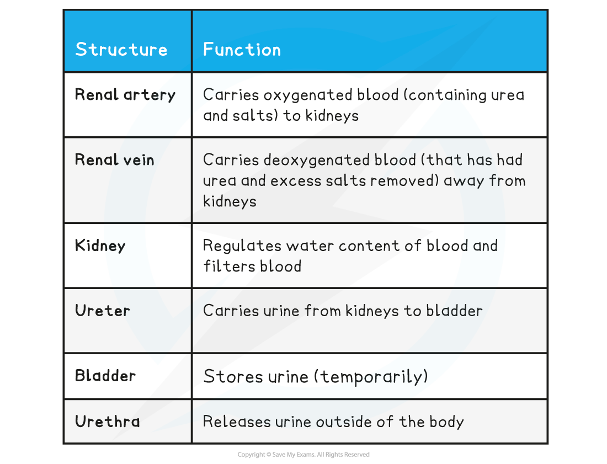
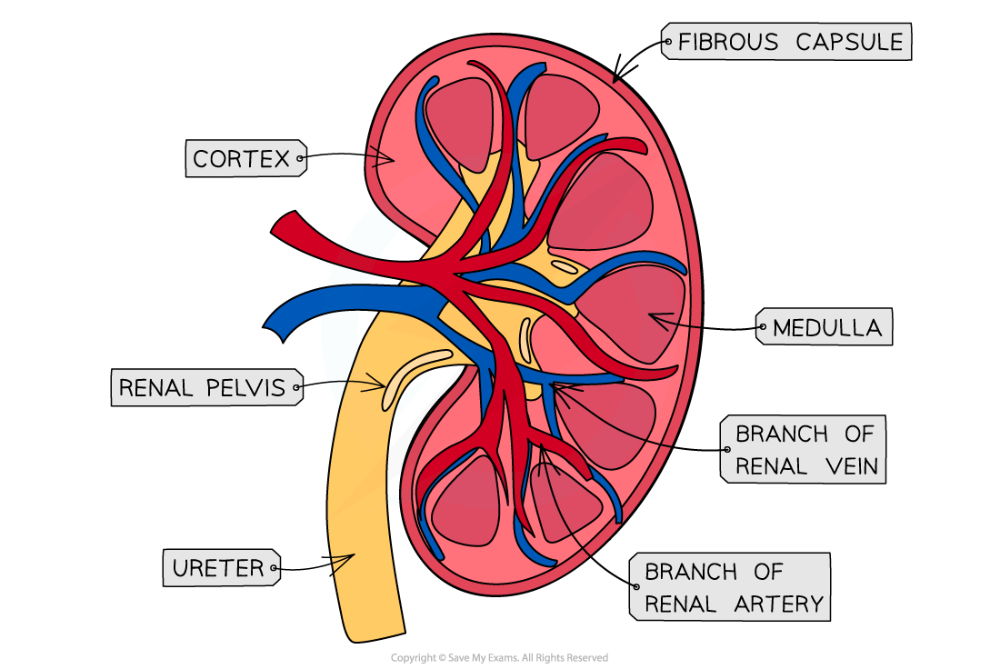
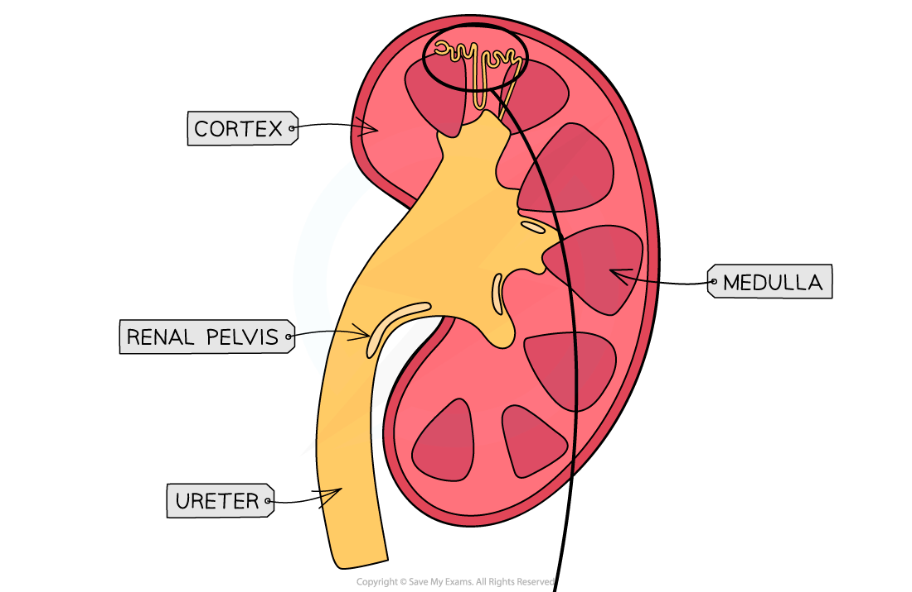
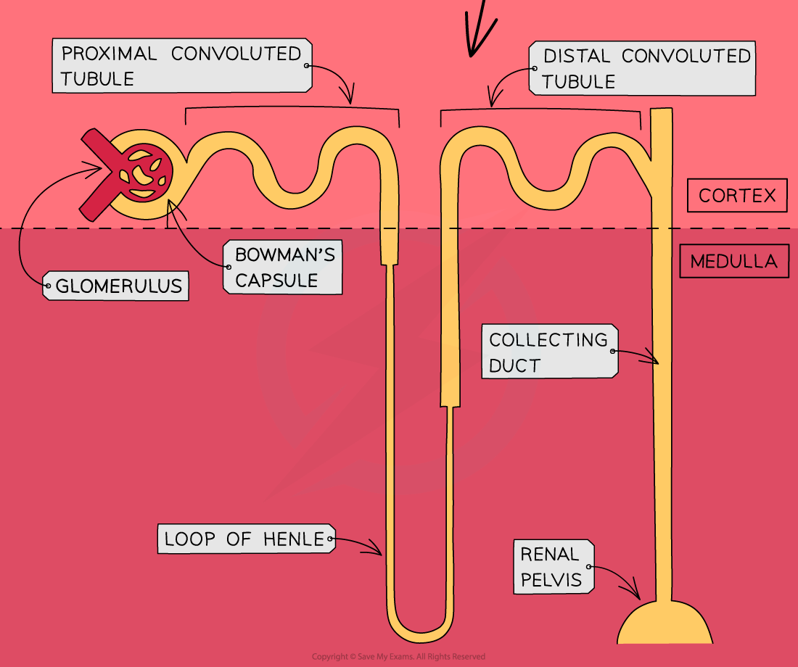
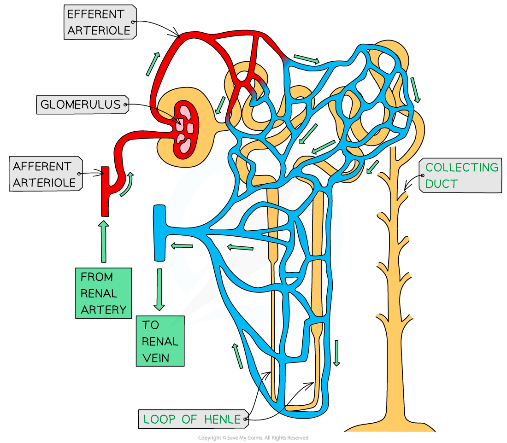

# The Kidney: Structure

## The Kidney: Structure

> **Spec point** — `spcpt_bvM4R82QB6TT5WSN`

## The Kidney: Structure

- Humans have **two** kidneys
- The kidneys are responsible for carrying out two very important functions

  - As an **osmoregulatory organ **they **regulate the water content of the blood**
  
    - This is essential for maintaining blood pressure and to prevent cell damage occurring due to *osmosis*
  - As an **excretory organ **they enable the** excretion of the toxic waste products of metabolism, **such as **urea,** and substances in excess of requirements, such as **salts**

***The kidneys are located above the bladder. They are supplied with blood by the renal artery and connect to the bladder via the ureter.***

**The Function of the Kidneys & their Associated Structures Table**

#### The gross structure of the kidney

- The kidney itself is surrounded by an outer layer known as the **fibrous capsule**
- Beneath the fibrous capsule, the kidney has **three main regions**

  - The **cortex**
  - The **medulla**
  - The **renal pelvis**

***The kidney has three main regions; the cortex, the medulla, and the renal pelvis.***

#### The microscopic structure of the kidney

- Each kidney contains **thousands** of **tiny tubes**, or **tubules**, known as **nephrons**
- Nephrons are the **functional unit** of the kidney and are responsible for the **formation of urine**
- Different parts of the nephron are found in different regions of the kidney

  - The **cortex**
  
    - Location of the glomerulus, Bowman’s capsule, proximal convoluted tubule, and distal convoluted tubule
  - The **medulla**
  
    - Location of the loop of Henle and collecting duct
  - The **renal pelvis**
  
    - All kidney nephrons drain into this structure, which connects to the ureter
- There are two types of nephrons in the kidney

  - **Cortical** nephrons
  
    - These occur **mainly** in the **renal cortex** and have a **short loop of Henle** that barely enters the medulla
    - They make up about 85% of the nephrons in a human kidney
  - **Juxtamedullary** nephrons
  
    - They have **long loops of Henle** that span across the entire medulla
    - Very efficient at **conserving water** in the body

***The nephron spans the three regions of the kidney.***

- There is also a network of **blood vessels** associated with each nephron
- Within the** Bowman’s capsule** of each nephron is a structure known as the **glomerulus**

  - Each glomerulus is supplied with blood by an **afferent arteriole** which carries blood from the **renal artery**
  - The afferent arteriole splits into a **ball of capillaries** that forms the **glomerulus** itself
  - The capillaries of the glomerulus rejoin to form the **efferent arteriole**
- Blood flows from the glomerulus into a network of capillaries that run closely **alongside the rest of the nephron** and eventually into the **renal vein**

***The afferent arteriole supplies the capillaries of the glomerulus, which rejoin to form the efferent arteriole.***
