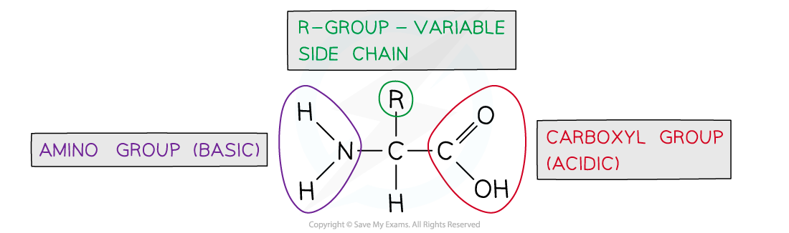
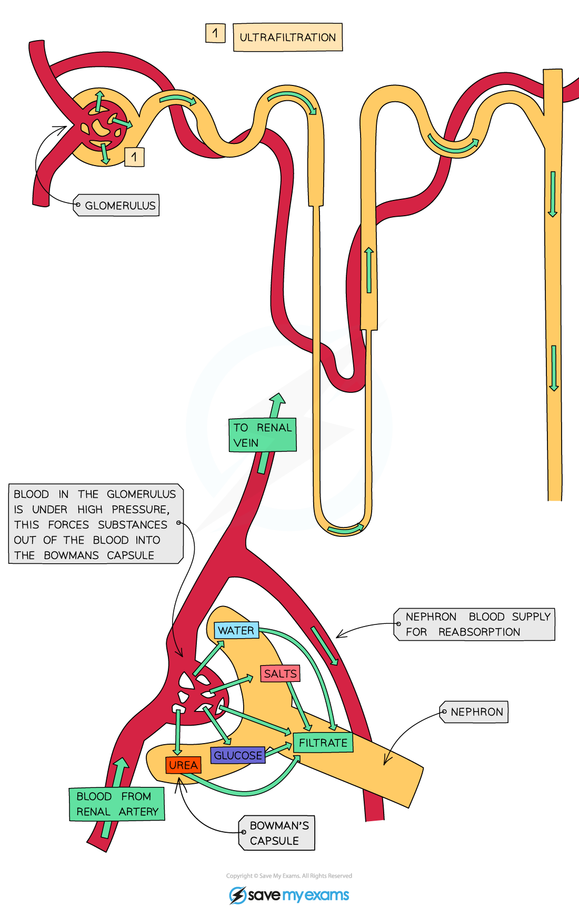

# Urea as a Waste Product

## Urea as a Waste Product

> **Spec point** — `spcpt_QBw3b8rCsV7tG2Cf`

## Urea as a Waste Product

#### Formation of urea

- The body **cannot store** excess protein or *amino acids*
- Liver cells, or hepatocytes, are responsible for **removing the amino group** from excess amino acids in a process called **deamination**
- During deamination the amino group (**-NH****2**) of an amino acid is removed, together with an extra hydrogen atom
- These combine to form **ammonia** (NH3)

**amino acids **$\rightarrow$** ammonia + keto acid**

- The remaining keto acid may enter the Krebs cycle to be **respired**, be converted to **glucose**, or converted to **glycogen / fat for storage**

  - This means that the amino acids within the protein will not be wasted but can function as a useful source of** energy**
- Due to its toxicity ammonia is quickly converted into **less toxic urea**

  - This happens in a series of steps known as the **ornithine cycle**, which can be summarised as

**ammonia + carbon dioxide **$\rightarrow$** urea + water**

- Urea forms part of urine and can be **excreted** by the kidneys
- Urea is filtered out of the bloodstream into the Bowman's capsule of the nephron by the process of **ultrafiltration**

***During the process of deamination the amino group (-NH******2******) is removed from the amino acid and converted into ammonia (NH******3******)***

#### Ultrafiltration

- Within the** Bowman’s capsule** of each kidney nephron is a structure known as the **glomerulus**; these two structures together carry out the process of **ultrafiltration**
- The blood in the glomerulus is at **high pressure**

  - The **afferent arteriole** that enters the glomerulus **is wider than the efferent arteriole **that leaves it, increasing the blood pressure as the blood flows through the glomerulus
- This high pressure forces small molecules in the blood **out of the capillaries of the glomerulus and into the Bowman’s capsule**
- The resulting fluid in the Bowman's capsule is called the **glomerular filtrate**
- **Large molecules such as proteins remain in the blood** and do not pass into the filtrate

***During the process of ultrafiltration small molecules are forced out of the capillaries into the Bowman's capsule***

- The **structures **within the glomerulus and Bowman's capsule are especially **well adapted for ultrafiltration**
- The blood in the **glomerular capillaries** is **separated **from the **lumen **of the **Bowman’s capsule **by **two cell layers** with a **basement membrane** in between them

  - The first **cell layer** is the *endothelium* **of the capillary; **gaps between the cells allow** fluid **to pass through
  - The next layer is the mesh-like **basement membrane**
  - The second cell layer is the *epithelium* **of the Bowman’s capsule; **gaps between the cells** **allow the passage of** small molecules**
- As blood passes through the glomerular capillaries the **gaps between the cells **and the **mesh-like basement membrane** allow substances dissolved in the blood plasma to **pass into the Bowman’s capsule**

  - The substances that pass into the Bowman’s capsule make up the **glomerular filtrate**
  - The main substances that form the glomerular filtrate are
  
    - Amino acids
    - Water
    - Glucose
    - Urea
    - Salts (Na+ and Cl- ions)
- **Red and white blood cells** and **platelets **remain in the blood as they are **too large** to pass between the cells
- The **basement membrane stops large protein molecules** from getting through
