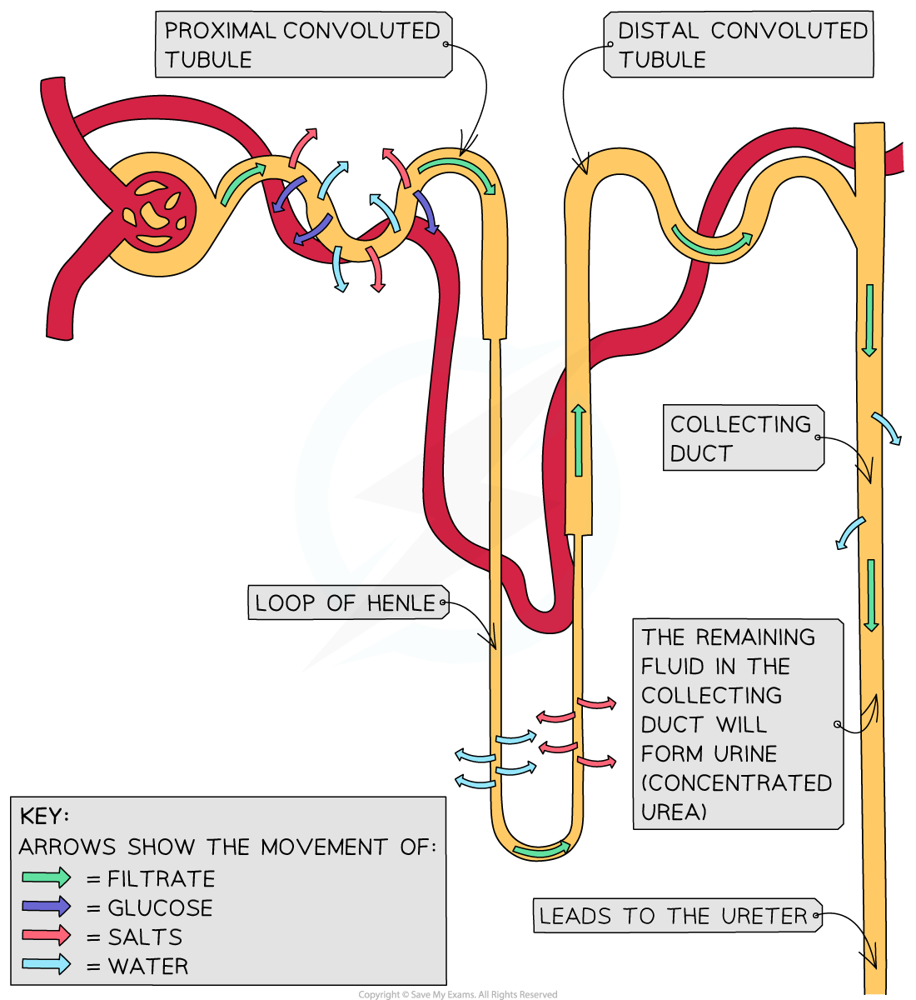
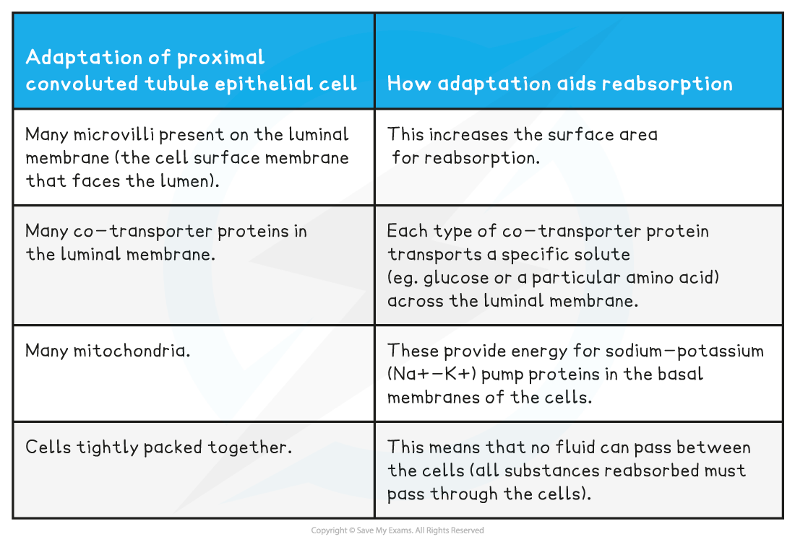
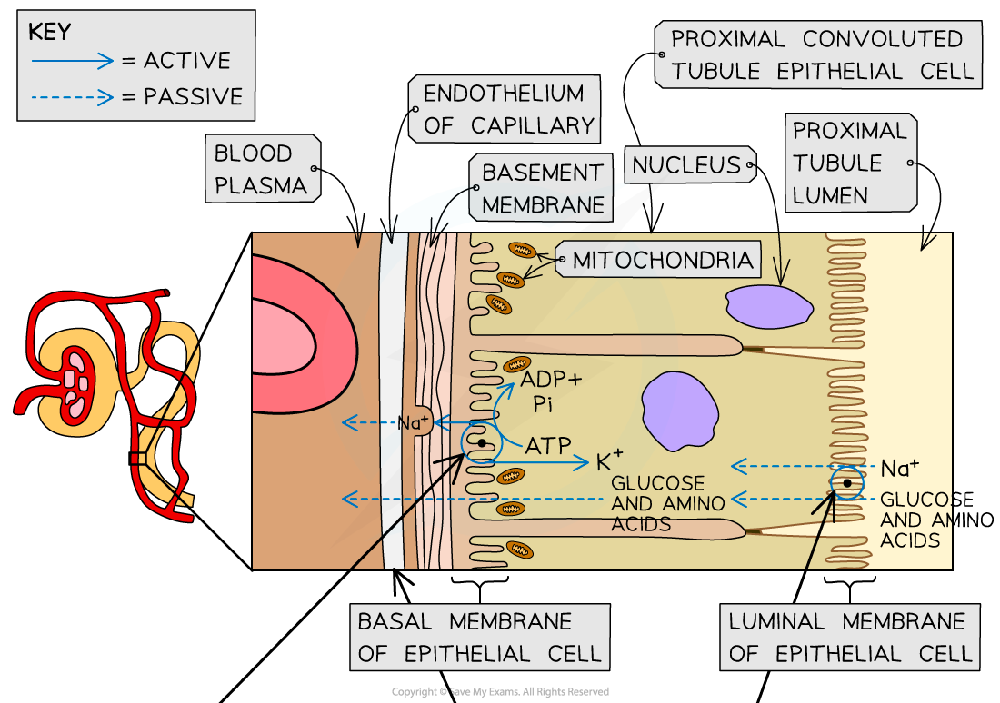
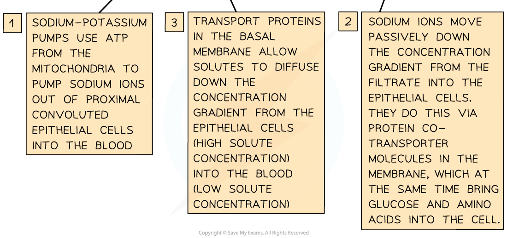
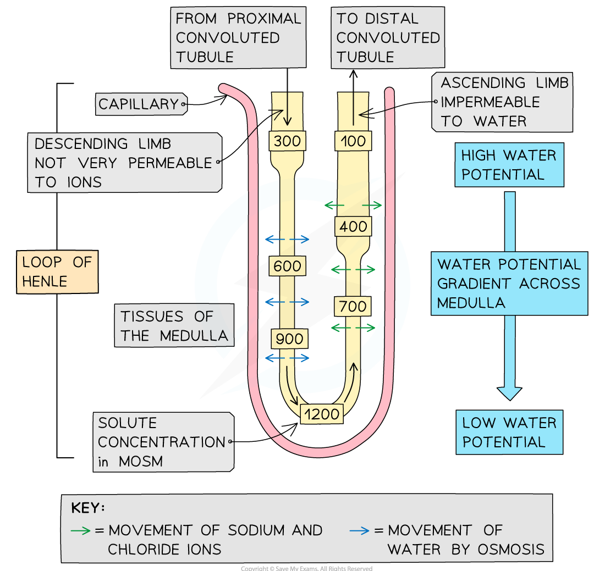

# Selective Reabsorption in the Kidney

## Selective Reabsorption in the Kidney

> **Spec point** — `spcpt_88TNGGNCJXqbFmSG`

## Selective Reabsorption in the Kidney

- The nephron is the **functional unit** of the kidney and is responsible for the **formation of urine**
- The process of urine formation in the kidneys occurs in **two stages**

  - **Ultrafiltration**
  - **Selective reabsorption**
- Ultrafiltration involves filtering small molecules from the blood at high pressure

  - This occurs between the glomerulus and the bowman's capsule
- Selective reabsorption allows the kidney to reabsorb useful small molecules into the blood

#### Selective reabsorption

- Many of the substances that pass into the **glomerular filtrate** are useful to the body
- These substances are therefore **reabsorbed** into the blood as the filtrate passes along the nephron
- This process is known as **selective reabsorption** since not all substances are reabsorbed

  - Reabsorbed substances include **water, salts, glucose,** and **amino acids**
- Most of this reabsorption occurs in the **proximal convoluted tubule**

  - Note that while** water and salts** are reabsorbed in the proximal convoluted tubule, the **loop of Henle** and **collecting duct** are also involved in the reabsorption of these substances

***Selective reabsorption of useful substances occurs in the proximal convoluted tubule, the loop of Henle and the collecting duct***

- The lining of the proximal convoluted tubule is composed of a **single layer of epithelial cells** which are **adapted to carry out reabsorption** in several ways

  - Microvilli
  
    - **Microvilli** are tiny finger-like projections on the surface of epithelial cells which increase the surface area for diffusion
  - Co-transporter proteins
  - Many mitochondria
  - Tightly packed cells

**Adaptations for Selective Reabsorption Table**

#### Molecules reabsorbed from the Proximal Convoluted Tubule

- **Sodium ions** (Na+) are transported from the proximal convoluted tubule into the surrounding tissues by **active transport**
- The positively charged sodium ions creates an electrical gradient, causing **chloride ions** (Cl-) to follow by **diffusion**
- **Sugars** and **amino acids** are transported into the surrounding tissues by **co-transporter proteins **which also transport sodium ions
- The movement of ions, sugars, and amino acids into the surrounding tissues **lowers the water potential** of the tissues, so **water leaves the proximal convoluted tubule** by *osmosis*
- **Urea** moves out of the proximal convoluted tubule from a high to a low concentration by **diffusion**
- All of the substances that leave the proximal convoluted tubule for the surrounding tissues **eventually make their way into nearby capillaries** down their *concentration gradients*

***Sodium, amino acids, and glucose are reabsorbed from the proximal convoluted tubule by an active process that involves co-transporter proteins.***

#### The role of the loop of Henle

- Many animals deal with the excretion of the toxic waste product **urea **by **dissolving it in water** and **excreting **it
- While this method of excretion works well, it brings with it the **problem of water loss**
- The role of the loop of Henle is to **enable the production of urine that is more concentrated than the blood**, and to therefore **conserve water**

  - Note that it is also possible to produce urine that is less concentrated than the blood; this is important when water intake is high to prevent blood becoming too dilute
- The loop of Henle achieves this by the use of a **countercurrent multiplier system**

  - ***Countercurrent*** refers to the opposite directions of filtrate flow in the descending and ascending limbs of the loop of Henle
  - ***Multiplier*** refers to the steep concentration gradient that the loop of Henle is able to generate across the medulla

#### The process in the loop of Henle

- **Sodium** and **chloride** ions move **out of the filtrate in the ascending limb** of the loop of Henle into the **surrounding medulla** region, lowering its water potential

  - The movement of ions occurs by both **diffusion** and** active transport**
  
    - Diffusion takes place in the first part of the ascending limb
    - Active transport occurs in the second part of the ascending limb
  - The ascending limb of the loop of Henle is **impermeable to water**, so water is **unable to leave the loop here by osmosis**
  - The **water potential in the ascending limb increases as it rises** back into the cortex due to the **removal of solutes** and **retention of water**
- The neighbouring **descending limb is permeable to water**, so water moves **out of the descending limb by osmosis** due to the low water potential in the medulla created by the ascending limb

  - The descending limb has few transport proteins in the membranes of its cells, so **has low permeability to ions**
  - The **water potential of the filtrate decreases as the descending limb moves down** into the medulla due to the **loss of water** and **retention of ions**
- The water and ions that leave the loop of Henle for the medulla make their way **into the nearby capillary network**

***The loop of Henle acts as a countercurrent multiplier, maximising the reabsorption of water by creating a steep water potential gradient across the medulla***
