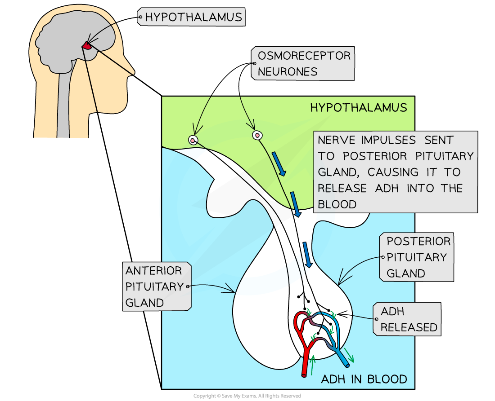
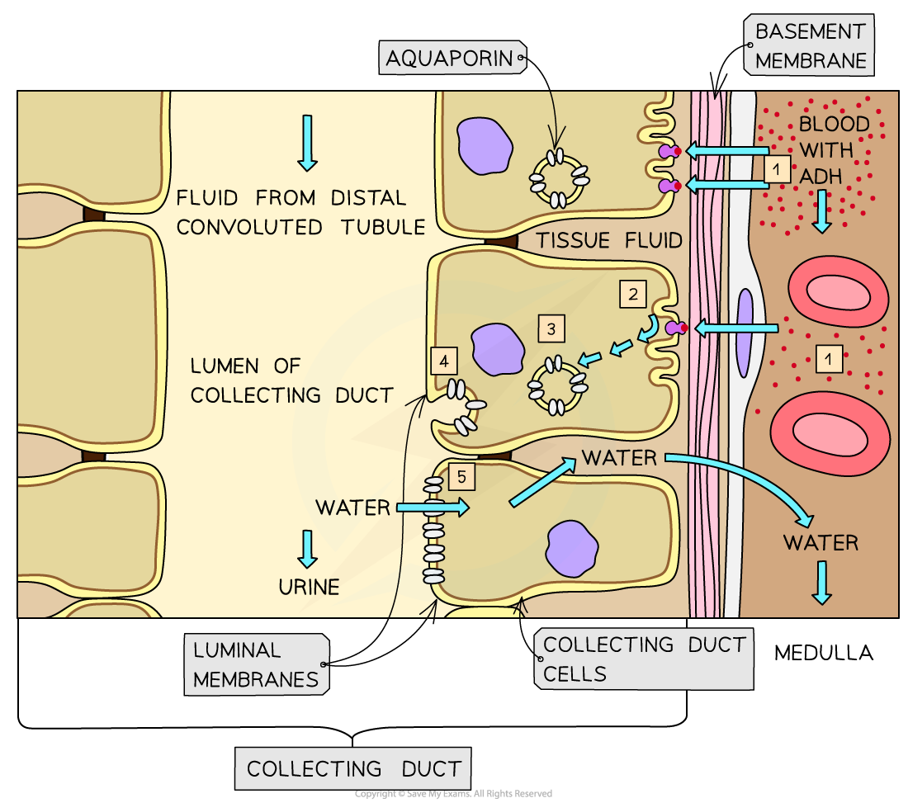
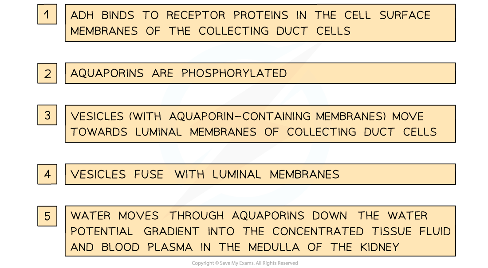

# Hormones in Osmoregulation

## Hormones in Osmoregulation

> **Spec point** — `spcpt_vVqMRp9tGVkRfBJW`

## Hormones in Osmoregulation

- The control of the **water potential** of body fluids is known as **osmoregulation**

  - Osmoregulation is a key part of **homeostasis**
- Specialised **sensory receptors**, known as **osmoreceptors**, monitor the water potential of the blood

  - These osmoreceptors are found in an area of the brain known as the **hypothalamus**
- If the osmoreceptors detect a **decrease** in the water potential of the **blood**, nerve impulses are sent along sensory neurones to the **posterior pituitary gland, **located just below the hypothalamus
- These nerve impulses stimulate the posterior pituitary gland to release **antidiuretic hormone (ADH)**
- ADH molecules enter the blood and travel throughout the body

  - ADH causes the **kidneys** to **reabsorb** more water
  - This **reduces the loss of water in the urine**

***When osmoreceptors detect a decrease in blood water potential, nerve impulses stimulate the release of ADH at the posterior pituitary gland. This ADH then travels in the blood to the kidneys, causing them to increase water reabsorption***

#### The effect of ADH on the kidneys

#### Low blood water content

- Blood water content might drop as a result of **reduced water intake**, **sweating**, or **diarrhoea**

  - Low blood water content can also be referred to as **high blood solute concentration**, or **low blood water potential**
  - If blood water content gets too low it can lead to **dehydration**
- A reduction of blood water content is **detected by the hypothalamus** in the brain
- The hypothalamus **causes the pituitary gland to secrete ADH** into the blood

  - The target cells of ADH are in the distal convoluted tubule and collecting duct in the kidneys
- ADH **increases the permeability of the walls of the distal convoluted tubule** and **collecting duct** in the kidneys to water

  - The permeability of the walls of the distal convoluted tubule and collecting duct are increased by increasing the number of **channel proteins called aquaporins** in the cell surface membranes of the cells lining the nephron lumen; this occurs in the following way
  
    - Collecting duct cells contain **vesicles**, the membranes of which contain many **aquaporins**
    - ADH molecules bind to receptor proteins, activating a signalling cascade that causes the **vesicles** to **move to** and **fuse** **with** the **luminal membranes** of the collecting duct cells
    - This **increases the permeability** of the membrane to water
- **More water is reabsorbed into the blood** via the distal convoluted tubule and collecting duct
- The reabsorption of water leaves a **concentrated filtrate** that passes through the collecting duct and into the renal pelvis

  - This remaining filtrate is the **urine**; from the renal pelvis it passes along the ureter to the **bladder**
- The **blood water content increases** and a **small quantity** of **concentrated urine** is produced

***ADH increases the permeability of the walls of the collecting duct to water by increasing the number of aquaporins in the cell surface membranes of the collecting duct cells.***

#### High blood water content

- Blood water content might increase due to increased water intake or loss of salts during sweating

  - High blood water content can also be referred to as **low blood solute concentration**, or **high blood water potential**
  - If blood water content gets too high it can lead to **overhydration**
- High blood water content is detected by the hypothalamus
- The hypothalamus **no longer stimulates the pituitary gland to release ADH** and ADH levels in the blood drop
- The **distal convoluted tubule and collecting duct walls become less permeable to water**

  - Fewer aquaporins are present
- **Less water is reabsorbed** from these regions of the nephron into the blood, and the water instead passes down the collecting duct into the renal pelvis along with the rest of the filtrate
- **Blood water content decreases** and a **large quantity** of **dilute urine** is produced
